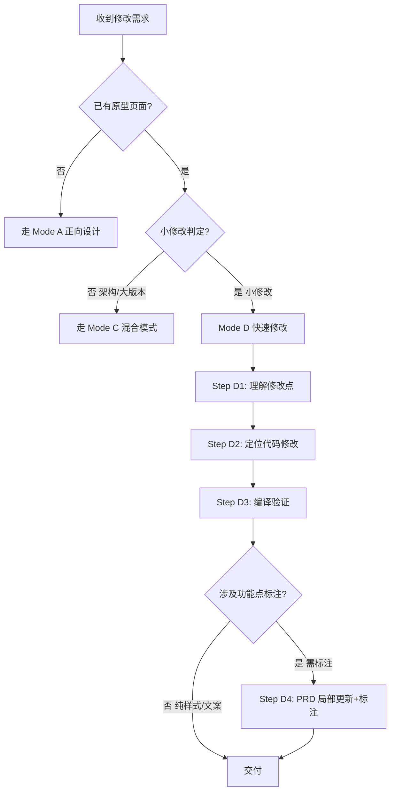

# 设计工作流 (Design Workflow Rules)

本规则定义三种 AI 设计工作流的完整流程，供任何 AI 工具参考。

> **顶层定位：平台是唯一输出基线，Figma / Axure / 截图 / PRD 只是输入源。**
> 输入源（Figma 设计稿、Axure 导出、截图、PRD 文档、口头描述）经三种模式统一转换为平台原生 React 代码 + PRD + Git 版本后交付。iframe 嵌入仅用于快速预览，不作为交付基线。
>
> **设计风格来源规则**：AI 生成原型代码时，设计风格来源优先级为：
> 1. **用户提供的输入源**（截图/Figma/现有产品代码）→ 还原该风格
> 2. **用户明确选择的预设** → 按预设生成
> 3. **禁止** AI 自行参考项目其他页面的 CSS/颜色/组件风格来推断新页面的设计方向。无输入源时，必须让用户选择设计系统预设。
>
> **项目隔离规则（强约束）**：不同原型项目之间代码、设计、数据**严格隔离**，禁止跨项目参考：
> - ❌ 禁止读取 `src/pages-imports/01-raw/租户门户/` 等其他项目的代码作为参考
> - ❌ 禁止复制其他项目的 CSS 变量、颜色值、组件结构、交互模式
> - ❌ 禁止以"参考一下其他项目怎么做"为由浏览跨项目代码
> - ✅ 每个项目的需求分析、方案设计、代码生成必须基于**本项目**的输入源（截图/Figma/PRD/口头描述）
> - ✅ 仅当用户**明确要求**复用某项目的组件时，才可在用户指定范围内参考
>
> **经验召回前置规则（强约束）**：在修改**布局相关代码**（Header、Sidebar、导航栏、页面整体结构）前，必须先执行经验召回：
> 1. 调用 ExperienceRecall 检索是否有相似任务的**失败经验**（如"误改外壳"、"布局崩溃"、"标签闭合错误"）
> 2. 若存在失败经验，必须规避已知的错误路径，不得重蹈覆辙
> 3. 经验召回是编码前的**前置动作**，不可省略或后置
> 4. 适用场景：平台 Header 集成、导航栏重构、页面布局调整、批量包裹共享组件等

---

## 模式 A：正向设计（从需求到原型）

**起点**：文字需求 / 功能描述
**终点**：可交互原型 + PRD 文档
**AI 价值**：创意生成 + 规范对齐 + 文档自动化

### 流程

#### A1 需求输入
- 从用户的文字描述中提取：业务目标、核心功能、用户角色、技术约束
- **必须追问的缺失信息（不可跳过）**：
  - 目标用户是谁？有哪些角色？
  - 核心目标是什么？解决什么问题？
  - 有哪些约束（预算/时间/技术）？
  - **是否有现有产品的截图、原型或设计稿？**（如有，必须获取并作为设计依据）
  - 技术栈和设计系统要求？
- **产物**：`docs/<Project>/需求清单.md`（需求清单）
- ⚠️ **人工确认（不可跳过）**：需求清单生成后，必须展示给用户并等待人工确认/修改，确认后才能进入下一阶段

#### A2 需求分析
- **竞品分析（必须执行）**：列出 3-5 个同类产品，对比核心功能差异
- 用户路径分析：用户完成目标的操作步骤
- 需求优先级排序：MoSCoW 法（Must/Should/Could/Won't）
- 技术可行性：识别技术难点和依赖
- **产物**：`docs/<Project>/需求分析.md`（分析报告）
- ⚠️ **人工确认（不可跳过）**：分析报告生成后，必须展示给用户并等待人工确认/修改，确认后才能进入下一阶段

#### A3 方案设计
- ⚠️ **人工决策点（不可跳过）**：AI 必须生成 2-3 个候选方案，由人工选择最终方案。AI 不应替人做业务决策。
- 方案对比维度：
  - 用户体验：操作步骤数、学习成本
  - 开发成本：技术复杂度、工时估算
  - 风险：技术风险、业务风险
  - 扩展性：未来迭代空间
- **产物**：`docs/<Project>/方案设计.md`（方案对比文档 + 决策记录）

#### A4 原型生成
- ⚠️ **前置校验**：确保 A3 方案已有人工确认的决策记录，否则退回 A3
- ⚠️ **设计风格决策点（不可跳过）**：
  - **AI 必须先分析输入源**（截图/Figma/现有产品代码），提取设计 token（主色、圆角、字号、间距等），并将分析结果展示给用户
  - **必须让用户确认设计风格**，提供选项：
    - 选项 A：按分析结果还原输入源风格（展示分析结果供用户参考）
    - 选项 B：从平台内置的 5 种预设中选择（Prototype Default、Element Plus、Ant Design 5.x、Arco Design、Naive UI）
  - **禁止** AI 跳过人工确认直接生成代码
- 按用户确认的设计风格生成规范代码
- 注册到平台路由
- 生成空状态、加载状态、错误状态
- **产物**：`src/pages/<Module>/<Page>/index.tsx` + `meta.json`

#### A5 PRD 文档
- 整合需求 + 方案 + 原型，输出完整 PRD
- 包含 Business Context、FR 段落、交互流程、边界情况
- **产物**：`src/pages/<Module>/<Page>/prd.md`（与原型代码同目录，便于 `?raw` 导入）
- ⚠️ **人工确认（不可跳过）**：PRD 文档生成后，必须展示给用户并等待人工确认/修改，确认后才能进入下一阶段

---

## 模式 B：逆向设计（从现有产品到原型）

**起点**：截图 / 录屏 / 现有产品 URL
**终点**：可交互原型 + PRD 文档
**AI 价值**：视觉还原 + 交互推断 + 文档反向生成

### 流程

#### B1 输入采集
- ⚠️ **必须先确认输入源类型**：截图、Figma 链接、还是 Figma 代码工程？
- 用户提供截图、Figma 链接、或 Figma 代码工程
- 截图放在 `docs/<Project>/assets/existing-product/` 目录下
- Figma 链接：通过 MCP 工具（`get_figma_data` + `download_figma_images`）读取设计稿节点数据 + 下载页面截图
- Figma 代码工程：插件导出的 zip/目录，放入 `01-raw/` 走适配管线
- 截图：AI 视觉识别 UI 结构、组件、颜色、字体、间距
- 输出结构化 UI 描述（组件树 + 样式 token）
- **可仅生成 PRD 不生成代码**（Figma 链接 → MCP 读取 → 直接输出标准 PRD）

> **Vision Bridge（视觉桥接降级方案）**
>
> 当当前模型**不支持多模态**（如 DeepSeek）时，通过 `vision-bridge` Skill + `vision-mcp` MCP Server 自动降级处理图片：
> - **触发条件**：Skill 检测到用户提供了图片路径（文本形式如 `src/assets/screenshot.png`）或关键词（"截图"、"设计稿"、"图片"），且当前模型不支持多模态
> - **工作原理**：图片以文件路径形式传递 → Skill 调用 `vision-mcp` 工具 → MCP Server 内部转发给多模态 API（默认 OpenAI GPT-4o，密钥通过环境变量 `OPENAI_API_KEY` 配置）→ 返回结构化 JSON → 当前模型基于 JSON 继续工作
> - **透明性**：若当前模型已支持多模态（如 GPT-4o / Claude Vision），Skill 自动跳过桥接，直接由模型处理图片，不额外消耗 API 调用
> - **适用场景**：B1 截图结构识别、B2 设计系统匹配、B5 反向 PRD 推断、C5 标注点定位等所有涉及图片视觉识别的环节
> - **工具列表**（详见 `mcp-servers/vision-mcp/`）：
>   - `analyze_ui_structure`：截图 → 组件树 + 布局结构 JSON
>   - `match_design_system`：截图 → 匹配预设 + token 值 JSON
>   - `infer_prd_from_screenshot`：截图 → 功能需求 + 实体 + 边界 JSON
>   - `cluster_screenshots`：多截图 → 页面分组 + 精度分级 JSON
>   - `locate_annotations`：原型截图 → 标注点坐标 + 选择器 JSON
>   - `diff_versions`：V1/V2 截图 → 差异区域 + 变更类型 JSON
>
> **Vision MCP 服务检查规则（强约束）**：调用 `vision-mcp` 工具前，**必须先检查本地 llama.cpp 视觉服务是否运行**，禁止在未检查的情况下直接调用导致超时失败：
> - **检查命令**：`lsof -i :8080`（默认端口 8080），或 `curl -s http://localhost:8080/v1/models`
> - **服务未运行时的处理**：
>   1. 不得反复重试 MCP 工具调用（会持续超时浪费资源）
>   2. 告知用户视觉服务未启动，基于现有文档、代码结构、文字描述继续工作
>   3. 若用户需要视觉识别，提示用户启动服务：`./llama-server -m qwen3-vl-8b-q8_0.gguf --mmproj qwen3-vl-8b-mmproj-f16.gguf --port 8080`
> - **服务配置**：OPENAI_BASE_URL 指向 `http://localhost:8080/v1`，OPENAI_API_KEY 设为非空占位符（如 `sk-local`）
> - **适用场景**：所有涉及 `analyze_ui_structure`、`match_design_system`、`infer_prd_from_screenshot`、`cluster_screenshots`、`locate_annotations`、`diff_versions` 的调用前

#### B2 视觉还原
- 匹配设计系统预设（**从输入源推断**，用户提供截图则从截图推断，用户提供 Figma 则从 Figma 推断）
- **禁止**从平台项目其他页面的 CSS/颜色/组件风格来推断设计方向
- 按规范生成可交互原型代码
- 还原视觉（85%+ 像素精度）和基本交互

#### B3 规范适配
- 将 AI 生成的代码适配到原型平台规范
- 修正组件映射、设计 token、命名约定
- 确保符合 [page-generator.md](./page-generator.md) 所有规则

> **Figma 代码工程的适配策略（与 AI 生成代码不同）**
>
> 当输入源是 **Figma 插件导出的代码工程**（非 AI 生成），B3 的适配策略为**最小改动**，保留 Figma 原始设计风格：
> - **参考源是 Figma 原始代码**，不是平台 CSS 变量。不要查看平台项目的 CSS/颜色后去映射
> - **保留**：inline style、原始颜色值（`#1890ff` 等）、内联 SVG 图标、Tailwind 类名、组件结构
> - **仅改**：`React.ReactNode` → `ReactNode`（type-only import）、`React.useState` → `useState`、`height: "100vh"` → `minHeight: "100vh"`
> - **禁止**：颜色映射为 token、SVG 替换为 lucide-react、引入 cn()/clsx、重构组件逻辑
> - 详见 [page-generator.md](./page-generator.md) § 4.0 Figma 代码转换的样式保留原则
>
> 对比：**AI 生成代码**（模式 A）必须使用平台 token、禁止 inline style；**Figma 转换代码**（模式 B）保留原始设计，仅做技术适配

#### B4 平台接入
- 自动注册路由、导航、标题
- 确保版本切换、缩放、Mock 数据正常

#### B5 反向 PRD
- 基于还原的原型，反向推断产品需求
- 补充：业务规则、权限、交互细节、边界情况
- 生成完整 PRD
- ⚠️ **人工确认（不可跳过）**：PRD 文档生成后，必须展示给用户并等待人工确认/修改

---

## 模式 C：混合模式（改造现有产品）

**起点**：已有产品（截图/代码）+ 新需求
**终点**：改造后的原型 + 完整 PRD + 功能点内嵌文档
**AI 价值**：上下文还原 + 需求叠加 + 改造生成

### 流程

#### C1 现有产品还原（= B1-B4）
- ⚠️ **必须先确认现有产品的输入形式**：是否有截图、原型代码、Figma 链接？
- 按模式 B 还原现有界面，建立"上下文基线"。
- 现有产品素材统一放入 `docs/<Project>/assets/existing-product/`
- **产物**：现有界面原型（作为改造基准，存为 `_versions/v1.tsx`）

#### C2 新需求分析（= A1-A2）
按模式 A 分析新需求，明确改造目标。
**产物**：`_workflow/需求清单.md` + `_workflow/需求分析.md`

#### C3 改造方案设计
**输入物**：现有原型 + 新需求分析
**AI 任务**：设计改造方案，标注"改哪里、为什么改、改完什么样"
**产物**：`_workflow/方案设计.md`（改造方案）

改造类型：
- **重构 (A)**：信息架构/交互逻辑的结构性调整，标注 `A.01`、`A.02`...
- **新增 (B)**：在现有界面增加新模块/功能，标注 `B.01`、`B.02`...
- **修改 (M)**：调整现有功能的交互/视觉/逻辑，标注 `M.01`、`M.02`...
- **删除 (R)**：移除不再需要的功能，标注 `R.01`、`R.02`...

⚠️ **人工决策点**：改造方案需确认，尤其是"删除"和"重构"类型。

#### C4 原型改造
**输入物**：现有原型代码 + 改造方案
**AI 任务**：基于现有代码生成改造后的新版本，保留原版作对比
**产物**：
- `_versions/v1.tsx`（保留旧版本，可 A/B 对比）
- `_versions/v2.tsx`（改造后的新版本）

#### C5 完整 PRD + 功能点内嵌（Mode C 核心步骤）

**5.1 生成 PRD**
- 输出 `prd_v1.md`（旧版简要描述）
- 输出 `prd_v2.md`（新版完整 PRD）
- PRD 结构：
  - Business Context（目标产品、技术栈、设计系统）
  - Feature Overview（功能概览）
  - 功能需求详单（FR-X 标记，每个功能需求一个 `**FR-X`）
  - Interaction Flow（交互流程）
  - Edge Cases（边界情况）

**5.2 PRD 段落标记**（硬约束）
在 `prd_v2.md` 中为每个功能需求加 `**FR-X` 标记：
```markdown
**FR-1 视角切换（Restructure, 顶层 Tab 必做）**
| 项目 | 说明 |
|---|---|
| 描述 | 页面最顶部显示「个人视角」/「团队视角」切换 Tab |
| 业务规则 | 1) 普通员工=只显示个人视角 |

**FR-2 团队视角：部门/成员筛选（Modify）**
...
```

**5.3 代码内嵌**（硬约束）
在 `v2.tsx` 中：
- `import prdV2Raw from '../prd_v2.md?raw'`
- `extractSection` 函数按 FR 段落提取
- `FEATURE_DOCS` 映射表（key 与 `FEATURE_LABELS` 1:1）
- `DocPanel` 组件（用 `createPortal` 渲染到 `document.body`）
- 功能点标注为胶囊形「说明」按钮
  - 蓝色可点击 → 弹出 DocPanel 展示完整 PRD
  - 灰色仅 tooltip → 无 PRD 详情

**5.4 测试验收 Changelog**
生成 `_workflow/c5_v1_vs_v2_changelog.md`，结构：
1. 对比概览（改动统计、重点说明、测试范围）
2. 重构项 (A)
3. 新增项 (B)
4. 修改项 (M)
5. 删除项 (R)
6. 测试 checklist（逐项验收）

编号规则：Changelog 编号 = FEATURE_LABELS key = 原型按钮编号

**测试流程**：
1. 打开「显示新增功能点」开关（Header 右侧）
2. 逐个点击「说明」按钮
3. 对照 Changelog 文档验收
4. 点击文档图标 📄 查看完整 PRD 描述

---

## 版本管理规范

### 版本创建时机

| 场景 | 是否创建新版本 |
|------|--------------|
| 视觉微调（颜色、间距、字体） | 否，直接修改当前版本 |
| 文案修改 | 否，直接修改当前版本 |
| 新增单个功能点 | 否，累积到当前版本 |
| 新增 ≥3 个功能点 + 修改 ≥2 个 | 考虑创建新版本 |
| 信息架构调整（Tab、导航、布局） | 是，创建新版本 |
| 业务规则重大变更 | 是，创建新版本 |
| 跨模块改造 | 是，创建新版本 |

### 版本命名

- 版本标识符必须用整数递增：`v1`、`v2`、`v3`...
- 禁止 `v2.1`、`v2-lite` 等命名
- 每个版本对应一个 `prd_vX.md` 和 `_versions/vX.tsx`

### 版本对比

- 保留所有历史版本
- Header 左下角版本切换器支持 A/B 对比
- 切换版本时强制 remount，状态按「路由+版本」隔离
- localStorage key 格式：`<route>__v<X>_show`

---

## 产物目录结构

### 文档目录（docs/）

每个项目在 `docs/` 下拥有独立目录，存放所有工作流产物和素材：

```
docs/
├── <ProjectName>/              # 项目名（如 IntelligentDiagnosis）
│   ├── assets/                 # 素材存放
│   │   ├── existing-product/   # 现有产品截图/原型
│   │   └── references/         # 竞品/参考图
│   ├── 需求清单.md              # A1 需求清单
│   ├── 需求分析.md              # A2 竞品分析/需求分析
│   └── 方案设计.md              # A3 方案对比 + 决策记录
│
├── <OtherProject>/             # 其他项目同理
│   └── assets/
│
└── solutions/                  # 全局架构/方案文档
    └── *.md
```

### 原型目录（src/）

```
src/pages/<Module>/<Page>/
  ├── index.tsx              # 原型代码（重导出默认版本）
  ├── meta.json              # 页面元数据
  ├── prd.md                 # 最终 PRD（单版本模式，与代码同目录）
  ├── prd_v1.md              # 多版本 PRD
  ├── prd_v2.md              # 多版本 PRD（含 **FR-X 标记）
  ├── _versions/             # 多版本原型
  │   ├── v1.tsx             # 含完整页面代码
  │   └── v2.tsx             # 含 ?raw 导入 + FEATURE_DOCS + DocPanel
  └── _workflow/             # 工作流产物（可选，不参与路由，与 docs/ 内容同步）
      ├── 需求清单.md            # A1 需求清单
      ├── 需求分析.md            # A2 分析报告
      ├── 方案设计.md            # A3 方案对比 / C3 改造方案
      ├── decision.md        # 方案决策记录
      └── c5_v1_vs_v2_changelog.md  # C5 测试验收 Changelog
```

### 规则

1. **工作流产物（需求/分析/方案）** 优先放 `docs/<Project>/`，`_workflow/` 为可选同步副本
2. **素材文件（截图/设计稿）** 统一放 `docs/<Project>/assets/`，不散落在各页面目录
3. **原型代码 + PRD 文档** 始终在 `src/pages/<Module>/<Page>/`（PRD 需被原型代码 `?raw` 导入，不可放在 `docs/`）
4. 二进制素材文件（截图、设计稿 PSD 等）可通过 `.gitignore` 排除，但目录结构保留
5. **页面必须放两级目录** `src/pages/<Module>/<Page>/`（平台路由机制是 `:module/:page`，一级目录会导致路由匹配失败，见 [page-generator.md §1.1](./page-generator.md#11-完整应用单入口强约束)）
6. **完整应用不拆分**：一个完整应用（共享 Header/导航的多个模块）= 两级目录下 1 个 `index.tsx` + `meta.json` + `prd.md`，子模块用内部状态切换，不带 `meta.json`

---

## 四种模式对比

| 维度 | 模式 A（正向） | 模式 B（逆向） | 模式 C（混合） | 模式 D（增量修改） |
|------|---------------|---------------|---------------|---------------------|
| 起点 | 文字需求 | 截图/URL | 现有产品+需求 | 已有原型+小修改需求 |
| AI 角色 | 设计师 | 还原师 | 改造师 | 快速修改师 |
| 核心价值 | 创意生成 | 视觉还原 | 上下文+迭代 | 快速响应+不破坏现有结构 |
| 适用场景 | 全新产品 / 全新模块 | 竞品分析 / 现有产品还原 | ≥3 个功能点 + 信息架构调整 | 日常 80% 小步迭代 |
| 产物 | 原型+PRD | 原型+PRD | 原型×N+PRD×N+内嵌 | 仅修改代码 + PRD 局部更新 |
| 版本管理 | 单版本 | 单版本 | 多版本 A/B 对比 | 直接改当前版本，不强制建新版本 |
| 功能点内嵌 | 可选 | 可选 | 必选 | 不改已有标注（可选新增 |
| 人工确认 | 4 次（A1/A3/A4/A5） | 1 次（B5） | 2 次（C1/C3+C5） | **0 次**（默认快速改完交付） |

---

## 模式 D：增量修改（日常小步迭代）

> **核心定位：这是日常 80% 以上场景的默认模式。**
> 当已有原型页面（`index.tsx + prd.md）存在，用户提出的是"改一个按钮、调一个布局、加一块小功能、改文案/样式/交互的小修改时，直接执行，不要触发完整工作流。

### 触发条件（满足以下全部）

1. **已有基线**：目标页面的 `index.tsx` 和 `prd.md`（或多版本 `v2.tsx + prd_v2.md）已存在并可正常编译
2. **修改范围小**：单次修改符合以下"小修改"判定标准
3. **不涉及架构变动**：不改模块划分、导航结构、路由注册、页面层级关系

### 小修改判定标准（满足任意一条即走 Mode D）

| 类型 | 示例 | 是否走 Mode D |
|------|------|-------------|
| 样式微调 | 改颜色/间距/字体/圆角/阴影/对齐 | ✅ |
| 文案修改 | 改按钮文字、标题、placeholder、提示信息 | ✅ |
| 单个功能点 | 新增 1-2 个小功能（如加一个筛选条件、加一个操作列 | ✅ |
| 交互细节调整 | 改弹窗结构、改表单字段顺序、改表格列顺序 | ✅ |
| 布局局部重排 | 页面内区块上下左右移动，不改层级 | ✅ |
| Mock 数据 | 增删 Mock 条目、改字段值 | ✅ |
| 新增 ≤2 个功能点 + 修改 ≤2 个 | 小版本累积 | ✅ |
| 信息架构调整 | 改导航/页面拆分/路由变更 | ❌ 走 Mode C |
| ≥3 个功能点 + ≥2 个修改 | 大版本改造 | ❌ 走 Mode C |
| 从零新建页面/模块 | 全新功能模块 | ❌ 走 Mode A |

### 决策流程图



### D1 理解修改点

- 直接根据用户描述 + 当前页面代码 + 当前页面 PRD，明确：
  - **改什么**：具体组件/区块/字段
  - **改成什么样**：目标样式/交互/数据
  - **影响范围**：是否影响其他功能（如筛选条件变了，列表查询逻辑是否要改）
- **不做的事**：
  - ❌ 不生成需求清单.md
  - ❌ 不做竞品分析
  - ❌ 不生成 2-3 个候选方案让用户选
  - ❌ 不做需求确认（除非描述模糊再问清后直接改）

### D2 代码修改

**修改原则**：

1. **最小改动**：只改用户要求的部分，不重构周边未涉及的代码
2. **保持结构**：不擅自调整现有组件拆分、不改变量命名、不改变数据结构
3. **遵循 R1-R5 红线**：见 agent-rules.md（不碰外壳、不跨项目、JSX 配对、Vision 检查、经验召回

**修改步骤**：

1. 读取目标页面 `index.tsx`（或 `_versions/v2.tsx`）和 `_shared.tsx`）
2. 精确定位修改位置（组件/函数/JSX 区块）
3. 使用 `Edit` 工具精确替换，禁止用 Write 全文件覆盖
4. 若涉及共享组件（如 PlatformShell），先改 `_shared.tsx`

### D3 编译验证

1. 保存后立即检查 Vite 编译输出：
   - ✅ 无 `PARSE_ERROR` → 通过
   - ❌ 有 `Adjacent JSX elements` / 标签配对错误 → 按 §9.1 修复
   - ❌ 有类型错误 → 修复类型后重试
2. 若页面可热更新确认页面无错位/溢出

### D4 PRD 局部更新 + 功能点标注（功能修改才做）

**纯样式/文案/Mock 数据修改跳过此步。

**涉及功能变更时**：

1. **更新 PRD 对应段落**：
   - 单版本：在 `prd.md` §4 功能需求详单中新增/修改对应 FR-X 段落
   - 多版本：在 `prd_v2.md`（当前版本）新增/修改对应 FR-X 段落
2. **新增功能点标注**（如需标注）：
   - 在 `FEATURE_LABELS` 中新增条目，保持编号连续
   - 在 `FEATURE_DOCS` 中新增 1:1 映射
   - 在 JSX 对应位置 inline 紧贴标题文字右侧插入 `<NewTag code="X.XX" />`
3. **不做的事**：
   - ❌ 不强制创建新版本（v3.tsx），直接改当前版本
   - ❌ 不生成完整 Changelog（除非用户要求）

### Mode D 与 Mode C 的切换条件

修改过程中发现实际超出"小修改"范围，**立即停下并告知用户**，切换到 Mode C：
- 用户要求的修改实际涉及 3+ 功能点
- 修改需要调整导航/路由/模块拆分
- 用户追加的连续多次修改累积到了架构

告知话术：
> "当前修改已超出小修改范围，涉及 XX 个功能点 + XX 修改，建议切换到 Mode C（混合模式）：创建新版本 + 完整 PRD 更新 + Changelog，是否继续？"

### 自检 Checklist

- [ ] 修改前确认页面已存在（index.tsx / v2.tsx）
- [ ] 判定为小修改（符合判定标准
- [ ] 代码修改最小化，未重构周边代码
- [ ] Vite 编译通过（无 PARSE_ERROR、无类型错误
- [ ] 功能变更时 PRD 对应段落已更新
- [ ] 功能变更时 FEATURE_LABELS / FEATURE_DOCS / NewTag 1:1 对应
- [ ] 未触及 R1-R5 任何一条红线
