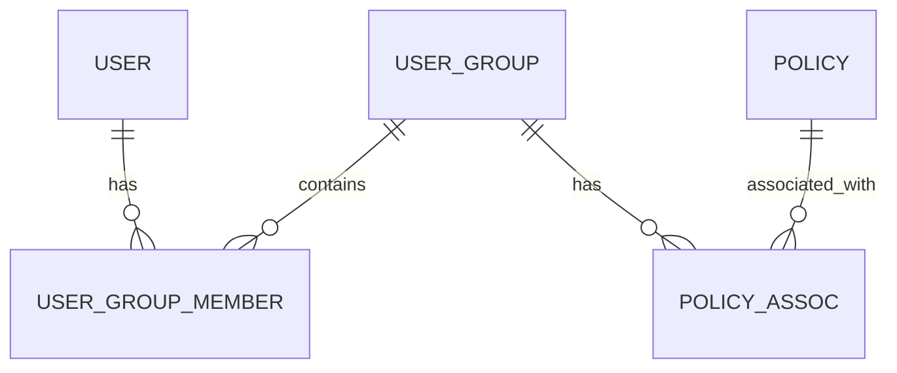
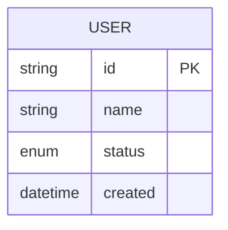
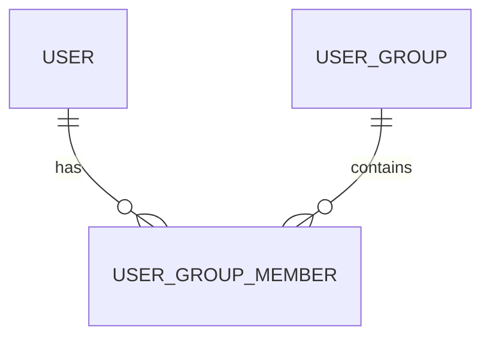
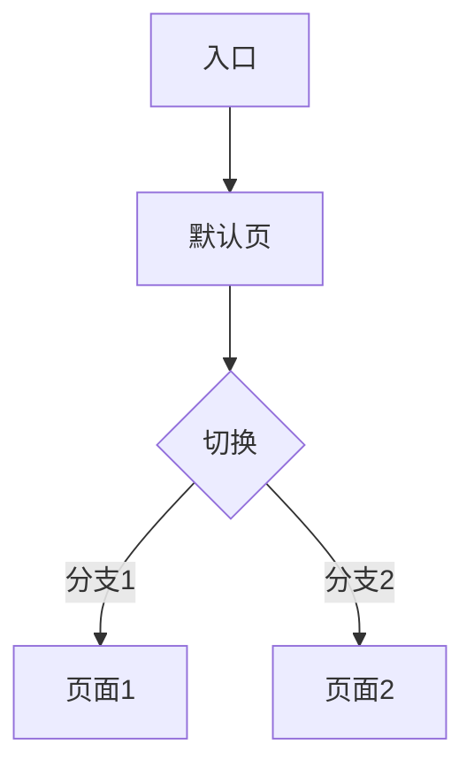
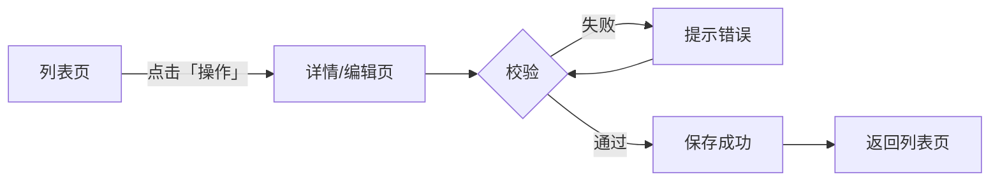
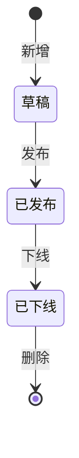

# 代码生成规范 (Page Generator Rules)

本规则定义原型平台的代码生成契约。任何 AI 工具（Trae / Cursor / v0 / Copilot 等）生成的代码必须遵守以下规范。

---

## 1. 目录约定（强约束）

```
src/pages/<业务域>/<页面>/
  ├── index.tsx          # 默认入口（必须 default export）
  ├── prd.md             # PRD 文档（单版本）
  ├── meta.json          # 页面元数据
  └── _versions/         # 多版本目录（可选）
      ├── v1.tsx
      └── v2.tsx
```

多版本页面必须拆分 PRD：
```
src/pages/<Module>/<Page>/
  ├── index.tsx          # 重导出默认版本
  ├── meta.json          # versions: ["v1","v2"], defaultVersion: "v2"
  ├── prd_v1.md          # V1 PRD
  ├── prd_v2.md          # V2 PRD
  └── _versions/
      ├── v1.tsx
      └── v2.tsx
```

## 2. 默认导出（强约束）

入口文件必须 `export default function XxxPage()`，基座通过 `React.lazy(() => import(...))` 加载。

```tsx
// 正确
export default function LoginPage() {
  return <div>...</div>
}

// 错误
export function LoginPage() { ... }
const LoginPage = () => <div>...</div>
export default LoginPage
```

多版本页面 index.tsx 应重导出：
```tsx
export { default } from './_versions/v2'
```

## 3. meta.json 元数据（强约束）

```json
{
  "title": "登录页",
  "module": "CRM",
  "defaultVersion": "v2",
  "versions": ["v1", "v2"],
  "tags": ["登录", "鉴权"]
}
```

必填字段：`title`、`module`
可选字段：`defaultVersion`、`versions`、`tags`

## 4. 样式系统（强约束）

- 必须使用 Tailwind CSS + Shadcn UI 风格组件
- 禁止 antd、inline-style、CSS Modules
- 必须使用平台设计 token：`bg-background`、`text-foreground`、`bg-primary`、`text-primary-foreground`、`bg-muted`、`text-muted-foreground`、`border-border`

### 4.0 Figma 代码转换的样式保留原则（强约束）

> **核心原则：Figma 代码转换时，参考源是 Figma 原始代码本身，不是平台 CSS 变量。**

当输入源是 Figma 插件导出的代码工程（放入 `01-raw/`），转换策略为**最小改动**，保留原始设计风格：

| 项目 | 策略 | 原因 |
|------|------|------|
| inline style (`style={{}}`) | **保留原样** | Figma 导出的精确样式值（颜色/尺寸/间距）是设计稿的真实还原，强行映射为 CSS 变量会丢失视觉保真度 |
| 原始颜色值（`#1890ff` 等） | **保留原样** | 不映射为 `bg-primary` 等 token。Figma 设计稿的配色体系（如 Ant Design 风格）与平台 token 不一定一致 |
| 内联 SVG 图标 | **保留原样** | 不替换为 lucide-react。Figma 导出的 SVG 是设计师精确定制的，替换会丢失视觉细节 |
| Tailwind 类名 | **保留原样** | 不重构为平台约定写法 |
| `React.ReactNode` / `React.CSSProperties` | **改为 type-only import** | `import type { ReactNode, CSSProperties } from "react"`，去掉 `React.` 前缀 |
| `height: "100vh"` | **改为 `minHeight: "100vh"`** | 防止内容溢出（唯一必须改的样式） |

**仅做以下改动**：
1. `React.ReactNode` → `ReactNode`，`React.CSSProperties` → `CSSProperties`（去命名空间 + type-only import）
2. `React.useState` → `useState` 等（去 React. 前缀 + 显式 import）
3. 外层容器 `height: "100vh"` → `minHeight: "100vh"`
4. 保留 `export default function App()` 不改名

**禁止做的事**：
- 不要把 inline style 改成 Tailwind 类
- 不要把颜色映射为 CSS 变量（`#1890ff` → `text-primary` 等）
- 不要把内联 SVG 替换为 lucide-react 图标
- 不要引入 `cn()` / `clsx` / `tailwind-merge` 工具函数
- 不要重构组件结构或逻辑

> **对比：AI 生成代码（模式 A）vs Figma 代码转换（模式 B）**
> - 模式 A（AI 生成）：必须遵守上方"样式系统"规则，使用平台 token，禁止 inline style
> - 模式 B（Figma 转换）：保留 Figma 原始设计，仅做技术适配（React 命名空间 + 布局溢出修复）

## 4.1 Figma 代码转换布局适配（强约束）

Figma 导出的代码通常自带全屏布局（`h-screen` + Header + Sidebar），直接放入平台会导致高度冲突、侧边栏底部与内容区不对齐等问题。

### 转换规则

| Figma 原始写法 | 平台正确写法 | 原因 |
|---------------|-------------|------|
| `h-screen` | `h-full` 或 `min-h-screen` | 平台内容区已有固定高度，`h-screen` 会溢出 |
| `overflow-hidden`（外层） | 移除 | 平台内容区管理滚动，页面不应锁高度 |
| `h-full overflow-hidden`（Sidebar） | 移除 `h-full` 和 `overflow-hidden` | 侧边栏需跟随内容高度自适应 |
| `overflow-y-auto`（main） | 移除 | 由平台内容区统一管理滚动 |

### 布局结构要求

Figma 代码通常有两种布局，转换时必须采用「Sidebar 通顶」结构：

```
正确（Sidebar 通顶）：
┌──────┬──────────────────────┐
│      │       TopNav          │
│ Side ├──────────────────────┤
│ bar  │       main            │
│      │                       │
└──────┴──────────────────────┘

错误（TopNav 全宽压顶）：
┌─────────────────────────────┐
│         TopNav (全宽)         │
├──────┬──────────────────────┤
│ Side │       main            │  ← Sidebar 底部与 main 不对齐
│ bar  │                       │
└──────┴──────────────────────┘
```

正确代码模板：
```tsx
return (
  <div className="flex min-h-screen bg-[#f0f2f5] overflow-hidden">
    <Sidebar />
    <div className="flex flex-1 flex-col min-w-0">
      <TopNav />
      <main className="flex-1 min-w-0 overflow-y-auto overflow-x-hidden">{renderPage()}</main>
    </div>
  </div>
)
```

### 宽表格横向滚动（强约束）

云API管理、运营平台等后台页面常有 10+ 列宽表格（`min-w-[2400px]`），如果 flex 容器不加 `min-w-0`，表格会把整个页面撑开导致布局崩溃，而不是在表格内部出现横向滚动条。

**根因**：flex item 默认 `min-width: auto`，不会被压缩到小于内容宽度，导致 `overflow-x-auto` 失效，压力传导到外层撑开整页。

**正确写法**（三层 `min-w-0` 逐层传递约束）：
```tsx
<div className="flex min-h-screen overflow-hidden">          {/* 外层锁死 */}
  <Sidebar />
  <div className="flex flex-1 flex-col min-w-0">             {/* 第1层 min-w-0 */}
    <TopNav />
    <main className="flex-1 min-w-0 overflow-y-auto overflow-x-hidden">  {/* 第2层 min-w-0 */}
      <div className="bg-white rounded-lg overflow-hidden">
        <div className="overflow-x-auto">                    {/* 表格滚动容器 */}
          <table className="min-w-[2400px] w-full">...</table>
        </div>
      </div>
    </main>
  </div>
</div>
```

**关键规则**：
- 外层 `overflow-hidden` 防止表格撑开平台容器
- content div 和 main 都加 `min-w-0`，破除 flex item 默认 `min-width: auto`
- main 用 `overflow-x-hidden` 让表格内部的 `overflow-x-auto` 接管横向滚动
- 表格用 `min-w-[Npx]` 设定最小宽度，不要用固定 `w-[Npx]`

**错误示例**（表格会撑开整页）：
```tsx
// 缺少 min-w-0 和 overflow-hidden
<div className="flex min-h-screen">
  <Sidebar />
  <div className="flex flex-1 flex-col">
    <TopNav />
    <main className="flex-1">
      <div className="overflow-x-auto">
        <table className="min-w-[2400px]">...</table>
      </div>
    </main>
  </div>
</div>
```

### Checklist
- [ ] 外层容器用 `min-h-screen`，不用 `h-screen`
- [ ] 外层容器加 `overflow-hidden` 防止表格撑开整页
- [ ] Sidebar 不含 `h-full` / `overflow-hidden`
- [ ] content div 和 main 都加 `min-w-0`（破除 flex item 默认 min-width: auto）
- [ ] main 用 `overflow-x-hidden`，不用 `overflow-y-auto`（垂直滚动由平台管理）
- [ ] 宽表格用 `overflow-x-auto` 容器包裹 + `min-w-[Npx]`，不用固定 `w-[Npx]`
- [ ] Sidebar 通顶，TopNav 在右侧内容区上方
- [ ] 页面内容多时 Sidebar 底部与 main 底部对齐

## 5. 设计系统感知（强约束）

平台内置 5 套设计系统预设，生成代码时必须匹配目标产品的设计系统：

| 预设 | 主色 | 圆角 | 适用产品 |
|------|------|------|---------|
| default | indigo | 6px | Prototype Default |
| element-plus | #409eff | 4px | Vue3 + Element Plus |
| ant-design | #1677ff | 6px | React + Ant Design |
| arco-design | #165dff | 4px | Arco Design |
| naive-ui | #18a058 | 4px | Naive UI |

生成规则：
1. 询问用户目标产品的设计系统（或从上下文推断）
2. 按钮圆角、字重、表格样式匹配对应 preset
3. 使用 `bg-primary` / `text-primary` token，不硬编码颜色
4. 如目标产品使用自定义设计系统，提取关键 token 并记录在 PRD

## 5.5 PRD 文档结构规范（强约束）

所有 PRD 文档（`prd.md` / `prd_v1.md` / `prd_v2.md`）必须采用统一的 10 章节结构，使用结构化表格格式（非纯文本描述）。

### 章节结构

| 章节 | 标题 | 内容形式 | 说明 |
|------|------|---------|------|
| §0 | 文档信息 | 表格（版本/日期/修改内容/作者） | 版本迭代记录 |
| §1 | 业务背景 | 列表 | 含产品定位、目标用户、业务背景、商业价值、成功指标、**技术栈、设计系统、入口位置** |
| §2 | 功能概览 | 表格（模块/功能点/优先级/类型） | 类型列标注「新增/重构/修改/删除」 |
| §3 | 用户故事 | 列表 | `US-X: 作为X，我想要Y，以便Z` 格式 |
| §4 | 功能需求详单 | **结构化表格 + 独立 AC 段落** | 每个 FR 用 `**FR-X` 标记，含 8 个维度 |
| §5 | 数据要求 | **字段表** | 每个实体一张表（字段/类型/必填/校验规则/说明） |
| §6 | 交互流程 | **Mermaid + 文字流程** | 每个流程图后必须有文字说明 |
| §7 | 非功能性需求 | 列表 | 性能/安全/兼容性/可访问性 |
| §8 | 边界情况 | 列表 | 场景 + 处理方式 |
| §9 | 待办问题 | 列表 | `Q-X: 问题 @责任人` 格式 |
| §10 | 组件映射 | **三列对比表** | UI元素 / Ant Design / Element Plus / 关键属性 |

### §4 功能需求详单格式（强约束）

每个 FR 必须采用结构化表格 + 独立验收标准段落：

```markdown
**FR-1 功能点名称**
| 项目 | 说明 |
|------|------|
| 用户故事 | US-X |
| 优先级 | Must / Should / Could |
| 描述 | 功能点的简要描述 |
| 输入 | 输入字段、筛选条件等 |
| 输出 | 输出内容、列表结构等 |
| 业务规则 | 1) 触发条件 2) 校验逻辑 3) 冲突处理 4) 旧数据兼容 |
| 权限控制 | 角色 + 可执行操作 |
| 状态流转 | 状态A →(动作)→ 状态B（无则填"无"） |

**验收标准 (Acceptance Criteria)**
- AC-1: Given 前置条件, When 触发动作, Then 预期结果
- AC-2: ...
```

**禁止的反模式**：
- ❌ 纯文本描述功能需求（如"管理员可以添加用户..."）
- ❌ 验收标准混在 FR 描述中（必须独立成段）
- ❌ 缺少业务规则/权限控制/状态流转维度（无则填"无"，不可省略）
- ❌ Given/When/Then 写在描述段落里（必须用 AC-X 列表）

### §5 数据要求格式（强约束）

使用**字段表**（非 ER 图）。每个实体一张表：

```markdown
### 实体名 (EntityName)
| 字段 | 类型 | 必填 | 校验规则 | 说明 |
|------|------|------|---------|------|
| id | string | 是 | 唯一 | 主键 |
| name | string | 是 | 1-100 字符 | 名称 |
| status | enum | 是 | active / inactive | 状态 |
```

**禁止的反模式**：
- ❌ 使用 Mermaid ER 图替代字段表（ER 图无法表达校验规则和必填性）
- ❌ 实体间关系用 Mermaid 关系图（关系在字段说明中体现即可）

### §6 交互流程格式（强约束）

每个流程必须同时包含 Mermaid 图和文字流程说明：

```markdown
### 6.X 流程名称

\`\`\`mermaid
flowchart TD
    A[步骤A] --> B[步骤B]
    B --> C{判断}
    C -->|是| D[结果D]
    C -->|否| E[结果E]
\`\`\`

文字流程：步骤A → 步骤B → 判断 → 是则结果D / 否则结果E
```

**禁止的反模式**：
- ❌ 只有 Mermaid 图无文字说明
- ❌ 只有文字说明无 Mermaid 图

### §10 组件映射格式（强约束）

使用三列对比表，覆盖主流组件库：

```markdown
| UI 元素 | Ant Design | Element Plus | 关键属性 |
|---------|-----------|--------------|---------|
| 按钮 | Button | ElButton | type="primary" / "default" |
| 数据表格 | Table | ElTable | columns, dataSource, pagination |
```

## 6. PRD 段落标记（Mode C 多版本必做）

PRD 中每个功能需求必须用 `**FR-X` 标记段落起始：

```markdown
## 2. 功能需求详单

**FR-1 视角切换（Restructure, 顶层 Tab 必做）**
| 项目 | 说明 |
|---|---|
| 描述 | 页面最顶部显示「个人视角」/「团队视角」切换 Tab |
| 业务规则 | 1) 普通员工=只显示个人视角 |

**FR-2 团队视角：部门/成员筛选（Modify）**
...
```

标记规则：
- `**FR-X` 必须唯一，每个功能段落一个
- 编号必须连续（FR-1, FR-2, FR-3...），不能跳号
- `**FR-X` 必须在行首
- 下一个 `**FR-Y` 出现时，前一个 FR 段落结束

## 7. PRD 内嵌代码（Mode C 多版本必做）

版本文件必须包含以下代码结构：

### 7.1 头部导入
```tsx
import { useState, useRef, useEffect, createContext, useContext, useCallback } from 'react'
import { createPortal } from 'react-dom'
import ReactMarkdown from 'react-markdown'
import remarkGfm from 'remark-gfm'
import rehypeMermaid from 'rehype-mermaid'
import prdV2Raw from '../prd_v2.md?raw'
```

### 7.2 extractSection 工具函数
```tsx
/** Extract a PRD section between **startFr and **endFr (exclusive) */
function extractSection(raw: string, startFr: string, endFr?: string): string {
  const lines = raw.split('\n')
  let start = -1, end = lines.length
  for (let i = 0; i < lines.length; i++) {
    if (lines[i].includes(`**${startFr}`)) start = i
    if (endFr && lines[i].includes(`**${endFr}`)) { end = i; break }
  }
  return lines.slice(start, end).join('\n').replace(/^#{1,6} /gm, (m) => m + ' ')
}
```

### 7.3 FEATURE_DOCS 映射表
```tsx
const FEATURE_DOCS: Record<string, string> = {
  'A.01': extractSection(prdV2Raw, 'FR-1'),
  'M.01': extractSection(prdV2Raw, 'FR-2'),
  'B.01': extractSection(prdV2Raw, 'FR-3'),
  // ... key 必须与 FEATURE_LABELS 1:1 对应
}
```

### 7.4 DocContext 定义
```tsx
const DocContext = createContext<(code: string) => void>(() => {})
```

### 7.5 DocPanel 组件
```tsx
function DocPanel({ code, onClose }: { code: string | null; onClose: () => void }) {
  useEffect(() => {
    if (!code) return
    const h = (e: KeyboardEvent) => { if (e.key === 'Escape') onClose() }
    window.addEventListener('keydown', h)
    return () => window.removeEventListener('keydown', h)
  }, [code, onClose])

  if (!code) return null
  const f = FEATURE_LABELS[code]
  const doc = FEATURE_DOCS[code] || '暂无该功能点的 PRD 详细描述'
  const typeShort = f ? { A: '重构', B: '新增', M: '修改', R: '删除' }[f.type] : ''

  // 必须用 createPortal 渲染到 document.body
  // 原型容器有 transform: scale()（zoom 控件），会破坏 fixed inset-0 定位
  return createPortal(
    <div className="fixed inset-0 z-[70]" onClick={onClose}>
      <div className="absolute inset-0 bg-black/20 backdrop-blur-[1px]" />
      <div
        className="absolute right-0 top-0 h-full w-[400px] max-w-[90vw] bg-background border-l border-border shadow-2xl flex flex-col animate-fade-in"
        onClick={(e) => e.stopPropagation()}
      >
        <div className="flex items-start justify-between gap-2 px-5 py-4 border-b border-border">
          <div>
            <div className="flex items-center gap-2">
              <span className="rounded bg-primary/10 text-primary px-1.5 py-0.5 text-[11px] font-semibold tabular-nums">{code}</span>
              {f && <span className="text-[11px] text-muted-foreground">{typeShort}</span>}
            </div>
            <h3 className="mt-1 text-sm font-semibold text-foreground">{f?.title || '功能点详情'}</h3>
          </div>
          <button onClick={onClose} className="shrink-0 w-7 h-7 flex items-center justify-center rounded-md text-muted-foreground hover:text-foreground hover:bg-accent transition-colors">
            <svg width="16" height="16" viewBox="0 0 24 24" fill="none" stroke="currentColor" strokeWidth="2" strokeLinecap="round" strokeLinejoin="round"><path d="M18 6 6 18M6 6l12 12" /></svg>
          </button>
        </div>
        <div className="flex-1 overflow-y-auto px-5 py-4">
          <div className="prose prose-sm max-w-none prose-headings:text-foreground prose-headings:font-semibold prose-p:text-foreground/90 prose-li:text-foreground/90 prose-th:text-foreground prose-td:text-foreground/80 prose-strong:text-foreground prose-code:text-foreground prose-code:bg-muted prose-code:px-1 prose-code:py-0.5 prose-code:rounded prose-code:before:content-none prose-code:after:content-none">
            <ReactMarkdown remarkPlugins={[remarkGfm]} rehypePlugins={[[rehypeMermaid, { strategy: 'img-svg' }]]}>{doc}</ReactMarkdown>
          </div>
        </div>
      </div>
    </div>,
    document.body,
  )
}
```

### 7.6 NewTag 组件（胶囊形「说明」按钮）
```tsx
function NewTag({ code }: { code: string }) {
  const hostRef = useRef<HTMLButtonElement | null>(null)
  const { openDoc, showFeat } = useContext(DocContext)
  const [tip, setTip] = useState<{ top: number; left: number; above: boolean; show: boolean }>({ top: 0, left: 0, above: true, show: false })

  const f = FEATURE_LABELS[code]
  if (!showFeat) return null
  if (!f) return null
  const hasDoc = !!FEATURE_DOCS[code]

  const showTip = () => {
    const el = hostRef.current
    if (!el) return
    const r = el.getBoundingClientRect()
    const TIP_W = 208
    const above = r.top > 120
    let left = r.left + r.width / 2 - TIP_W / 2
    if (left < 8) left = 8
    const vw = window.innerWidth
    if (left + TIP_W > vw - 8) left = vw - 8 - TIP_W
    setTip({ top: above ? r.top - 6 : r.bottom + 6, left, above, show: true })
  }
  const hideTip = () => setTip(p => ({ ...p, show: false }))

  return (
    <>
      <button
        ref={hostRef}
        type="button"
        onMouseEnter={showTip}
        onMouseLeave={hideTip}
        onFocus={showTip}
        onBlur={hideTip}
        onClick={hasDoc ? (e) => { e.stopPropagation(); openDoc(code) } : undefined}
        title={hasDoc ? '查看 PRD 详细说明' : `${f.title}`}
        className={`inline-flex items-center gap-0.5 h-4 px-1 rounded-full bg-background/95 ring-1 text-[9px] transition-colors z-10 whitespace-nowrap font-medium shadow-sm ${
          hasDoc
            ? 'ring-primary/40 text-primary hover:bg-primary/10 hover:ring-primary/60 cursor-pointer'
            : 'ring-border text-muted-foreground hover:bg-accent cursor-help'
        }`}
      >
        <svg width="8" height="8" viewBox="0 0 24 24" fill="none" stroke="currentColor" strokeWidth="2.5" strokeLinecap="round" strokeLinejoin="round">
          <path d="M14 2H6a2 2 0 0 0-2 2v16a2 2 0 0 0 2 2h12a2 2 0 0 0 2-2V8z" />
          <polyline points="14 2 14 8 20 8" />
          <line x1="9" y1="13" x2="15" y2="13" />
          <line x1="9" y1="17" x2="13" y2="17" />
        </svg>
        说明
      </button>
      {tip.show && createPortal(
        <div
          style={{ position: 'fixed', top: tip.top, left: tip.left, zIndex: 99999, transform: tip.above ? 'translateY(-100%)' : 'translateY(0)' }}
          className="w-52 rounded-md bg-foreground px-3 py-2 text-[11px] text-background shadow-xl ring-1 ring-black/10 pointer-events-none leading-snug"
        >
          <span className="font-semibold block mb-0.5">{code} {f.title}</span>
          <span className="text-background/85">{f.desc}</span>
          {hasDoc && <span className="block mt-1 text-background/60 text-[10px]">点击查看完整 PRD</span>}
        </div>,
        document.body,
      )}
    </>
  )
}
```

### 7.7 顶层 Provider + DocPanel 渲染
```tsx
export default function V2Page() {
  const [docCode, setDocCode] = useState<string | null>(null)
  const openDoc = useCallback((code: string) => setDocCode(code), [])
  const closeDoc = useCallback(() => setDocCode(null), [])

  return (
    <DocContext.Provider value={openDoc}>
      {/* 页面内容，含 <NewTag code="A.01" /> 等 */}
      <DocPanel code={docCode} onClose={closeDoc} />
    </DocContext.Provider>
  )
}
```

## 8. 功能点标注规范

### 8.1 FEATURE_LABELS 定义
```tsx
const FEATURE_LABELS: Record<string, { type: 'A'|'B'|'M'|'R'; title: string; desc: string }> = {
  'A.01': { type: 'A', title: '顶层双视角 Tab', desc: '页面最顶部显示个人视角/团队视角切换 Tab' },
  'B.01': { type: 'B', title: '团队统计卡', desc: '团队视角聚合统计：待办/超时/平均时长/本周通过' },
  'M.01': { type: 'M', title: '部门/成员筛选', desc: '团队视角新增部门下拉+成员下拉筛选' },
  // ...
}
```

### 8.2 标注类型
| 类型 | 代码 | 说明 |
|------|------|------|
| A 重构 | A.01, A.02... | 信息架构调整 |
| B 新增 | B.01, B.02... | 新增功能 |
| M 修改 | M.01, M.02... | 现有功能修改 |
| R 删除 | R.01, R.02... | 移除功能 |

### 8.3 交互规则
- Header 右侧「显示新增功能点」checkbox 开关，按「路由+版本」存 localStorage
- 打开开关 → 功能点旁出现胶囊形「说明」按钮
- 蓝色按钮 = 有 PRD 详情 → 可点击 → DocPanel 展示完整 PRD
- 灰色按钮 = 无 PRD 详情 → 仅 hover 显示简短 tooltip
- 关闭开关 → 所有按钮瞬间消失，零占位零位移

### 8.4 NewTag 位置规范（强约束）

NewTag 角标统一采用 **inline 紧贴标题文字右侧**的定位方式，确保角标与标题视觉关联性强、位置可预测。

**核心原则**：角标作为 `inline-flex` 元素，在 `flex items-center gap-2` 容器中紧跟标题文字流动。禁止使用 `absolute` 定位（会导致角标跑到页面右上角，与标题脱节）。

#### 统一规则

所有层级（L1 页面标题、L2 卡片子标题、L3 操作组）均采用相同的 inline 紧贴方式：

```tsx
<div className="flex items-center gap-2">
  <div className="font-medium" style={{ fontSize: 20 }}>策略管理</div>
  <NewTag code="B.06" />
</div>
```

#### 不同场景的写法

| 场景 | 写法 | 说明 |
|------|------|------|
| **L1 页面标题** | `<div className="flex items-center gap-2"><div className="font-medium">标题</div><NewTag code="X.XX" /></div>` | 标题独占一行，角标紧跟标题文字 |
| **L2 卡片子标题**（含返回按钮） | `<div className="flex items-center justify-between"><div className="flex items-center gap-2"><h3>标题</h3><NewTag code="X.XX" /></div><button>返回</button></div>` | 标题+角标为一组，返回按钮在右侧 |
| **L3 操作组** | `<div className="flex items-center gap-2"><Btn>按钮1</Btn><Btn>按钮2</Btn><NewTag code="X.XX" /></div>` | 角标紧贴最后一个按钮 |

#### 强制规则

1. **必须用 `flex items-center gap-2` 包裹**标题和 NewTag，确保垂直对齐和水平间距
2. **禁止使用 `absolute` 定位** — 会导致角标脱离文档流，跑到 `relative` 祖先的右上角
3. **禁止使用 `relative` 父容器 + `absolute -top-1.5 right-0` 角标** — 角标离标题太远，关联性弱
4. **NewTag 组件本身不需要 `position` prop** — 默认就是 inline-flex，跟随父容器流动

#### 禁止的反模式

- ❌ `<div className="font-medium relative">标题<NewTag /></div>` + 组件内 `absolute -top-1.5 right-0` → 角标跑到右上角
- ❌ 角标放在行首（如 `<NewTag /><Btn>按钮</Btn>`）→ 语义不明确，应紧贴标题或按钮
- ❌ 标题和角标不在同一个 flex 容器 → 间距不可控，垂直不对齐

#### 自检 Checklist

生成代码后必须自检：
- [ ] 所有 NewTag 是否都用 `flex items-center gap-2` 包裹？
- [ ] 是否有 NewTag 使用了 `absolute` 定位？（应为否）
- [ ] L2 含返回按钮的场景，标题+角标是否为一组，返回按钮在右侧？
- [ ] L3 操作组角标是否紧贴最后一个按钮？

## 9. 禁止事项

| 反模式 | 原因 | 正确做法 |
|--------|------|---------|
| 硬编码 PRD 文本在 JSX | 重复内容，维护困难 | `?raw` 导入 + `extractSection` |
| DocPanel 内联渲染（不用 portal） | `transform: scale()` 破坏 fixed 定位 | `createPortal` 到 `document.body` |
| FEATURE_DOCS 与 FEATURE_LABELS key 不匹配 | 点击显示错误文档 | key 必须 1:1 对应 |
| PRD 跳过 `**FR-X` 标记 | `extractSection` 找不到边界 | 每个需求段落加标记 |
| 用 `innerHTML` / `dangerouslySetInnerHTML` | 安全风险 | `ReactMarkdown` + `remarkGfm` |
| 渲染多个 DocPanel 实例 | z-index 冲突、堆叠 | 单例模式（单个 `code` state） |
| 中文标点（、（））在代码注释 | oxc 解析器可能 PARSE_ERROR | 用 ASCII 标点 |
| 注释中含 `**/` glob 模式 | Vite 8 oxc 误判为注释结束 | 用文字描述代替 |
| Figma 转换后保留 `h-screen` | 平台内容区已有固定高度，溢出/底部不对齐 | 用 `min-h-screen`，详见 §4.1 |
| TopNav 全宽压顶（Sidebar 在下方） | Sidebar 底部与 main 不对齐 | Sidebar 通顶，详见 §4.1 |
| flex 容器下宽表格不加 `min-w-0` | flex item 默认 `min-width: auto`，表格撑开整页，`overflow-x-auto` 失效 | 每层 flex 容器加 `min-w-0` + 外层 `overflow-hidden`，详见 §4.1 |
| 表格用固定 `w-[2400px]` | 宽度被锁死无法自适应窄容器 | 用 `min-w-[2400px] w-full`，让 `overflow-x-auto` 接管滚动 |
| PRD 交互流程只有文字无流程图 | 复杂流程难理解、易歧义 | Mermaid 流程图 + 文字流程双轨制，详见 §6 |
| DocPanel 缺少 rehype-mermaid | PRD 中 Mermaid 代码块不渲染为流程图 | 配置 `rehypePlugins={[[rehypeMermaid, { strategy: 'img-svg' }]]}` |

## 10. 输出 Checklist

生成代码后必须检查：

- [ ] `meta.json` 存在，含 `title` 和 `module`
- [ ] `index.tsx` 有 `export default`
- [ ] 代码注释用 ASCII 标点，无 `**/` glob 模式
- [ ] 使用 Tailwind 工具类，无 inline-style、无 antd
- [ ] 无禁止依赖（MUI、Ant Design、Emotion、styled-components）
- [ ] 硬编码颜色映射到设计 token
- [ ] flex 容器链路加 `min-w-0` + 外层 `overflow-hidden`，宽表格在内部 `overflow-x-auto` 滚动（详见 §4.1）
- [ ] 多版本页面拆分 `prd_v1.md` / `prd_v2.md`
- [ ] 多版本 `index.tsx` 重导出默认版本
- [ ] PRD 文件存在，含 Business Context
- [ ] 设计系统预设已选择并应用
- [ ] Mode C：PRD 有 `**FR-X` 标记
- [ ] Mode C：版本文件含 `?raw` 导入 + `extractSection` + `FEATURE_DOCS`
- [ ] Mode C：DocPanel 用 `createPortal` 到 `document.body`
- [ ] Mode C：DocPanel 支持 Esc + 遮罩关闭
- [ ] Mode C：功能点按钮蓝色可点击 / 灰色仅 tooltip
- [ ] Mode C：`FEATURE_DOCS` 与 `FEATURE_LABELS` key 1:1
- [ ] Mode C：DocPanel 配置 `rehypeMermaid`（strategy: 'img-svg'），PRD 中 Mermaid 流程图可渲染

## 11. PRD 标准结构

PRD 采用「分层渐进式」结构：简单页面可只填前 4 节，复杂页面填全部 11 节。
强制必填：§1 业务背景、§3 用户故事、§4 功能需求详单、§8 验收标准。

### 11.1 完整模板

```markdown
# <页面标题> PRD

## 0. 文档信息
| 版本 | 日期 | 修改内容 | 作者 |
|------|------|---------|------|
| v1.0 | YYYY-MM-DD | 初稿 | <作者> |

## 1. 业务背景
- **产品定位**: <产品名>
- **目标用户**: <角色，如运营人员 / 租户管理员>
- **业务背景**: <为什么做，解决什么问题>
- **商业价值**: <预期收益，如效率提升 X% / 错误率降低 Y%>
- **成功指标**: <可量化的衡量标准，如转化率提升 X%>
- **目标产品技术栈**: <待业务方确定，建议与现有产品线一致，如 Vue3 + Element Plus / React + Ant Design>
- **设计系统**: <目标产品设计系统，如 Ant Design / Element Plus / Arco / Naive UI>
- **入口位置**: <在产品中的位置，如 云API管理 > 接口管理>

## 2. 功能概览
<2-3 句话说明核心功能与用户价值>

| 模块 | 功能点 | 优先级 | 类型 |
|------|--------|--------|------|
| <模块> | <功能> | Must / Should / Could | 新增 / 修改 / 重构 |

优先级采用 MoSCoW：Must（必做）/ Should（应做）/ Could（可做）/ Won't（不做）

## 3. 用户故事
- US-1: 作为 <角色>，我想要 <动作>，以便于 <价值>
- US-2: 作为 <角色>，我想要 <动作>，以便于 <价值>

## 4. 功能需求详单

**FR-1 <功能名>**
| 项目 | 说明 |
|------|------|
| 用户故事 | US-1 |
| 优先级 | Must / Should / Could / Won't |
| 描述 | <用户能做什么> |
| 输入 | <字段名 / 类型 / 格式 / 校验规则> |
| 输出 | <结果 / 数据格式 / 提示> |
| 业务规则 | 1) 触发条件: <...> 2) 校验逻辑: <...> 3) 冲突处理: <...> 4) 旧数据兼容: <...> |
| 权限控制 | <角色 / 可见性 / 操作权限> |
| 状态流转 | <状态A → 状态B，触发条件> |

**验收标准 (Acceptance Criteria)**
- AC-1: Given <前置条件>, When <操作>, Then <预期结果>
- AC-2: Given <前置条件>, When <操作>, Then <预期结果>
- AC-3: Given <前置条件>, When <操作>, Then <预期结果>

**FR-2 <功能名>**
...

## 5. 数据要求
| 字段 | 类型 | 必填 | 校验规则 | 说明 |
|------|------|------|---------|------|
| code | string | 是 | 唯一，字母+数字 | 接口编码 |
| name | string | 是 | 1-50 字符 | 接口名称 |

### 5.1 ER 图（强约束）

涉及多实体关联时必须输出 ER 图。Mermaid `erDiagram` 语法严格，以下规则必须遵守：

**语法格式**：`<实体1> <基数> <实体2> : <关系名>`

**基数符号**（必须使用下列之一）：
| 符号 | 含义 |
|------|------|
| `\|\|--\|\|` | 一对一 |
| `\|\|--o{` | 一对多（零或多） |
| `\|\|--\|{` | 一对多（一或多） |
| `}o--o{` | 多对多 |
| `}o--\|\|` | 多对一 |

**强制规则**：
1. **每条关系只能连接两个实体**。禁止三元关系语法 `A ||--o{ B }||--|| C : label`，Mermaid 解析器会在第二个 `}` 处报 `Expecting 'COLON', 'STYLE_SEPARATOR', got 'ONE_OR_MORE'` 错误。
2. **多对多关系必须拆解**：通过中间表拆为两条一对多关系。



3. **实体属性块**用大括号包裹，每行 `<类型> <字段名> <约束>`：


4. **关系名**用英文或中文均可，但同一 PRD 内保持一致风格。

**错误示例**（会报错）：
```mermaid
erDiagram
    USER ||--o{ USER_GROUP_MEMBER }||--|| USER_GROUP : belongs_to
```

**正确示例**（拆为两条）：


## 6. 交互流程

流程图（Mermaid）+ 文字流程双轨制，复杂流程必须两者都有，简单流程可只有文字。

### 6.1 页面导航主流程

文字流程：入口 → 默认页 → 通过导航切换到各分支页面

### 6.2 核心操作流程

文字流程：列表页 → 操作 → 校验 → 保存 → 返回

### 6.3 状态机（有状态流转的实体必填）


## 7. 非功能性需求
- **性能**: 页面加载 ≤ 2s，列表查询 ≤ 500ms
- **安全**: 敏感字段脱敏显示，操作日志记录
- **兼容性**: Chrome 90+ / Firefox 88+ / Edge 90+
- **可访问性**: 键盘导航、ARIA 标签、对比度 AA

## 8. 边界情况
- 空状态: <无数据时显示什么>
- 加载状态: <skeleton / spinner>
- 错误状态: <网络异常 / 权限不足 / 数据冲突>
- 数据边界: <最大层级 / 最大数量 / 字符长度上限>

## 9. 待办问题
- [ ] Q1: <问题> @<负责人>
- [ ] Q2: <问题> @<负责人>

## 10. 组件映射

> 目标产品开发时的组件库建议映射，实际以目标产品选定的技术栈为准。

| UI 元素 | Ant Design | Element Plus | 关键属性 |
|---------|-----------|--------------|---------|
| 按钮 | Button | ElButton | type="primary" / "default" |
| 数据表格 | Table | ElTable | columns, dataSource, pagination, scroll |
| 文本输入 | Input | ElInput | placeholder, allowClear |
| 下拉选择 | Select | ElSelect | options, placeholder, allowClear |
| 树形控件 | Tree | ElTree | treeData, onSelect |
| 表单项 | Form.Item | ElFormItem | label, rules |
| 弹窗 | Modal | ElDialog | title, open, onOk, onCancel |
| 分页 | Pagination | ElPagination | total, current, pageSize |
| 标签 | Tag | ElTag | color |
```

### 11.2 渐进式采用规则

| 页面复杂度 | 必填章节 | 可选章节 |
|-----------|---------|---------|
| 简单（单一列表 / 静态展示） | §0 §1 §2 §3 §4 | §5 §6 §7 §8 §9 §10 |
| 中等（表单 / 筛选 / 弹窗） | §0 §1 §2 §3 §4 §6 §8 | §5 §7 §9 §10 |
| 复杂（多版本 / 状态机 / 权限矩阵） | 全部 §0-§10 | - |

### 11.3 关键字段约束

| 字段 | 约束 | 示例 |
|------|------|------|
| `**FR-X` | 必须行首，编号连续不跳号，每个功能段落唯一 | `**FR-1 接口管理` |
| 优先级 | 枚举：Must / Should / Could / Won't | `Must` |
| AC 编号 | 同一 FR 内连续编号 | `AC-1 AC-2 AC-3` |
| US 编号 | 全文连续编号 | `US-1 US-2 US-3` |
| 验收标准格式 | 必须 Given-When-Then 三段式 | `Given 已登录，When 点击，Then 弹出` |

### 11.4 DocPanel 兼容性

`extractSection` 仍按 `**FR-X` 标记拆分 PRD，新增章节（§0 §3 §5 §7 §9）不影响 DocPanel 提取逻辑。DocPanel 展示的是 §4 中对应 FR-X 的完整段落（含验收标准 AC-X），便于测试对照验收。

### 11.5 禁止事项

| 反模式 | 原因 | 正确做法 |
|--------|------|---------|
| 跳过 §3 用户故事 | 缺失用户视角，难以验收 | 每个 FR 必须关联至少一个 US |
| 验收标准用文字描述 | 歧义、不可测 | Given-When-Then 三段式 |
| 业务规则一行带过 | 边界不清，开发自由发挥 | 拆 4 项：触发/校验/冲突/兼容 |
| 无优先级 | 资源冲突时无法取舍 | MoSCoW 标注每个 FR |
| 状态流转缺触发条件 | 状态机不完整 | 每条流转标注「事件 + 条件」 |
