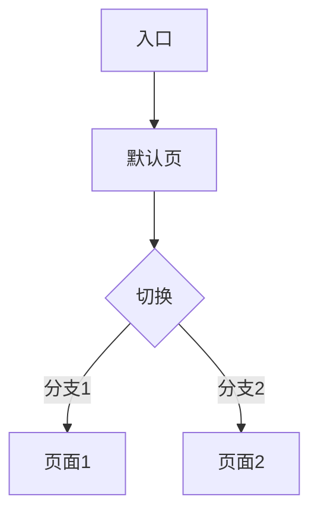
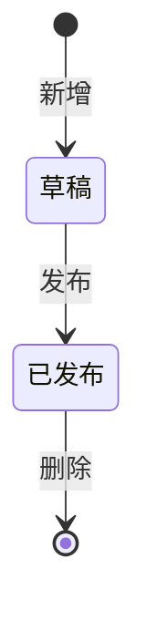

# 代码模板 (Code Templates)

Mode C 多版本改造的代码脚手架模板。使用时按项目实际情况调整。

---

## 1. meta.json 模板

```json
{
  "title": "<页面标题>",
  "module": "<业务域>",
  "defaultVersion": "v2",
  "versions": ["v1", "v2"],
  "tags": ["<标签1>", "<标签2>"]
}
```

## 2. index.tsx（多版本重导出）

```tsx
export { default } from './_versions/v2'
```

## 3. prd_vX.md 模板

完整结构详见 `.skills/page-generator.md` §11。以下为快速复制模板：

```markdown
# <页面标题> PRD

## 0. 文档信息
| 版本 | 日期 | 修改内容 | 作者 |
|------|------|---------|------|
| v1.0 | YYYY-MM-DD | 初稿 | <作者> |

## 1. 业务背景
- **产品定位**: <产品名>
- **目标用户**: <角色>
- **业务背景**: <为什么做，解决什么问题>
- **商业价值**: <预期收益>
- **成功指标**: <可量化衡量标准>
- **目标产品技术栈**: <待业务方确定，如 Vue3 + Element Plus / React + Ant Design>
- **设计系统**: <目标产品设计系统>
- **入口位置**: <在产品中的位置>

## 2. 功能概览
<2-3 句话说明核心功能与用户价值>

| 模块 | 功能点 | 优先级 | 类型 |
|------|--------|--------|------|
| <模块> | <功能> | Must | 新增 |

## 3. 用户故事
- US-1: 作为 <角色>，我想要 <动作>，以便于 <价值>
- US-2: 作为 <角色>，我想要 <动作>，以便于 <价值>

## 4. 功能需求详单

**FR-1 <功能名>**
| 项目 | 说明 |
|------|------|
| 用户故事 | US-1 |
| 优先级 | Must / Should / Could / Won't |
| 描述 | <用户能做什么> |
| 输入 | <字段 / 类型 / 格式 / 校验> |
| 输出 | <结果 / 数据格式 / 提示> |
| 业务规则 | 1) 触发条件 2) 校验逻辑 3) 冲突处理 4) 旧数据兼容 |
| 权限控制 | <角色 / 可见性 / 操作权限> |
| 状态流转 | <状态A → 状态B，触发条件> |

**验收标准 (Acceptance Criteria)**
- AC-1: Given <前置条件>, When <操作>, Then <预期结果>
- AC-2: Given <前置条件>, When <操作>, Then <预期结果>
- AC-3: Given <前置条件>, When <操作>, Then <预期结果>

**FR-2 <功能名>**
...

## 5. 数据要求
| 字段 | 类型 | 必填 | 校验规则 | 说明 |
|------|------|------|---------|------|
| code | string | 是 | 唯一 | 编码 |

## 6. 交互流程

流程图（Mermaid）+ 文字流程双轨制。复杂流程两者都要，简单流程可只有文字。


文字流程：入口 → 默认页 → 切换分支



## 7. 非功能性需求
- **性能**: 页面加载 ≤ 2s，列表查询 ≤ 500ms
- **安全**: 敏感字段脱敏，操作日志记录
- **兼容性**: Chrome 90+ / Firefox 88+
- **可访问性**: 键盘导航、ARIA 标签、对比度 AA

## 8. 边界情况
- 空状态: <无数据时显示>
- 加载状态: <skeleton / spinner>
- 错误状态: <网络异常 / 权限不足>
- 数据边界: <最大层级 / 最大数量>

## 9. 待办问题
- [ ] Q1: <问题> @<负责人>

## 10. 组件映射

> 目标产品开发时的组件库建议映射。

| UI 元素 | Ant Design | Element Plus | 关键属性 |
|---------|-----------|--------------|---------|
| 按钮 | Button | ElButton | type="primary" / "default" |
| 数据表格 | Table | ElTable | columns, dataSource, pagination |
| 文本输入 | Input | ElInput | placeholder, allowClear |
| 下拉选择 | Select | ElSelect | options, placeholder |
| 树形控件 | Tree | ElTree | treeData, onSelect |
| 表单项 | Form.Item | ElFormItem | label, rules |
| 弹窗 | Modal | ElDialog | title, open, onOk |
| 分页 | Pagination | ElPagination | total, current, pageSize |
| 标签 | Tag | ElTag | color |
```

### 渐进式采用

| 复杂度 | 必填 | 可选 |
|--------|------|------|
| 简单 | §0 §1 §2 §3 §4 | §5-§10 |
| 中等 | §0 §1 §2 §3 §4 §6 §8 | §5 §7 §9 §10 |
| 复杂 | §0-§10 全部 | - |

## 4. Changelog 模板

```markdown
# V1 → V2 改动验收清单

## 1. 对比概览

| 指标 | 数量 |
|------|------|
| 重构 | 0 |
| 新增 | 0 |
| 修改 | 0 |
| 删除 | 0 |
| **合计** | **0** |

**重点说明**：<一句话说明本次版本的核心变化>

**测试范围**：
- [ ] 个人视角 Tab
- [ ] 团队视角 Tab
- [ ] 详情弹窗

## 2. 重构项 (A)

| 编号 | 标题 | 验收要点 | 测试结果 |
|------|------|---------|---------|
| - | 无 | - | - |

## 3. 新增项 (B)

| 编号 | 标题 | 验收要点 | 测试结果 |
|------|------|---------|---------|
| - | 无 | - | - |

## 4. 修改项 (M)

| 编号 | 标题 | 验收要点 | 测试结果 |
|------|------|---------|---------|
| - | 无 | - | - |

## 5. 删除项 (R)

| 编号 | 标题 | 验收要点 | 测试结果 |
|------|------|---------|---------|
| - | 无 | - | - |

## 6. 测试 Checklist

### 基础验证
- [ ] Header 「显示新增功能点」开关正常工作
- [ ] 切换版本（V1/V2）后功能点标注正确
- [ ] 刷新页面后开关状态按「路由+版本」隔离
- [ ] 功能点 tooltip 位置正确（不被遮挡）

### PRD 文档联动
- [ ] 点击蓝色「说明」按钮 → DocPanel 弹出
- [ ] DocPanel 显示完整 PRD 段落（非简略描述）
- [ ] Esc 键关闭 DocPanel
- [ ] 遮罩点击关闭 DocPanel
- [ ] DocPanel 内 Markdown 表格渲染正确

### A/B 对比
- [ ] 切换到 V1 → 无功能点标注（或显示 V1 的标注）
- [ ] 切换到 V2 → 显示正确的功能点标注
- [ ] V1/V2 切换时无状态残留

### 视觉回归
- [ ] 页面缩放（50%-200%）正常
- [ ] 窄屏适配正常
- [ ] 设计系统预设一致
```

## 5. extractSection 工具函数

```tsx
/**
 * Extract a PRD section between **startFr and **endFr (exclusive).
 * Returns markdown content with heading levels adjusted (## → #).
 */
function extractSection(raw: string, startFr: string, endFr?: string): string {
  const lines = raw.split('\n')
  let start = -1, end = lines.length
  for (let i = 0; i < lines.length; i++) {
    if (lines[i].includes(`**${startFr}`)) start = i
    if (endFr && lines[i].includes(`**${endFr}`)) { end = i; break }
  }
  if (start === -1) return `<!-- Section ${startFr} not found in PRD -->`
  return lines.slice(start, end).join('\n').replace(/^#{1,6} /gm, (m) => m + ' ')
}
```

## 6. FEATURE_LABELS 完整示例

```tsx
const FEATURE_LABELS: Record<string, {
  type: 'A' | 'B' | 'M' | 'R'
  title: string
  desc: string
}> = {
  // 重构：信息架构/逻辑调整
  'A.01': { type: 'A', title: '顶层双视角 Tab', desc: '页面最顶部显示个人视角/团队视角切换 Tab' },

  // 新增：全新功能
  'B.01': { type: 'B', title: '团队统计卡', desc: '团队视角聚合统计：待办/超时/平均时长/本周通过' },
  'B.02': { type: 'B', title: '团队 4 子 Tab', desc: '团队视角下新增 4 个子 Tab：总览/待办/分布/效率' },

  // 修改：现有功能调整
  'M.01': { type: 'M', title: '部门/成员筛选', desc: '团队视角新增部门下拉+成员下拉筛选' },
  'M.02': { type: 'M', title: '看板分组', desc: '我的看板支持按状态分组显示' },

  // 删除：移除的功能
  'R.01': { type: 'R', title: '旧版统计模块', desc: '移除 V1 中独立的统计面板，整合到团队视角' },
}
```

## 7. 版本容器（强制 remount）

```tsx
// 在 App.tsx 或 Layout 中，版本切换时强制 remount
<ErrorBoundary>
  <Suspense fallback={null}>
    <div
      key={`${routePath}-${prdKey}`}
      className="w-full h-full transition-transform duration-100 origin-center"
      style={{ transform: `scale(${zoom})` }}
    >
      <PageComponent />
    </div>
  </Suspense>
</ErrorBoundary>
```

## 8. localStorage key 规范

```
<route>__v<X>_show
```

示例：
- `feat_oa_approvalcenter__v1_show`
- `feat_oa_approvalcenter__v2_show`

读取/写入封装：
```tsx
const getFeatureKey = (route: string, version: string) => `feat_${route.replace(/\//g, '_')}__${version}_show`

const loadFeatureShow = (route: string, version: string): boolean => {
  try {
    return localStorage.getItem(getFeatureKey(route, version)) === '1'
  } catch {
    return false
  }
}

const saveFeatureShow = (route: string, version: string, show: boolean) => {
  try {
    localStorage.setItem(getFeatureKey(route, version), show ? '1' : '0')
  } catch {}
}
```

## 9. 完整 v2.tsx 文件骨架

```tsx
import { useState, useRef, useEffect, createContext, useContext, useCallback } from 'react'
import { createPortal } from 'react-dom'
import ReactMarkdown from 'react-markdown'
import remarkGfm from 'remark-gfm'
import prdV2Raw from '../prd_v2.md?raw'

// === PRD 段落提取 ===
function extractSection(raw: string, startFr: string, endFr?: string): string {
  // ... 见上文模板 5
}

// === 功能点定义 ===
const FEATURE_LABELS = { /* ... 见上文模板 6 */ }

// === PRD 文档映射 ===
const FEATURE_DOCS: Record<string, string> = {
  'A.01': extractSection(prdV2Raw, 'FR-1'),
  'B.01': extractSection(prdV2Raw, 'FR-3'),
  // ...
}

// === DocContext ===
const DocContext = createContext<(code: string) => void>(() => {})

// === DocPanel（Portal 到 body） ===
function DocPanel({ code, onClose }: { code: string | null; onClose: () => void }) {
  // ... 见 page-generator.md §7.5
}

// === NewTag（胶囊形说明按钮） ===
function NewTag({ code }: { code: string }) {
  // ... 见 page-generator.md §7.6
}

// === 版本页 ===
export default function V2Page() {
  const [docCode, setDocCode] = useState<string | null>(null)
  const openDoc = useCallback((code: string) => setDocCode(code), [])
  const closeDoc = useCallback(() => setDocCode(null), [])

  return (
    <DocContext.Provider value={openDoc}>
      <div className="flex flex-col min-h-screen bg-background text-foreground">
        {/* Page header */}
        <header className="h-14 flex items-center justify-between px-6 border-b border-border bg-muted/30 shrink-0">
          {/* ... */}
        </header>
        {/* Page content with feature tags */}
        <main className="flex-1 overflow-auto p-6">
          <div className="relative">
            <h1>页面标题</h1>
            <NewTag code="A.01" />
          </div>
          {/* ... */}
        </main>
      </div>
      <DocPanel code={docCode} onClose={closeDoc} />
    </DocContext.Provider>
  )
}
```
