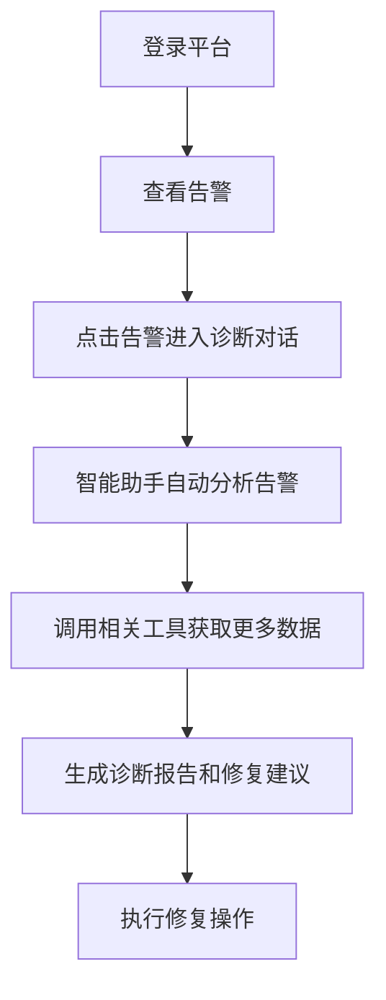
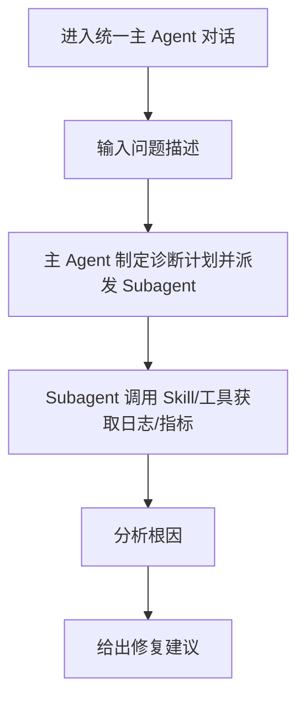
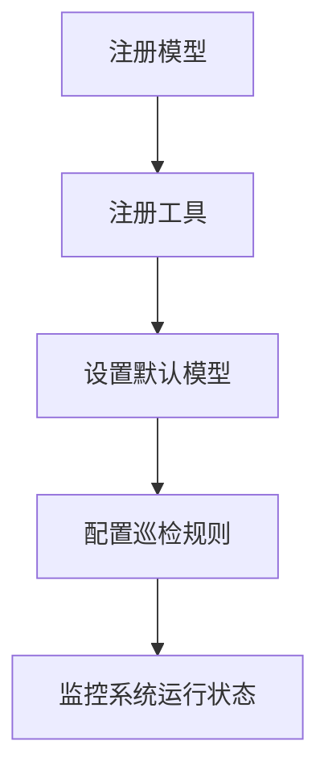

# 智能诊断平台 - 需求分析报告

## 1. 竞品分析

### 1.1 同类产品对比

| 产品 | 定位 | 优势 | 劣势 | 我们的差异化 |
|------|------|------|------|----------------|
| **LangFlow** | 低代码流编排 | 可视化编排、社区生态丰富 | 界面较厚重，偏开发人员使用，不适合运维人员 | 面向运维场景做功能减法，聚焦诊断对话而非复杂编排 |
| **ChatGPT Custom GPTs** | GPT 定制 | 开箱即用、生态好 | 依赖 OpenAI、不适合私有化部署、无法对接内部 MCP 工具 | 完全私有化部署，深度集成企业内部算力平台 |
| **LangChain Studio** | 开发调试 | 功能完整 | 本地桌面端，不支持多用户协作 | Web 化多租户，支持团队协作和权限管理 |
| **Dify** | LLM 应用开发平台 | 可视化、支持 RAG、插件 | 偏向应用生成，诊断功能薄弱 | 专注智能诊断场景，深度集成监控告警和巡检 |

### 1.2 竞品总结

我们的差异化优势：
1. **场景垂直**：专注运维智能诊断，不是通用 LLM 平台
2. **深度集成**：与企业现有容器云+算力平台深度对接，不是孤立产品
3. **多角色**：支持运维/开发/管理员三种角色，不同角色有不同视图
4. **Web 原生**：纯 Web 访问，无需安装客户端

## 2. 用户路径分析

### 2.1 典型用户路径：运维人员故障排查

### 2.2 典型用户路径：开发人员调试应用

### 2.3 典型用户路径：平台管理员配置系统

## 3. 需求优先级排序（MoSCoW）

### Must Have（必须做）

- [x] 模型管理：注册、列表、启停、默认模型设置
- [x] 工具管理（MCP）：注册、列表、启停
- [x] 智能对话：多轮对话、统一主 Agent、工具调用展示、流式响应
- [x] OIDC 统一认证入口
- [x] 参考现有平台风格（Ant Design 5.x）

### Should Have（应该做）

- [x] 告警中心：三种告警类型展示、筛选
- [x] 平台巡检：计划、规则、结果
- [x] GPU 资源监控（对接 Hami）
- [x] 技能管理：定义、绑定模型工具

### Could Have（可以做）

- [ ] 对话导出/分享
- [ ] 知识库关联智能体
- [ ] 操作审计日志查询

### Won't Have（不做）

- [ ] LangFlow 式可视化流编排（保持简洁对话式交互）
- [ ] 模型训练/微调（只做调度不做训练）
- [ ] 自定义工作流拖拽编排（聚焦对话诊断）

## 4. 技术可行性分析

### 4.1 前端

- **设计风格**：匹配现有平台 Ant Design 5.x 风格，通过平台设计系统 token 实现，一致性好
- **组件支持**：Shadcn UI + Tailwind 可完全实现所有组件
- **流式响应**：React 原生支持 Server-Sent Events 或 fetch streaming，技术成熟

### 4.2 后端集成

- **OIDC 认证**：现有容器云平台已提供，只需前端对接回调
- **Hami+Ray 调度**：通过现有 API 对接，前端只需展示状态
- **MCP 工具**：协议已定，前端只需展示调用过程

### 4.3 风险识别

- **流式响应大模型延迟**：前端已做骨架+流式分段渲染，可缓解
- **大页面列表渲染**：分页处理，避免一次性加载过多数据

## 5. 结论

需求边界清晰，技术方案可行，可进入方案设计阶段。
