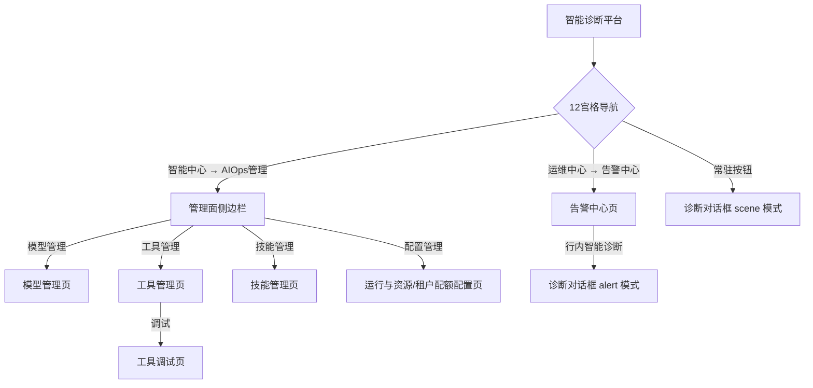
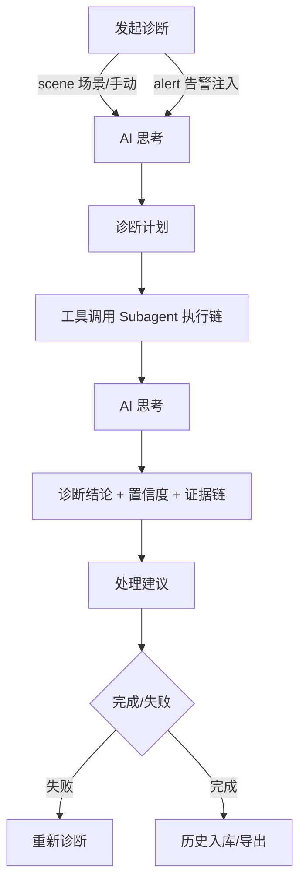
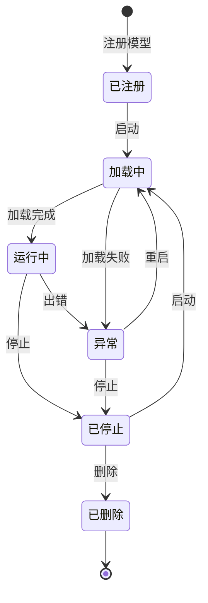
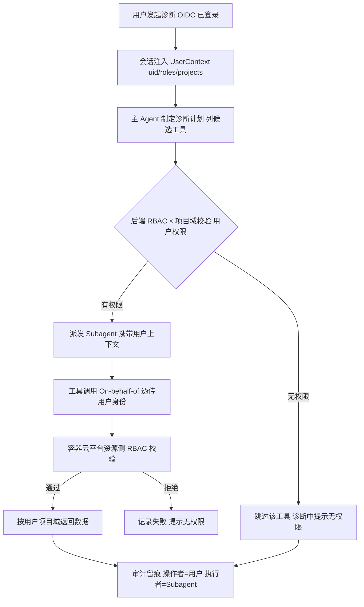

# IssuePilot 智能诊断平台 PRD

## 0. 文档信息
| 版本 | 日期 | 修改内容 | 作者 |
|------|------|---------|------|
| v1.0 | 2026-08-07 | 初稿，完整 PRD 结构 | lianghua |
| v2.0 | 2026-08-07 | 与当前原型实现对齐：移除管理面智能对话页、工具管理重构（协议/请求头/连通性测试/查看函数/调试）、告警中心 5 Tab（历史告警无智能诊断）、诊断流程「根因分析→诊断结论」、巡检 Skill 联动场景、历史记录单条导出、暂不支持多对话 Tab | lianghua |
| v3.0 | 2026-08-13 | 同步原型变更：对话助手命名统一为「Copilot AI 智能助手」；技能管理移除创建/编辑能力（仅保留导入/导出/删除）；新增配置管理（FR-6 Agent 运行参数配置） | lianghua |
| v3.1 | 2026-09-22 | 配置管理重构：参数设置→并发与配额、审计保留→会话留存，新增会话留存分区与导出审计数据功能（编辑按钮左侧）；模型/工具/技能管理 Header 对齐平台风格（标题行+工具栏行：创建居左、搜索/筛选居右，去掉独立筛选卡）；配置页标题栏右侧加提示文字 | lianghua |

## 1. 业务背景
- **产品定位**: IssuePilot 智能诊断平台（Web 端）
- **目标用户**: 运维人员、SRE 工程师、DBA、安全工程师、平台管理员
- **用户体系**: 用户身份依托容器云平台底座功能 **OIDC** 统一认证（诊断平台无独立账号体系）；权限基于容器云平台 **RBAC** 模型，按「角色 → 权限 → 项目域」三级授权。用户**仅能查看与操作自己所属项目域内的资源**（Pod/服务/告警/巡检计划/日志等），跨项目资源不可见、不可操作（分权限分域隔离）
- **业务背景**: 原有 Electron 桌面端 + Python Server 架构存在部署成本高、算力无法共享、无多租户隔离、无平台级集成等痛点。需升级为 Web 平台化架构，深度融合容器云平台（GTCP+OIDC）和算力加速平台（GTCAP），实现 AI 模型、MCP 工具和诊断技能的统一管理
- **商业价值**: 运维诊断效率提升 60%，GPU 算力利用率提升 40%，多团队协作效率提升 50%
- **成功指标**: 模型注册到部署 ≤ 5 分钟，MCP 工具服务发现 ≤ 10 秒，对话首包响应 ≤ 3s，巡检覆盖率 100%
- **目标产品技术栈**: React + Vite + Tailwind CSS（原型实现，原型已采用 Element Plus 风格 + lucide-react 图标库）
- **入口位置**: 智能诊断平台（单入口子应用），管理面导航 + 应用面常驻对话按钮

## 2. 功能概览
IssuePilot 智能诊断平台提供 AI 驱动的智能诊断能力。架构遵循「统一主 Agent + 预置 Skill + 动态派发 Subagent」：用户不区分 Agent，对话统一由主 Agent 处理，主 Agent 按诊断计划动态派发 Subagent 执行预置 Skill（能力 = SKILL.md 技能文件，执行载体 = 动态 Subagent）。

平台定位「框架 + 内容」：管理面承载模型/工具/技能配置，应用面提供统一诊断入口（常驻对话 + 告警中心），具体故障场景通过定制 Skill 与 MCP 工具实现。

| 视图 | 模块 | 功能点 | 优先级 | 类型 |
|------|------|--------|--------|------|
| 管理面 | 模型管理 | 模型注册 | Must | 新增 |
| 管理面 | 模型管理 | 模型启停控制 | Must | 新增 |
| 管理面 | 模型管理 | 默认模型设置 | Must | 新增 |
| 管理面 | 工具管理 (MCP) | 工具添加/编辑/删除/启停 | Must | 新增 |
| 管理面 | 工具管理 (MCP) | 工具类型与协议（SSE/Streamable HTTP） | Must | 新增 |
| 管理面 | 工具管理 (MCP) | 自定义请求头 | Must | 新增 |
| 管理面 | 工具管理 (MCP) | 连通性测试 | Must | 新增 |
| 管理面 | 工具管理 (MCP) | 查看函数（行内展开） | Must | 新增 |
| 管理面 | 工具管理 (MCP) | 函数调试（独立页面） | Must | 新增 |
| 管理面 | 技能管理 | 技能导入/导出/删除 | Must | 新增 |
| 管理面 | 配置管理 | 运行时资源托管展示（CPU/内存）+ 并发与配额/回收策略/审批策略/会话留存卡片级编辑（子智能体并发/运行时上限、生命周期/闲置回收、审批等待期限300s、会话保留期限180天+导出审计数据） | Should | 新增 |
| 应用面 | 智能诊断 | 常驻对话（场景卡片 6 个 + 手动输入） | Must | 新增 |
| 应用面 | 智能诊断 | 五阶段诊断流程（思考→计划→工具调用→结论→建议） | Must | 新增 |
| 应用面 | 智能诊断 | 工具卡片可视化（指标趋势/链路拓扑/火焰图） | Must | 新增 |
| 应用面 | 智能诊断 | 诊断历史（还原 + 单条导出） | Must | 新增 |
| 应用面 | 智能诊断 | 巡检 Skill 联动（复用平台巡检计划） | Should | 新增 |
| 运维面 | 告警中心 | 告警消息 3 Tab（指标/日志/事件） | Must | 新增 |
| 运维面 | 告警中心 | 告警概览与历史告警 | Must | 新增 |
| 运维面 | 告警中心 | 告警行内「智能诊断」联动 | Must | 新增 |

## 用户与权限模型

### 认证与授权（依托容器云平台）
- **认证**: OIDC统一认证，平台不维护独立账号体系。所有页面与 API 请求携带 OIDC ID Token / Access Token
- **授权**: RBAC 三级模型——**角色（Role）→ 权限（Permission）→ 项目域（Project/Workspace）**。用户在容器云平台被授予角色与所属项目，平台侧不重复授权，直接复用容器云平台的权限判定结果
- **分权限分域**: 用户仅能访问自己所属项目域内的资源。诊断目标（Pod/服务/节点）、日志、指标、链路、告警、巡检计划等全部按项目域过滤；跨项目数据不可见

### Agent 操作平台资源的权限继承方案（框架设计）
> 核心原则：**Agent 不持有平台身份，只代理发起用户的身份执行，权限只减不增**——智能诊断可以操作平台所有资源，但每一次操作都落在发起用户自己的权限边界内。

| 机制 | 说明 |
|------|------|
| **身份透传（On-behalf-of）** | 诊断会话绑定发起用户（OIDC claims：uid/roles/projects）；主 Agent 派发 Subagent 调用工具时，工具请求**携带用户上下文透传到后端**，后端以该用户身份调用容器云平台 API，资源侧 RBAC 自动校验。Agent 无独立账号，天然继承用户权限边界 |
| **项目域强制过滤（数据层兜底）** | 所有工具查询在服务端强制绑定用户所属项目域，即使工具端点可访问跨域数据，返回结果也只允许用户项目域内资源，杜绝越权取数 |
| **操作审计** | Agent 发起的每次工具调用/资源操作记录审计日志（操作者=发起用户、执行载体=Subagent、目标资源、时间、结果）；敏感操作（重启/执行/变更）需二次确认并强制留痕 |

**与现有原型衔接**：
- 工具权限统一由容器云平台 OIDC + RBAC 管控，原型不展示工具级权限声明/预检 UI，权限判定完全落在后端资源侧 RBAC 与项目域过滤
- 处理建议中的可执行项复用平台 RBAC——用户无执行权限时按钮置灰并提示「无 <权限>，无法执行」，与现有 `AGENT_EXEC_ENABLED=false` 逻辑衔接

## 3. 用户故事
- US-1: 作为平台管理员，我想要注册和管理 AI 模型并设置默认模型，以便于为智能诊断提供推理能力
- US-2: 作为平台管理员，我想要注册和管理 MCP 工具服务（协议/请求头/连通性测试/函数调试），以便于主 Agent 调用外部系统能力
- US-3: 作为平台管理员，我想要创建和管理诊断技能（SKILL.md），以便于将模型+工具编排为可复用的诊断能力
- US-4: 作为普通用户，我想要通过常驻对话或场景卡片直接发起智能诊断（无需选择智能体），以便于快速定位故障
- US-5: 作为普通用户，我想要查看诊断过程（Subagent 派发、工具调用、思考过程、证据链），以便于理解诊断逻辑
- US-6: 作为运维人员，我想要查看告警中心并在告警行直接发起智能诊断，以便于及时发现和处理系统异常
- US-7: 作为运维人员，我想要查看历史诊断记录并导出报告，以便于复盘与留档
- US-8: 作为运维人员，我想要询问集群健康状态时自动运行平台巡检计划并解读结果，以便于快速掌握系统健康
- US-9: 作为普通用户，我想要智能诊断只在我所属项目域内、以我的权限执行资源查询与操作，以便于不越权访问或变更他人资源

## 4. 功能需求详单

**FR-1 模型管理**
| 项目 | 说明 |
|------|------|
| 用户故事 | US-1 |
| 优先级 | Must |
| 描述 | 模型注册、编辑、默认模型设置。模型由平台模型服务层（vLLM 部署 / API 网关集成）统一封装，对外暴露标准协议接口。支持模型类型：对话、嵌入、Rerank、多模态。模型无运行态概念，不提供启停操作 |
| 输入 | 模型名称、模型服务商（锁定为「算力加速平台」，预留外接模型口子）、模型类型、模型协议（OpenAI Responses / OpenAI Chat Completions / Anthropic Messages / Google Generative AI，默认 OpenAI Chat Completions）、BaseURL（必填）、API Key（非必填，内网/网关部署可留空）、上下文窗口（tokens，默认 128000）、最大输出 max_token（默认 4096） |
| 输出 | 模型列表（含名称、服务商、协议、类型、BaseURL、创建时间），可按名称检索与按类型筛选，对话/多模态模型可「设为默认」 |
| 业务规则 | 1) 触发条件: 进入页面自动加载模型列表 2) 检索与筛选: 支持按模型名称/服务商模糊搜索，按模型类型（对话/嵌入/Rerank/多模态）筛选 3) 校验逻辑: 模型名称与 BaseURL 为必填，校验不通过时在表单底部提示；API Key 非必填；上下文窗口/最大输出为数值参数 4) 模型服务商锁定为平台内置「算力加速平台」，注册/编辑表单不可修改，外接模型为后续迭代 5) 默认模型: 仅对话/多模态类型可设为默认（嵌入/Rerank 为检索能力，不可作主推理模型）；默认模型持久化，会话发起默认使用 6) 注册/编辑共用同一表单弹窗，编辑时预填并支持「保存修改」 |
| 权限控制 | 仅平台管理员可注册/编辑/删除/设默认模型|
| 状态流转 | 无运行态；模型注册后即为可用配置，删除即从列表移除 |

**验收标准 (Acceptance Criteria)**
- AC-1: Given 平台管理员已登录，When 进入模型管理页，Then 标题行 + 工具栏行（注册模型按钮居左、类型筛选 + 搜索框居右，同一行），无独立筛选卡片，下方显示模型列表
- AC-2: Given 点击「注册模型」，When 填写完整表单（名称/类型/协议/BaseURL 必填）并提交，Then 列表新增一条记录
- AC-3: Given 注册/编辑表单必填项为空，When 点击「确认注册/保存修改」，Then 表单底部提示「请填写模型名称和 BaseURL」，不提交
- AC-4: Given 模型卡片点击「编辑」，When 打开表单弹窗，Then 预填该模型现有配置，修改后「保存修改」更新列表记录
- AC-5: Given 对话/多模态模型卡片，When 点击「设为默认」，Then 该模型标记为默认模型，会话发起默认使用；嵌入/Rerank 模型不提供「设为默认」入口
- AC-6: Given 注册/编辑表单，When 查看「模型服务商」，Then 锁定显示为「算力加速平台」且不可修改
- AC-7: Given 注册/编辑表单，When 查看模型协议，Then 默认选中「OpenAI Chat Completions」，可切换其余三种协议
- AC-8: Given 注册/编辑表单 API Key 字段，When 内网/网关部署，Then 可不填写直接提交（非必填）
- AC-9: Given 模型列表，When 使用搜索框或类型筛选，Then 仅展示名称/服务商匹配或类型命中的模型，无启停/运行状态相关元素

**FR-2 工具管理 (MCP)**
| 项目 | 说明 |
|------|------|
| 用户故事 | US-2 |
| 优先级 | Must |
| 描述 | MCP 工具服务的注册与管理中心（仅 MCP Server，不提供自定义工具）。服务端部署：协议仅支持 SSE / Streamable HTTP（不支持 Stdio）；支持自定义请求头（鉴权通过 Authorization 等请求头承载）、连通性测试、函数查看与函数调试；MCP Server 具备完整生命周期状态 |
| 输入 | 协议（SSE/Streamable HTTP）、工具名称、服务器地址、描述、自定义请求头（key-value，可承载鉴权信息） |
| 输出 | 工具列表（含 ID、工具名称、工具类型、协议、路径/来源、开关 + 异常错误图标）+ 统计概览（状态视角：总计/已就绪/异常/已禁用）|
| 业务规则 | 1) 触发条件: 进入页面自动加载工具列表 2) 校验逻辑: 协议仅 SSE / Streamable HTTP（服务端部署不支持 Stdio），端点格式为 URL；鉴权信息通过自定义请求头承载（如 Authorization: Bearer xxx），无需独立鉴权配置 3) 冲突处理: 不可重复注册同一端点 4) 部署方式: 服务端已部署，客户端仅对接，不负责部署 5) 函数调试: 选择函数→按 Schema 填参→运行→深色控制台输出结果 6) 状态与开关: MCP Server 7 态——disabled(管理员停用，开关关)/connecting(开启中，开关开+转圈)/ready(开启成功，开关开)/degraded、authRequired、incompatible、unavailable(均为开启失败，开关回关并附错误图标)；其中 connecting 为开启/刷新过程的瞬时态，4 个异常态为开启失败的稳定态（鼠标移入错误图标展示原因） 7) 连通性测试: 测试返回映射为 ready(成功)/authRequired(鉴权请求头缺失或失效)/incompatible(协议或目录不符)/unavailable(地址或网络不可达) 8) 检索与筛选: 页面提供搜索框（按名称模糊检索，带一键清空）+ 类型筛选 tab（全部/内置工具/MCP 工具）+ 状态筛选 tab（全部/已就绪/异常/已禁用），两类 tab 可组合叠加；统计卡片为状态视角——总计=全部工具数、已就绪=ready、异常=4 个异常态合计、已禁用=disabled；调试功能保留代码（独立页面）但列表操作列不展示「调试」按钮 |
| 权限控制 | 仅平台管理员可注册/编辑/删除/启停工具|
| 状态流转 | 已注册 →(点击开启)→ connecting(转圈) →(成功)→ ready；(开启失败)→ 异常态（开关回关+错误图标）；ready →(停用)→ disabled；函数可查看（行内展开）与调试（独立页面） |

**验收标准 (Acceptance Criteria)**
- AC-1: Given 平台管理员已登录，When 进入工具管理页，Then 标题行 + 工具栏行（添加工具按钮居左、状态 tab + 搜索框居右，同一行），无独立筛选卡片；下方显示工具列表（ID/名称/类型/协议/路径/开关+异常错误图标）与统计概览（状态视角：总计/已就绪/异常/已禁用）
- AC-2: Given 点击「添加工具」，When 表单直接为 MCP Server（无自定义工具选项），填写（协议/名称/地址/请求头）并点击「连通性测试」，Then 显示测试结果并映射为对应状态（ready/authRequired/unavailable 等）
- AC-3: Given 添加工具表单，When 配置自定义请求头（如 Authorization: Bearer xxx），Then 可增删多组请求头，鉴权信息通过该头部承载，无独立鉴权配置项
- AC-4: Given 添加工具表单，When 配置自定义请求头（添加头部 key-value），Then 可增删多组请求头
- AC-5: Given 工具列表操作列，When 点击「查看函数」，Then 在该行下方直接展开函数列表（无弹窗、无遮罩），再次点击收起
- AC-6: Given 工具列表操作列，When 点击「查看函数」，Then 在该行下方直接展开函数列表（无弹窗、无遮罩），再次点击收起；调试功能保留独立页面代码但列表操作列不展示「调试」按钮
- AC-7: Given 工具状态列，When 点击开关开启，Then 先进入 connecting(转圈)，成功落 ready、失败落异常态（开关回关+错误图标）；点击开关关闭，Then 落 disabled

**FR-3 技能管理**
| 项目 | 说明 |
|------|------|
| 用户故事 | US-3 |
| 优先级 | Must |
| 描述 | 可复用的诊断技能管理。技能 = SKILL.md 文件（frontmatter: name/description/version + 正文指令），文件存在即生效，无启用/禁用生命周期状态。原型不提供创建与编辑入口（技能以 SKILL.md 文件形式存在即生效，由开发侧维护），页面仅支持导入/导出/删除 |
| 输入 | 导入：SKILL.md 文件或技能.zip 文件（包含多个 SKILL.md 文件）（解析 frontmatter: name/description/version + 正文指令）；|
| 输出 | 技能卡片列表（含技能名称、描述、版本、更新时间）+ 分页 |
| 业务规则 | 1) 触发条件: 进入页面自动加载技能列表 2) 文件模式: 技能无来源/状态标签，不绑定模型；创建/编辑不在原型 UI 提供（符合"技能即文件"理念，由开发侧维护 SKILL.md）3) 交互: 仅支持导入（解析 frontmatter）、导出（下载 .md）、删除（需确认）|
| 权限控制 | 仅平台管理员可导入/删除技能 |
| 状态流转 | 导入 → 解析 frontmatter → 列表新增卡片；删除 → 确认 → 移除 |

**验收标准 (Acceptance Criteria)**
- AC-1: Given 平台管理员已登录，When 进入技能管理页，Then 标题行 + 工具栏行（导入技能按钮居左、搜索框居右，同一行），无独立筛选卡片，下方显示技能卡片列表和分页
- AC-2: Given 点击「导入技能」，When 上传 .md 文件/zip 文件，Then 自动解析 frontmatter 并预览名称/描述/版本，确认后入库
- AC-3: Given 技能卡片，When 点击「导出」，Then 下载该技能的 SKILL.md 文件/zip 文件
- AC-4: Given 点击「删除」，When 弹窗确认，Then 删除后不可恢复
- AC-5: Given 技能管理页，When 查看操作区，Then 仅显示「导出」「删除」按钮，无「创建」「编辑」入口

**FR-4 智能诊断（应用面统一入口）**
| 项目 | 说明 |
|------|------|
| 用户故事 | US-4, US-5, US-8 |
| 优先级 | Must |
| 描述 | 应用面统一诊断入口。双入口：① 常驻对话（右下角浮动按钮，场景模式+手动输入主题）；② 告警中心行内「智能诊断」（alert 预填模式）。对话助手统一命名为「Copilot AI 智能助手」（顶部标题、欢迎语、导出报告标题均使用该命名）。 |
| 输入 | scene 模式：场景卡片（6 个固定场景）或手动输入（通用诊断主题）；alert 模式：告警行上下文（策略/级别/目标/消息）自动注入 |
| 输出 | 五阶段消息流：用户请求 → AI 思考（折叠）→ 诊断计划 → 工具调用（Subagent 执行链）→ AI 思考（折叠）→ 诊断结论（含置信度 + 可展开证据链）→ 处理建议（可执行项带按钮，无执行能力时提示联系管理员） |
| 业务规则 | 1) 场景卡片固定 6 个：容器故障诊断/日志异常分析/性能剖析/数据库慢查询/网络排障/集群健康巡检 2) 工具卡片两层展示：外层=工具名+参数+结果汇总+Subagent 执行链；内层点击展开=原始内容+SVG 可视化（指标趋势/链路拓扑/火焰图） 3) 执行能力开关 AGENT_EXEC_ENABLED=false 时，处理建议区提示「当前无可执行智能体，请联系平台管理员」 4) 诊断历史持久化（最近 20 条），双入口共用，点击还原完成态，每条可「导出报告」（Markdown 下载） 5) 巡检场景：复用平台已创建的巡检计划，不重复实现定时调度——派发「巡检执行 Subagent」执行 inspection-run/health-check/report-analysis skill |
| 权限控制 | 所有登录用户可发起智能诊断 |
| 状态流转 | 发起 → 思考 → 计划 → 工具调用 → 思考 → 结论 → 建议 → 完成/失败（失败可重新诊断）；scene 模式可「换个场景」；可追问不重置状态 |

**验收标准 (Acceptance Criteria)**
- AC-1: Given 常驻对话入口，When 点击右下角浮动按钮，Then 空态显示 6 个场景卡片 + 手动输入框
- AC-2: Given 场景卡片，When 点击任一场景，Then 以该主题进入五阶段诊断；手动输入走「通用诊断」主题
- AC-3: Given 诊断进行中，When 五阶段推进，Then 每条 AI 消息逐条流式出现（思考折叠/计划/工具/结论/建议）
- AC-4: Given 工具调用阶段，When 展开工具卡片，Then 显示 Subagent 执行链（[subagent] → [skill]）和原始查询结果/SVG 图表
- AC-5: Given 诊断完成，When 查看诊断结论卡，Then 显示「诊断结论」+ 置信度（高/中/低）+ 可展开证据链
- AC-6: Given 处理建议区，When 无执行能力，Then 显示「当前无可执行智能体，请联系平台管理员」
- AC-7: Given 诊断历史，When 点击历史记录，Then 还原该次诊断完成态；点击「导出报告」下载 Markdown
- AC-8: Given 巡检场景，When 用户询问集群健康状态，Then 自动运行平台已创建的巡检计划并解读结果

**FR-5 告警中心**
| 项目 | 说明 |
|------|------|
| 用户故事 | US-6 |
| 优先级 | Must |
| 描述 | 告警消息中心，增加智能诊断入口。 |
| 输入 | 指标告警/日志告警/事件告警 Tab 操作栏增加 智能诊断按钮；告警行上下文（策略/级别/目标/消息）自动注入 |
| 输出 | 五阶段消息流：用户请求 → AI 思考（折叠）→ 诊断计划 → 工具调用（Subagent 执行链）→ AI 思考（折叠）→ 诊断结论（含置信度 + 可展开证据链）→ 处理建议（可执行项带按钮，无执行能力时提示联系管理员）|
| 业务规则 | 1) 指标告警/日志告警/事件告警：行内「智能诊断」按钮 → 注入告警上下文发起诊断（alert 模式） 2) 历史告警：仅展示数据，不提供智能诊断入口  3) 入口：仅 12 宫格全局导航「运维中心 → 告警中心」调出（默认隐藏），告警中心页自带导航栏，隐藏常驻智能中心导航 |
| 权限控制 | 运维人员和项目中普通用户可发起告警智能诊断；各自只能访问自身权限的资源 |
| 状态流转 | Tab 切换 → 筛选 → 查询 → 列表展示；行内「智能诊断」→ 打开共享诊断对话框（alert 模式自动发起） |

**验收标准 (Acceptance Criteria)**
- AC-1: Given 告警中心，When 进入页面，Then 显示 5 个 Tab（概览/指标/日志/事件/历史）
- AC-2: Given 指标/日志/事件告警 Tab，When 点击行内「智能诊断」，Then 打开共享诊断对话框并预填告警上下文自动发起诊断
- AC-3: Given 历史告警 Tab，When 查看列表，Then 不显示「操作」列（无智能诊断入口）
- AC-4: Given 概览 Tab，When 查看，Then 显示统计卡片和告警类型分布
- AC-5: Given 筛选区，When 填写筛选条件并点击「查询」，Then 列表按条件过滤
- **FR-6 配置管理（运行时资源 + 并发与配额 + 回收策略 + 审批策略 + 会话留存）**
| 项目 | 说明 |
|------|------|
| 用户故事 | US-2（平台管理员配置 Agent 运行时资源与多租户配额） |
| 优先级 | Should |
| 描述 | 平台配置中心，单页分层展示五个分区：**运行时资源**（平台统一托管、不展示编辑入口、仅展示运行时资源保障只读框）；**并发与配额**（可编辑）；**回收策略**（可编辑）；**审批策略**（可编辑）；**会话留存**（可编辑 + 导出审计数据）。参数为前端原型，支持本地保存与预校验；实际生效依赖后端能力，接口就绪后自动绑定。标题栏右侧附提示文字「点击卡片右上角「编辑」进行修改」，无独立页面说明区块 |
| 输入 | 仅展示/开放以下参数：运行时资源保障（CPU 2 核 / 内存 4 GiB，平台托管只读）；并发与配额（子智能体并发数、运行时上限）；回收策略（最长生命周期、闲置回收期限）；审批策略（审批等待期限）；会话留存（保留期限）。平台级容量、预热池策略、执行调度与每 Turn 并发数等调度器内部细节不在此展示 |
| 输出 | 标题栏（标题 + 右侧提示文字）+ 五个分区卡片。运行时资源分区：运行时资源保障只读框（CPU 2 核 / 内存 4 GiB）；并发与配额、回收策略、审批策略分区：每参数独立卡片，默认态展示当前值与说明 + 右上角「编辑」按钮，点击进入编辑态出现数字输入框 + 右下角「取消 / 确认」按钮，确认后写入并显示保存时间；会话留存分区：保留期限卡片 + 右上角「导出审计数据」按钮（位于「编辑」按钮左侧），点击弹出时间范围选择弹窗（近 7/30/90 天或全部保留期） |
| 业务规则 | 1) 触发条件: 进入页面加载本地已保存配置，无则使用默认值 2) 卡片级编辑: 每个可编辑卡片独立进入编辑态，确认即持久化（localStorage），取消丢弃草稿；无组级保存/重新读取 3) 约束: 可编辑项在 min/max 区间内可调整 4) 精简原则: 平台级容量、预热池策略、执行调度参数、每 Turn 并发数为调度器内部细节，不提供展示与编辑入口；每 Turn 并发数与每用户并发数语义重叠，不重复展示 5) 运行时资源保障（CPU/内存）为只读展示，管理员不可修改 6) 审批策略: 仅对「新生成」的审批卡生效，设置冻结等待期限（默认 300 秒），已存在的审批卡保持原有期限不变 7) 会话留存: Agent 会话存入数据库的保留时间，用于后续故障处理的按需导出；缩短期限会使更早的会话数据进入后台清理范围；本页不展示会话记录 8) 导出审计数据: 在会话留存卡片右上角（编辑按钮左侧）提供导出按钮，点击弹出时间范围选择弹窗（近 7/30/90 天或全部保留期），确认后模拟导出 9) 默认值: 子智能体并发数 8 / 运行时上限 3 / 最长生命周期 24h / 闲置回收 15min / 审批等待期限 300s / 会话保留期限 180 天；运行时资源保障 CPU 2 核 / 内存 4 GiB |
| 权限控制 | 仅平台管理员可修改「并发与配额」「回收策略」「审批策略」「会话留存」分区参数 |
| 状态流转 | 点击卡片编辑 → 修改数值 → 确认 → 本地持久化并显示时间；取消 → 回退原值；会话留存卡片支持点击「导出审计数据」弹出时间范围选择弹窗 |

**验收标准 (Acceptance Criteria)**
- AC-1: Given 平台管理员已登录，When 进入配置管理页，Then 标题栏右侧显示提示文字「点击卡片右上角「编辑」进行修改」，下方单页分层展示五个分区：运行时资源（平台托管只读）、并发与配额（可编辑）、回收策略（可编辑）、审批策略（可编辑）、会话留存（可编辑 + 导出），无「平台托管 / 可调整」标签，无独立页面说明区块
- AC-2: Given 查看「运行时资源」分区，When 查看，Then 显示运行时资源保障（CPU 2 核 / 内存 4 GiB）只读框，无编辑入口，且不含 Sandbox 字样
- AC-3: Given 查看「并发与配额」与「回收策略」分区，When 查看，Then 每个参数为独立卡片，右上角有「编辑」按钮，展示当前值与说明
- AC-4: Given 点击卡片「编辑」，When 查看，Then 卡片进入编辑态出现数字输入框 + 右下角「取消 / 确认」按钮；点击取消回退原值
- AC-5: Given 编辑态输入合法数值并点击「确认」，When 查看，Then 参数写入本地存储并显示保存时间
- AC-6: Given 查看「审批策略」分区，When 查看，Then 显示「审批等待期限」（默认 300 秒），描述为仅对新建审批卡生效、已有审批卡保持原期限
- AC-7: Given 查看「会话留存」分区，When 查看，Then 显示「保留期限」（默认 180 天），卡片右上角在「编辑」按钮左侧有「导出审计数据」按钮
- AC-8: Given 点击「导出审计数据」按钮，When 查看，Then 弹出时间范围选择弹窗（近 7/30/90 天或全部保留期），确认后模拟导出

**F-Copilot 对话助手统一命名 Copilot AI 智能助手**
| 项目 | 说明 |
|------|------|
| 用户故事 | US-1（平台管理员/SRE 使用诊断助手） |
| 优先级 | Must |
| 描述 | 对话助手统一命名为「Copilot AI 智能助手」，覆盖对话框顶部标题、欢迎语、导出报告标题。替代原「智能诊断助手」，定位更通用（对话框已承载诊断/巡检/知识库检索等） |
| 输入 | 无（命名变更，纯文案/标识调整） |
| 输出 | 顶部标题「Copilot AI 智能助手」/「Copilot AI 智能助手 · 告警」；欢迎语「你好，我是 Copilot AI 智能助手」；导出报告「Copilot AI 智能助手诊断报告」 |
| 业务规则 | 1) 触发条件: 渲染对话框任意入口 2) 一致性: 顶部标题/欢迎语/报告标题必须使用同一命名 3) 告警模式下标题追加「· 告警」后缀 |
| 权限控制 | 无 |
| 状态流转 | 无 |

**验收标准 (Acceptance Criteria)**
- AC-1: Given 打开诊断对话框（常驻或告警入口），When 查看顶部标题，Then 显示「Copilot AI 智能助手」或「Copilot AI 智能助手 · 告警」
- AC-2: Given 新对话欢迎态，When 查看，Then 欢迎语为「你好，我是 Copilot AI 智能助手」
- AC-3: Given 导出诊断历史，When 查看 Markdown 报告，Then 一级标题为「Copilot AI 智能助手诊断报告」

**F-Perm 工具权限统一 OIDC + RBAC 管控**
| 项目 | 说明 |
|------|------|
| 用户故事 | US-10（平台管理员保障平台安全与可追溯） |
| 优先级 | Must |
| 描述 | 移除工具级「所需权限域」声明与前端预检 UI，工具权限判定完全落在后端资源侧 RBAC 与项目域过滤。前端不展示工具级权限声明/预检 UI |
| 输入 | 无（移除字段） |
| 输出 | 工具管理表单不含「所需权限域」字段；对话工具卡片不展示「以用户身份执行 · 权限域 · 项目域」 |
| 业务规则 | 1) 触发条件: 加载工具管理页 / 诊断工具调用 2) 权限判定: 由后端 OIDC 身份透传 + 资源侧 RBAC + 项目域强制过滤完成，前端不二次声明 3) 权限不足: 后端拒绝，诊断中提示无权限（前端不预检拦截） |
| 权限控制 | 平台 OIDC + RBAC（资源侧） |
| 状态流转 | 无 |

**验收标准 (Acceptance Criteria)**
- AC-1: Given 平台管理员进入工具管理页，When 查看注册/编辑表单，Then 无「所需权限域」字段
- AC-2: Given 诊断对话展示工具卡片，When 查看，Then 不显示「权限域」字样，仅保留身份透传与项目域信息（如有）
- AC-3: Given 用户无某工具执行权限，When 工具被调用，Then 由后端 RBAC 拒绝并提示无权限，前端不做工具级预检拦截

## 5. 交互流程

### 5.1 页面导航主流程

文字流程：进入平台 → 12宫格导航打开平铺弹窗 → 智能中心「AIOps管理」切换模型/工具/技能管理/配置管理页（常驻左侧导航）→ 运维中心「告警中心」调出告警页 → 右下角浮动按钮随时发起诊断；工具管理「调试」进入独立调试页（面包屑导航）

### 5.2 五阶段诊断流程

文字流程：发起诊断 → AI 思考（折叠）→ 展示诊断计划 → 动态派发 Subagent 并行执行 Skill（工具卡片可展开原始内容+图表）→ 回收回报后再思考 → 输出诊断结论（置信度+证据链）→ 给出处理建议（可执行项带按钮）→ 完成入库历史

### 5.3 巡检 Skill 联动流程

文字流程：用户询问集群健康状态 → 主 Agent 识别意图 → 派发「巡检执行 Subagent」→ 运行平台已创建的巡检计划（inspection-run）→ 采集健康状态（health-check）→ 分析结果（report-analysis）→ 输出健康结论与风险项解读

### 5.4 模型状态机

文字流程：注册 → 启动 → 加载中 → 运行中 → 停止 → 已删除；运行中/加载中可进入异常状态，异常后停止或重启

### 5.5 Agent 权限执行流程（身份透传）

文字流程：OIDC 登录用户发起诊断 → 会话注入 UserContext → 主 Agent 按「用户权限 × 工具权限声明」预检 → 无权限工具跳过并提示 → 有权限工具由 Subagent 携带用户上下文执行 → 工具调用以用户身份透传到容器云平台 → 资源侧 RBAC 校验 + 项目域过滤 → 每次操作审计留痕

## 6. 非功能性需求
- **性能**: 页面加载 ≤ 2s，列表查询 ≤ 500ms，诊断五阶段每步推进 0.8~1.2s（模拟流式），对话首包响应 ≤ 3s
- **安全**: 所有 API 经 OIDC 认证（SSO，无独立账号体系）；RBAC 三级授权（角色→权限→项目域）；项目域数据隔离，用户仅可见所属项目资源；Agent 执行遵循身份透传（On-behalf-of），权限只减不增、不提供独立平台账号；工具调用前做权限声明预检，无权限自动跳过；敏感操作（重启/执行/变更）二次确认；Agent 全量操作审计留痕
- **兼容性**: Chrome 90+ / Firefox 88+ / Edge 90+
- **可访问性**: 键盘导航支持 Tab 切换，ARIA 标签标注，对比度 AA
- **可用性**: 系统可用性 ≥ 99.9%，MCP 工具连通性测试即时反馈，诊断历史本地持久化不丢失
- **可扩展性**: 场景卡片随 Skill 扩展，MCP 工具支持热插拔，诊断流程由 Skill 驱动可编排

## 7. 边界情况
- 空状态: 各列表无数据时显示「暂无数据/暂无匹配」占位；诊断历史为空时显示「暂无历史对话」
- 加载状态: 列表查询时显示 loading，诊断五阶段逐条流式出现（不可一次性全量渲染）
- 错误状态: 网络异常显示「加载失败，请重试」，诊断步骤失败进入失败态（提示原因 + 重新诊断）
- 数据边界: SKILL.md 正文最大 5000 字符，技能名称最大 50 字符
- 默认模型缺失: 模型管理未设置默认模型时，会话回退使用内置默认模型（DeepSeek-R1）
- 执行能力缺失: 未开通执行能力（AGENT_EXEC_ENABLED=false）时，处理建议区提示联系平台管理员
- 历史记录上限: 诊断历史仅保留最近 20 条，超出后淘汰最旧记录
- 多对话 Tab: 当前不支持多对话 Tab（诊断几秒完成，"进行中"窗口极短），历史记录已覆盖回溯需求
- 工具无函数: MCP 工具未暴露函数时，查看函数/调试页显示「该工具未暴露函数」
- 告警诊断入口: 历史告警（已恢复）不提供智能诊断入口，仅活跃告警可诊断

## 8. 组件映射

| UI 元素 | 实现方式 | 关键属性 |
|---------|---------|---------|
| 按钮 | 原生 button + Tailwind | className="h-8 px-4 bg-[#409EFF] rounded-[4px]" |
| 数据表格 | 原生 Table + Tailwind | className="w-full text-[13px]" |
| 文本输入 | 原生 input | className="h-9 px-3 text-[14px] border rounded-[4px]" |
| 下拉选择 | 原生 select + ChevronDown 图标 | className="appearance-none" |
| 弹窗 | 固定定位 Modal | className="fixed inset-0 bg-black/50" + z-50 |
| 卡片 | 原生 div + border | className="bg-white rounded-[4px] border" |
| 标签/Badge | 内联 span | className="px-2 py-0.5 text-[12px] rounded-[4px]" |
| 状态指示器 | 圆点 span | className="w-1.5 h-1.5 rounded-full" |
| 图标 | element-plus 图标库 | 按需导入各图标组件 |
| 诊断对话框 | DiagnosisDialog 共享组件 | mode="scene"/"alert"，双入口复用 |
| 平台外壳 | PlatformShell 共享组件 | Header + 侧边栏 + 12宫格导航 |
| 工具调试页 | DebugPage 独立页面 | 面包屑导航，无遮罩 |
| 查看函数 | InlineFuncList 行内展开 | 无弹窗，行下展开 |
| Tab 切换 | 原生 button + border-bottom | className="border-b-2 transition-colors" |
| 配置管理页 | ConfigManagementPage | 五分区：运行时资源只读（CPU2核/内存4GiB，无Sandbox字样、无平台托管标签）+ 并发与配额/回收策略/审批策略卡片级编辑（右上编辑、右下取消确认）+ 会话留存（保留期限编辑 + 右上导出审计数据按钮位于编辑左侧 + 时间范围弹窗）；标题栏右侧提示文字 |
| 对话助手命名 | Copilot AI 智能助手 | 顶部标题/欢迎语/导出报告统一命名 |
