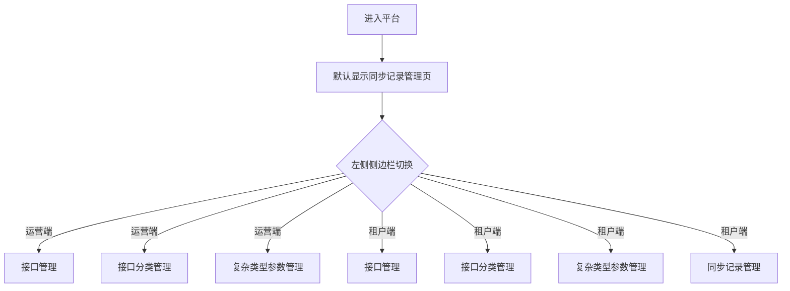
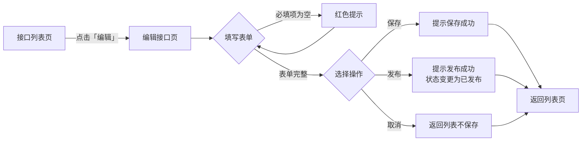
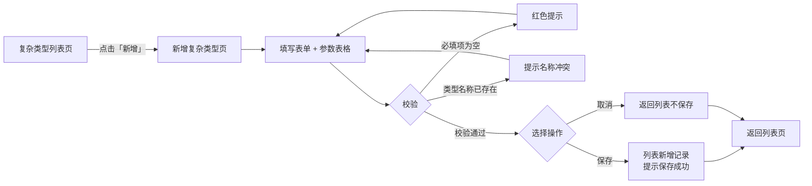
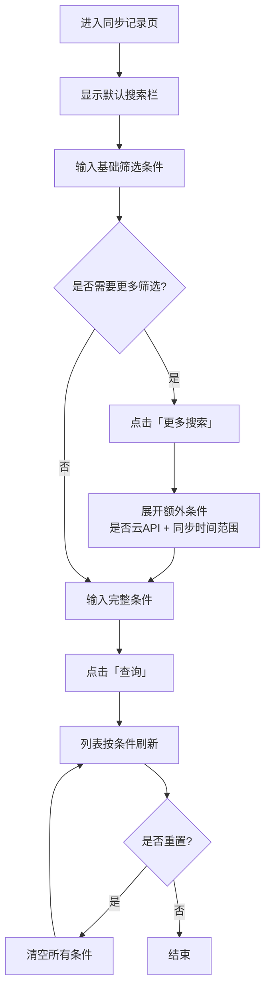
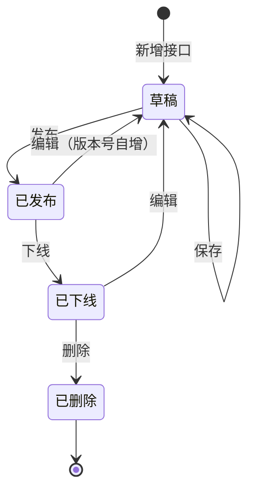

# 云API管理控制台 PRD

## 0. 文档信息
| 版本 | 日期 | 修改内容 | 作者 |
|------|------|---------|------|
| v1.0 | 2026-08-05 | 初稿，按新模板重写 | AI 生成 |

## 1. 业务背景
- **产品定位**: 云API管理统一运营平台
- **目标用户**: 运营人员（管理全平台接口）、租户管理员（管理本租户接口与同步记录）
- **业务背景**: 接口数量增长后缺乏统一管理入口，运营与租户视角混杂，同步状态难以追踪。本控制台将接口元数据、分类、复杂类型、同步记录整合为双视角统一界面
- **商业价值**: 接口管理效率提升 40%，同步异常发现时长从小时级降至分钟级
- **成功指标**: 接口列表查询响应 ≤ 500ms，同步记录可追溯率 100%，租户自助排查率 ≥ 60%
- **目标产品技术栈**: 待业务方确定（建议与现有产品线一致，如 Vue3 + Element Plus / React + Ant Design 等）
- **设计系统**: Ant Design 风格
- **入口位置**: 云API管理 > 控制台

## 2. 功能概览
云API管理统一运营平台，提供运营端和租户端双视角的接口全生命周期管理能力。包含接口管理、接口分类管理、复杂类型参数管理、同步记录管理等核心模块。

| 模块 | 功能点 | 优先级 | 类型 |
|------|--------|--------|------|
| 运营端 | 接口管理 | Must | 新增 |
| 运营端 | 接口分类管理 | Must | 新增 |
| 运营端 | 复杂类型参数管理 | Must | 新增 |
| 租户端 | 接口管理 | Must | 新增 |
| 租户端 | 同步记录管理 | Must | 新增 |
| 通用 | 新增复杂类型 | Should | 新增 |
| 通用 | 编辑接口 | Must | 新增 |

## 3. 用户故事
- US-1: 作为运营人员，我想要管理所有接口的元数据，以便于维护接口的全生命周期信息
- US-2: 作为运营人员，我想要按服务树组织接口分类， 以便于从业务维度快速定位接口
- US-3: 作为运营人员，我想要管理复杂类型参数，以便于复用出入参结构定义
- US-4: 作为租户管理员，我想要查看本租户的接口列表，以便于了解可用接口
- US-5: 作为租户管理员，我想要查看同步记录，以便于排查接口同步失败的原因
- US-6: 作为运营人员，我想要新增复杂类型并定义参数结构，以便于标准化接口出入参
- US-7: 作为运营人员，我想要编辑接口的完整配置，以便于调整接口的转发、鉴权、限频等策略

## 4. 功能需求详单

**FR-1 接口管理（运营端）**
| 项目 | 说明 |
|------|------|
| 用户故事 | US-1 |
| 优先级 | Must |
| 描述 | 运营端接口列表，支持 18 列展示、筛选、新增/发布/删除/导入/导出，行级编辑/发布/删除 |
| 输入 | 筛选条件：产品/服务、接口名称、接口状态、是否云API、创建时间、更新时间 |
| 输出 | 接口列表（分页 10 条/页），含 code、产品/服务、接口名称、接口中文名、接口转发类型、接口状态、版本号、是否云API、超时时间、签名鉴权等 18 列 |
| 业务规则 | 1) 触发条件: 进入页面自动加载第一页 2) 校验逻辑: 删除操作需二次确认 3) 冲突处理: 同一接口不可重复发布 4) 旧数据兼容: 已发布接口编辑后版本号自增 |
| 权限控制 | 仅运营人员可新增/发布/删除/导入/导出；租户不可见此菜单 |
| 状态流转 | 草稿 →(发布)→ 已发布 →(下线)→ 已下线 →(删除)→ 已删除 |

**验收标准 (Acceptance Criteria)**
- AC-1: Given 运营人员已登录，When 进入接口管理页，Then 显示接口列表第一页（10 条）
- AC-2: Given 列表有数据，When 点击某行「删除」，Then 弹出二次确认弹窗，确认后该行消失并提示「删除成功」
- AC-3: Given 列表列数超过容器宽度，When 横向拖动滚动条，Then 表格横向滚动且不撑开整页布局
- AC-4: Given 已选择筛选条件，When 点击「查询」，Then 列表按条件刷新
- AC-5: Given 列表有数据，When 点击「导出」，Then 下载当前筛选条件下的接口数据

**FR-2 接口分类管理**
| 项目 | 说明 |
|------|------|
| 用户故事 | US-2 |
| 优先级 | Must |
| 描述 | 左侧服务树 5 层级结构，右侧服务信息表单，支持新增/删除节点 |
| 输入 | 服务中文名称、服务英文名称、服务编码 |
| 输出 | 树形结构展示，选中节点显示对应服务信息表单 |
| 业务规则 | 1) 触发条件: 点击树节点显示右侧表单 2) 校验逻辑: 服务编码唯一 3) 冲突处理: 删除节点时若存在子节点需先删除子节点 4) 旧数据兼容: 树深度最多 5 层，超出不允许添加子节点 |
| 权限控制 | 仅运营人员可新增/删除节点；租户不可见此菜单 |
| 状态流转 | 无 |

**验收标准 (Acceptance Criteria)**
- AC-1: Given 运营人员已登录，When 进入接口分类管理页，Then 左侧显示服务树，右侧显示空表单
- AC-2: Given 选中某节点，When 点击「新增子节点」，Then 树新增一个子节点并清空右侧表单
- AC-3: Given 节点深度已达 5 层，When 点击「新增子节点」，Then 提示「最多支持 5 层」且不新增
- AC-4: Given 节点存在子节点，When 点击「删除」，Then 提示「请先删除子节点」

**FR-3 复杂类型参数管理**
| 项目 | 说明 |
|------|------|
| 用户故事 | US-3 |
| 优先级 | Must |
| 描述 | 复杂类型列表，支持筛选、新增、编辑、删除 |
| 输入 | 筛选条件：类型名称、类型中文描述、版本、出入参类型、产品/服务 |
| 输出 | 列表（分页 10 条/页），含类型名称、版本、产品/服务、出入参类型、类型中文描述、类型英文描述、创建时间、修改时间 |
| 业务规则 | 1) 触发条件: 进入页面自动加载 2) 校验逻辑: 类型名称唯一 3) 冲突处理: 已被接口引用的类型不可删除 4) 旧数据兼容: 编辑后版本号自增 |
| 权限控制 | 仅运营人员可新增/编辑/删除；租户不可见此菜单 |
| 状态流转 | 无 |

**验收标准 (Acceptance Criteria)**
- AC-1: Given 运营人员已登录，When 进入复杂类型参数管理页，Then 显示列表第一页
- AC-2: Given 已输入筛选条件，When 点击「查询」，Then 列表按条件刷新
- AC-3: Given 点击「重置」，When 所有筛选条件清空，Then 列表恢复全量
- AC-4: Given 某类型已被接口引用，When 点击「删除」，Then 提示「该类型已被接口引用，不可删除」

**FR-4 接口管理（租户端）**
| 项目 | 说明 |
|------|------|
| 用户故事 | US-4 |
| 优先级 | Must |
| 描述 | 租户视角接口列表，与运营端共享同一组件，展示租户可见的接口数据 |
| 输入 | 同 FR-1 筛选条件 |
| 输出 | 同 FR-1 列表结构，仅显示租户有权限的接口 |
| 业务规则 | 1) 触发条件: 进入页面自动加载 2) 校验逻辑: 仅显示租户有权限的接口 3) 冲突处理: 无 4) 旧数据兼容: 无 |
| 权限控制 | 租户管理员只读，不可新增/发布/删除/导入/导出 |
| 状态流转 | 无 |

**验收标准 (Acceptance Criteria)**
- AC-1: Given 租户管理员已登录，When 进入接口管理页，Then 仅显示该租户有权限的接口
- AC-2: Given 租户视角，When 查看操作列，Then 不显示新增/发布/删除/导入/导出按钮

**FR-5 同步记录管理**
| 项目 | 说明 |
|------|------|
| 用户故事 | US-5 |
| 优先级 | Must |
| 描述 | 同步记录列表，支持筛选、更多搜索、查看详情 |
| 输入 | 基础筛选：产品/服务、接口名称、版本号、同步结果、接口状态、目的地域；更多搜索：是否云API、同步时间范围 |
| 输出 | 列表（分页 10 条/页），含 code、产品/服务、接口名称、接口中文名、接口转发类型、接口状态、版本号、是否云API、目的地域、同步时间、同步结果 |
| 业务规则 | 1) 触发条件: 进入页面自动加载 2) 校验逻辑: 无 3) 冲突处理: 无 4) 旧数据兼容: 默认显示最近 30 天同步记录 |
| 权限控制 | 租户管理员可见本租户同步记录；运营人员可见全部 |
| 状态流转 | 无 |

**验收标准 (Acceptance Criteria)**
- AC-1: Given 租户管理员已登录，When 进入同步记录管理页，Then 显示本租户最近 30 天同步记录
- AC-2: Given 默认搜索栏，When 点击「更多搜索」，Then 展开额外筛选条件（是否云API、同步时间范围）
- AC-3: Given 更多搜索已展开，When 再次点击，Then 收起额外筛选条件
- AC-4: Given 已输入筛选条件，When 点击「查询」，Then 列表按条件刷新

**FR-6 新增复杂类型**
| 项目 | 说明 |
|------|------|
| 用户故事 | US-6 |
| 优先级 | Should |
| 描述 | 复杂类型表单 + 参数内容表格，支持添加参数、保存、取消 |
| 输入 | 表单：产品/服务（必填）、类型名称（必填）、类型中文描述、类型英文描述（必填）、出入参类型（必填）；参数表格：参数名称、是否必填、类型、数组类型、是否允许NULL、中文描述、英文描述 |
| 输出 | 保存成功后返回列表页 |
| 业务规则 | 1) 触发条件: 复杂类型列表点击「新增」跳转此页 2) 校验逻辑: 必填项不能为空，类型名称唯一 3) 冲突处理: 类型名称已存在时保存失败并提示 4) 旧数据兼容: 无 |
| 权限控制 | 仅运营人员可新增 |
| 状态流转 | 无 |

**验收标准 (Acceptance Criteria)**
- AC-1: Given 运营人员在复杂类型列表页，When 点击「新增」，Then 跳转到新增复杂类型页
- AC-2: Given 必填项为空，When 点击「保存」，Then 红色提示「必填项不能为空」
- AC-3: Given 类型名称已存在，When 点击「保存」，Then 提示「类型名称已存在」
- AC-4: Given 表单填写完整，When 点击「保存」，Then 列表新增一条记录并提示「保存成功」，返回列表页
- AC-5: Given 任意状态，When 点击「取消」，Then 返回列表页不保存

**FR-7 编辑接口**
| 项目 | 说明 |
|------|------|
| 用户故事 | US-7 |
| 优先级 | Must |
| 描述 | 多 Section 表单：基本信息、入参、出参、错误码、后端地址、签名鉴权 |
| 输入 | 基本信息：产品/服务、接口名称、接口中文名、接口中文描述、接口英文描述、版本、接口转发类型、查询接口、是否云API、请求方式；入参表格：参数名称、是否必填、类型、数组类型、是否允许NULL、中文描述、英文描述；出参表格：同入参结构；错误码定义：错误码、描述；后端地址表格：路由、后端地址、接口限频、账号限频、账号限频白名单；签名鉴权：签名和鉴权、接口调用timeout值、呼入系统、负责人、变更记录 |
| 输出 | 保存成功后返回列表页 |
| 业务规则 | 1) 触发条件: 接口列表点击「编辑」跳转此页 2) 校验逻辑: 接口名称必填，版本号格式为 x.y.z 3) 冲突处理: 已发布接口编辑后需重新发布 4) 旧数据兼容: 系统公共参数 placementId、appId、pke-envId 自动注入 |
| 权限控制 | 仅运营人员可编辑 |
| 状态流转 | 草稿 →(保存)→ 草稿 →(发布)→ 已发布 |

**验收标准 (Acceptance Criteria)**
- AC-1: Given 运营人员在接口列表，When 点击某行「编辑」，Then 跳转到编辑接口页并加载该接口数据
- AC-2: Given 编辑页已加载，When 修改任意字段，Then 字段值更新且不自动保存
- AC-3: Given 必填项为空，When 点击「保存」，Then 红色提示「必填项不能为空」
- AC-4: Given 表单填写完整，When 点击「保存」，Then 提示「保存成功」并返回列表页
- AC-5: Given 表单填写完整，When 点击「发布」，Then 提示「发布成功」，接口状态变为「已发布」
- AC-6: Given 任意状态，When 点击「取消」，Then 返回列表页不保存

## 5. 数据要求

### 接口 (Interface)
| 字段 | 类型 | 必填 | 校验规则 | 说明 |
|------|------|------|---------|------|
| code | string | 是 | 唯一，字母+数字 | 接口编码 |
| name | string | 是 | 1-100 字符 | 接口名称 |
| chineseName | string | 否 | 1-100 字符 | 接口中文名 |
| status | enum | 是 | draft / published / offline / deleted | 接口状态 |
| version | string | 是 | x.y.z 格式 | 版本号 |
| isCloudAPI | boolean | 是 | true / false | 是否云API |
| timeout | number | 否 | 1-60000 (ms) | 超时时间 |
| signAuth | string | 否 | - | 签名鉴权 |

### 复杂类型 (ComplexType)
| 字段 | 类型 | 必填 | 校验规则 | 说明 |
|------|------|------|---------|------|
| typeName | string | 是 | 唯一，1-50 字符 | 类型名称 |
| version | string | 是 | x.y.z 格式 | 版本号 |
| chineseDesc | string | 否 | 1-200 字符 | 类型中文描述 |
| englishDesc | string | 是 | 1-200 字符 | 类型英文描述 |
| paramType | enum | 是 | input / output | 出入参类型 |

### 同步记录 (SyncRecord)
| 字段 | 类型 | 必填 | 校验规则 | 说明 |
|------|------|------|---------|------|
| code | string | 是 | - | 接口编码 |
| syncTime | datetime | 是 | ISO 8601 | 同步时间 |
| syncResult | enum | 是 | success / failed | 同步结果 |
| targetRegion | string | 是 | - | 目的地域 |

## 6. 交互流程

### 6.1 页面导航主流程

文字流程：进入平台 → 默认显示同步记录管理页 → 通过左侧侧边栏在运营端/租户端各模块间切换

### 6.2 接口编辑流程

文字流程：接口列表 → 点击「编辑」→ 编辑接口页 → 填写表单 → 保存/发布/取消 → 返回列表页

### 6.3 新增复杂类型流程

文字流程：复杂类型列表 → 点击「新增」→ 新增复杂类型页 → 填写表单与参数 → 保存/取消 → 返回列表页

### 6.4 同步记录搜索流程

文字流程：默认搜索栏 → 输入条件 → 查询；需要更多筛选 → 点击「更多搜索」展开额外条件 → 查询；可随时重置清空条件

### 6.5 接口状态机

文字流程：草稿 →(发布)→ 已发布 →(下线)→ 已下线 →(删除)→ 已删除；已发布/已下线状态编辑后回到草稿状态，版本号自增

## 7. 非功能性需求
- **性能**: 页面加载 ≤ 2s，列表查询 ≤ 500ms，18 列表格横向滚动流畅无卡顿
- **安全**: 接口编辑需操作日志记录，删除操作需二次确认
- **兼容性**: Chrome 90+ / Firefox 88+ / Edge 90+
- **可访问性**: 键盘导航支持 Tab 切换，ARIA 标签标注表格列头，对比度 AA

## 8. 边界情况
- 空状态: 表格无数据时显示「暂无数据」占位
- 加载状态: 列表查询时显示 loading spinner
- 错误状态: 网络异常显示「加载失败，请重试」按钮
- 数据边界: 服务树最大深度 5 层，超出不允许添加子节点；接口名称最大 100 字符
- 表格横向滚动: 18 列表格列数超过容器宽度时，使用 `overflow-x-auto` 横向滚动，不撑开整页布局
- 删除确认: 所有删除操作需二次确认弹窗
- 已发布接口编辑: 已发布状态的接口编辑后需重新发布才能生效

## 9. 待办问题
- [ ] Q1: 接口删除是软删除还是硬删除? @后端
- [ ] Q2: 同步记录默认保留多久? @产品
- [ ] Q3: 导出接口数据的格式是 Excel 还是 CSV? @产品
- [ ] Q4: 租户端接口列表是否需要支持按接口状态筛选? @产品

## 10. 组件映射

> 以下为目标产品开发时建议使用的组件库映射。实际开发以目标产品选定的技术栈为准。
> 若目标产品使用 Ant Design，参考「Ant Design」列；若使用 Element Plus，参考「Element Plus」列。

| UI 元素 | Ant Design | Element Plus | 关键属性 |
|---------|-----------|--------------|---------|
| 按钮 | Button | ElButton | type="primary" / "default" / "link" |
| 数据表格 | Table | ElTable | columns, dataSource, pagination, scroll={{ x: 2400 }} |
| 文本输入 | Input | ElInput | placeholder, allowClear |
| 下拉选择 | Select | ElSelect | options, placeholder, allowClear |
| 树形控件 | Tree | ElTree | treeData, onSelect, draggable |
| 表单项 | Form.Item | ElFormItem | label, rules |
| 弹窗 | Modal | ElDialog | title, open, onOk, onCancel |
| 分页 | Pagination | ElPagination | total, current, pageSize |
| 标签 | Tag | ElTag | color |
