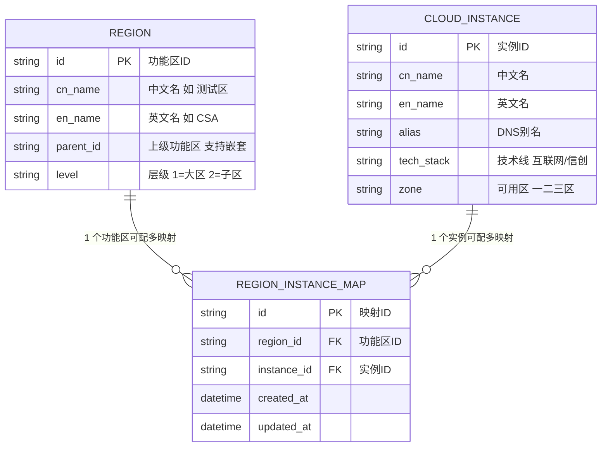
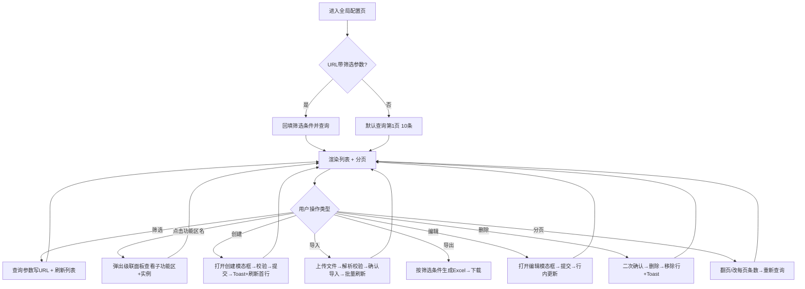

# 智算管理平台 - 全局配置 PRD

## 1. 文档信息

| 项 | 内容 |
|---|---|
| 文档编号 | PRD-IC-GC-001 |
| 产品名称 | 智算管理平台 |
| 模块名称 | 系统管理 → 配置中心 → 全局配置 |
| 版本 | V1.0 |
| 作者 | 产品团队 |
| 创建日期 | 2026-08-05 |
| 状态 | 待评审 |

**版本历史：**

| 版本 | 日期 | 修改人 | 修改说明 |
|---|---|---|---|
| V1.0 | 2026-08-05 | 产品团队 | 初稿，基于 Figma 设计稿反推 |

---

## 2. 业务背景

智算管理平台面向多租户、多可用区、多技术栈的 GPU 集群调度场景，需要在「全局配置」层统一维护 **功能区 ↔ 云实例** 的映射关系。

当前存在的问题：

- 不同功能区（测试区/开发区/生产区）各自绑定不同底层云实例（公有云/专有云/混合云），缺乏统一入口维护
- 运维人员无法快速判断某功能区可用的可用区、技术栈、实例配额
- 创建新功能区或扩容时，需要手工在多个子系统录入实例信息，效率低易出错

---

## 3. 功能概览

全局配置是平台运维的基础配置页，负责维护 **功能区中文/英文名称** 与 **底层云实例** 的多对多映射。

| 功能点 | 类型 | 说明 |
|---|---|---|
| FR-01 云实例筛选 | 查询 | 按云实例名称下拉筛选，支持查询/重置 |
| FR-02 配置列表 | 展示 | 8 列数据展示 + 分页 + hover 展开功能区详情 |
| FR-03 功能区展开 | 交互 | 点击功能区中文名 → 展开下钻（测试/开发/生产区）和关联网实例 |
| FR-04 创建配置 | 新增 | 新建功能区-云实例绑定关系（模态框） |
| FR-05 导入配置 | 新增 | Excel / CSV 批量导入映射关系 |
| FR-06 导出配置 | 导出 | 按当前筛选条件导出为 Excel |
| FR-07 编辑配置 | 修改 | 修改某条映射的可用区、技术线、别名等 |
| FR-08 删除配置 | 删除 | 单条删除（二次确认） |
| FR-09 分页 | 交互 | 每页 10/20/50 条 + 跳页 |
| FR-10 约束校验 | 规则 | 一个功能区最多关联 5 个云实例 |

---

## 4. 用户故事

**US-1 作为平台运维管理员**
> 我希望统一维护功能区和云实例的映射关系，
> 这样下发调度任务时系统能自动按功能区路由到正确的实例和可用区。

**US-2 作为租户运营**
> 我希望能快速查询某测试区当前绑定了哪些云实例、使用的是什么技术栈，
> 这样可以提前预判资源瓶颈并通知运维扩容。

**US-3 作为平台开发者**
> 我希望能通过导出功能拿到当前全量映射表，
> 这样本地开发环境可以 mock 相同的拓扑结构，减少和线上偏差。

---

## 5. 功能需求详单

### **FR-01 云实例筛选**

**需求描述**
页面顶部提供「云实例名称」下拉选择 + 查询/重置按钮，用于缩小列表范围。

**交互说明**
1. 下拉框支持模糊输入（远程搜索），placeholder：`请选择云实例名称`
2. 点击右侧蓝色「查询」→ 按选中值刷新表格；点击「重置」→ 清空筛选条件
3. 查询参数会保留在 URL 中（便于分享筛选结果）

**数据字段**
- 云实例名称下拉值范围：`cloud_instance.cn_name` 字段全集

**验收标准**
- **AC-01-1 Given** 已选择云实例名称 **When** 点击查询 **Then** 表格仅展示该实例相关行
- **AC-01-2 Given** 有筛选条件 **When** 点击重置 **Then** 表格恢复全量 + 下拉框重置为空
- **AC-01-3 Given** 无匹配项 **When** 查询 **Then** 展示空态插画 + 文案「暂无数据，试试其他筛选条件」

---

### **FR-02 配置列表**

**需求描述**
以数据表形式展示所有功能区与云实例的映射，共 8 列。

**列表字段**

| 列名 | 字段来源 | 说明 |
|---|---|---|
| 功能区中文名称 | `region_cn_name` | 可点击展开下钻，hover 高亮 |
| 功能区英文名称 | `region_en_name` | 如 `CSA` / `DSA`，全大写 |
| 云实例中文名称 | `cloud_instance.cn_name` | 如「平台测试花木云实例一」 |
| 云实例英文名称 | `cloud_instance.en_name` | 如 `CPT-SH-INS1` |
| 云实例ID | `cloud_instance.id` | 内部唯一标识，如 `ptyunhm01` |
| 云实例别名 | `cloud_instance.alias` | DNS 别名，如 `ptyunhm01.ccb.com` |
| 技术线 | `cloud_instance.tech_stack` | 如「互联网技术栈」「信创技术栈」 |
| 可用区 | `cloud_instance.zone` | 如「一区」「二区」「三区」 |
| 操作 | — | 编辑 / 删除 |

**验收标准**
- **AC-02-1 Given** 正常数据 **When** 加载列表 **Then** 8 列全部按顺序显示，表头与数据左对齐
- **AC-02-2 Given** 字段超长 **When** 渲染 **Then** 超出部分省略号截断，hover 显示完整值
- **AC-02-3 Given** 响应宽度不足 **When** 拖拽缩小窗口 **Then** 表格横向滚动条可拖拽查看所有列

---

### **FR-03 功能区展开（级联详情）**

**需求描述**
点击「功能区中文名称」，在该单元格内弹出下钻层：展示该功能区下所有子功能区（测试/开发/生产区）、以及各自关联网的云实例列表。

**交互说明**
1. 点击单元格 → 右侧弹出两列级联面板（参考 Figma 设计稿中的展开样式）
2. 左列：子功能区（测试区、开发区、生产区，每项右侧箭头）
3. 右列：该子功能区下关联的所有云实例中文名
4. 顶部红色提示：`一个功能区可以关联最多5个云实例`（超限时红色显示）
5. 点击面板外任意区域 → 关闭面板

**验收标准**
- **AC-03-1 Given** 正常列表行 **When** 点击功能区中文名称 **Then** 弹出级联面板
- **AC-03-2 Given** 面板已弹出 **When** 点击外部区域 / 按 Esc **Then** 面板关闭
- **AC-03-3 Given** 某子功能区已关联 5 个实例 **When** 查看面板顶部提示 **Then** 红色背景文字显示「一个功能区可以关联最多5个云实例」

---

### **FR-04 创建配置**

**需求描述**
点击顶部蓝色「创建」按钮 → 弹创建模态框，新建一条功能区-云实例映射。

**表单字段**

| 字段 | 类型 | 必填 | 校验 |
|---|---|---|---|
| 功能区中文名称 | Select（字典） | 是 | 已有值不能重复组合同一实例 |
| 功能区英文名称 | Input | 是 | 大写字母/数字，长度 2-16 |
| 云实例中文名称 | Select（联动） | 是 | 根据功能区筛选可关联实例 |
| 云实例英文名称 | Auto-fill | — | 根据选中中文自动填充，不可编辑 |
| 云实例ID | Auto-fill | — | 同上 |
| 云实例别名 | Input | 否 | 合法域名格式 |
| 技术线 | Select | 是 | 互联网技术栈 / 信创技术栈 |
| 可用区 | Select | 是 | 一区 / 二区 / 三区 |

**验收标准**
- **AC-04-1 Given** 已点击创建按钮 **When** 模态框打开 **Then** 显示所有字段，必填项星号标记
- **AC-04-2 Given** 必填项为空 **When** 点击确定 **Then** 对应字段下方红框 + 错误提示
- **AC-04-3 Given** 功能区已关联 5 个实例 **When** 再次提交相同功能区 **Then** 阻止提交，提示「该功能区已达最大关联数（5），请先删除旧映射」
- **AC-04-4 Given** 合法数据提交成功 **When** 接口 200 返回 **Then** 模态框关闭，表格第一行显示新数据 + Toast 成功提示

---

### **FR-05 导入配置**

**需求描述**
点击顶部「导入」按钮 → 弹导入模态框，支持 Excel / CSV 批量上传。

**流程**
1. 提供模板下载入口（点击下载模板.xlsx）
2. 拖拽或选择文件上传，文件类型 .xlsx / .csv，最大 10MB
3. 上传后解析校验 → 展示成功 N 条 / 失败 M 条
4. 失败行逐条显示错误原因，用户修正后可二次上传
5. 全部通过 → 确认导入

**验收标准**
- **AC-05-1 Given** 未选文件 **When** 点击确定 **Then** 提示「请先上传文件」
- **AC-05-2 Given** 上传文件大于 10MB **When** 选择文件 **Then** 立即提示「文件过大，最大支持 10MB」
- **AC-05-3 Given** 模板存在校验不通过行 **When** 解析完成 **Then** 显示失败清单和错误原因，不允许确认导入
- **AC-05-4 Given** 成功导入 **When** 返回列表 **Then** 表格显示所有新数据行

---

### **FR-06 导出配置**

**需求描述**
点击顶部「导出」按钮 → 按当前筛选条件导出为 Excel。

**验收标准**
- **AC-06-1 Given** 有筛选条件 **When** 点击导出 **Then** 仅导出筛选后的行（不是全量）
- **AC-06-2 Given** 无筛选条件 **When** 点击导出 **Then** 导出全量数据
- **AC-06-3 Given** 导出成功 **Then** 文件名格式：`全局配置_YYYYMMDD_HHmmss.xlsx`
- **AC-06-4 Given** 0 条数据 **When** 点击导出 **Then** 提示「暂无数据可导出」并阻止下载

---

### **FR-07 编辑配置**

**需求描述**
操作列点击「编辑」→ 弹编辑模态框，回填该条数据允许修改的字段。

**允许修改字段**
- 云实例别名
- 技术线
- 可用区
- 功能区英文名称（仅英文名无其他已引用时可改）

**不允许修改**
- 功能区中文名称
- 云实例中文/英文/ID（改这三项视为删 + 重建）

**验收标准**
- **AC-07-1 Given** 点击编辑 **When** 模态框打开 **Then** 允许修改字段可编辑，其他字段 disabled 灰显
- **AC-07-2 Given** 合法修改 **When** 提交成功 **Then** 表格该行就地更新，不刷新全表
- **AC-07-3 Given** 英文名已被作业调度关联 **When** 尝试修改英文名 **Then** 提示「该英文名已被关联使用，暂不支持修改」

---

### **FR-08 删除配置**

**需求描述**
操作列点击「删除」→ 二次确认弹窗 → 调用删除接口。

**验收标准**
- **AC-08-1 Given** 点击删除 **When** 弹窗出现 **Then** 文案：「确认删除该映射关系吗？删除后该功能区将不再路由到此云实例，已调度的作业不受影响。」
- **AC-08-2 Given** 弹窗中点击确认 **When** 接口成功 **Then** 该行从列表中移除 + Toast 成功
- **AC-08-3 Given** 弹窗中点击取消 / 点遮罩 / Esc **Then** 弹窗关闭，不执行删除

---

### **FR-09 分页**

**需求描述**
表格底部标准分页控件。

**交互要素**
- 总条数展示：`共 5 条`
- 每页条数选择：10 / 20 / 50 条（默认 10）
- 页码按钮：← 上一页、当前页高亮、下一页 →
- 跳页输入框：`前往 [ ] 页` + 回车跳转

**验收标准**
- **AC-09-1 Given** 默认加载 **Then** 选中 10 条/页，当前页为第 1 页
- **AC-09-2 Given** 修改每页条数 **Then** 立即刷新数据并回到第 1 页
- **AC-09-3 Given** 输入跳页超出范围 **When** 回车 **Then** 自动钳位到最大页
- **AC-09-4 Given** 只有 1 页数据 **Then** 上一页/下一页按钮 disabled

---

### **FR-10 约束校验（5 实例上限）**

**需求描述**
强制约束「一个功能区最多关联 5 个云实例」，所有入口（创建 / 导入 / 编辑）统一校验。

**触发位置**
- FR-04 创建时重复提交相同功能区
- FR-05 导入批量校验
- FR-07 编辑时更换功能区
- FR-03 展开面板的红色提示（仅展示）

**验收标准**
- **AC-10-1 Given** 功能区已关联 5 实例 **When** 通过任意入口尝试新增第 6 条 **Then** 统一拦截并返回错误：`{code: "REGION_INSTANCE_LIMIT", message: "功能区{NAME}最多可关联5个云实例"}`
- **AC-10-2 Given** 删除操作后剩余 4 实例 **When** 再添加第 5 条 **Then** 允许通过

---

## 6. 数据要求

### 6.1 实体关系图

### 6.2 接口清单（目标产品）

| 方法 | 路径 | 说明 |
|---|---|---|
| GET | `/api/v1/global-config/maps` | 分页查询映射列表，支持 region_id/instance_id 筛选 |
| POST | `/api/v1/global-config/maps` | 创建单条映射 |
| PUT | `/api/v1/global-config/maps/:id` | 编辑映射 |
| DELETE | `/api/v1/global-config/maps/:id` | 删除映射 |
| POST | `/api/v1/global-config/maps/import` | 批量导入（multipart/form-data） |
| GET | `/api/v1/global-config/maps/export` | 导出 Excel（Content-Disposition: attachment） |
| GET | `/api/v1/global-config/regions` | 功能区字典（创建页下拉） |
| GET | `/api/v1/global-config/instances` | 云实例字典（创建页下拉 + 筛选下拉） |
| GET | `/api/v1/global-config/regions/:id/detail` | 功能区级联详情（FR-03 展开面板数据） |

---

## 7. 交互流程

### 7.1 标准 8 状态流程图

### 7.2 文字流程说明

1. **进入页面**：用户通过左侧菜单「系统管理 → 配置中心 → 全局配置」进入，首屏默认第 1 页 10 条；如 URL 携带 `?instanceId=xxx&page=2&pageSize=20` 则自动回填并查询。
2. **筛选操作**：下拉选择云实例 → 查询 → 表格刷新，筛选条件写入 URL querystring；重置后清空所有条件。
3. **功能区展开**：点击功能区中文名称 → 弹出级联面板，左列展示测试区/开发区/生产区（若为 level=2 子功能区则不展示下级），右列联动展示该子功能区下已关联的云实例中文名，顶栏显示 5 实例上限红色提示。
4. **创建流程**：点击创建 → 模态框打开 → 依次选择功能区、云实例 → 自动填充英文/ID → 填写别名/技术线/可用区 → 校验失败红框；校验通过 → 调用 POST → 成功后关闭模态框，表格第一行显示新插入数据。
5. **导入流程**：点击导入 → 下载模板（如需）→ 拖拽上传 → 后台解析并逐条校验（必填、重复、超限、格式）→ 返回成功/失败清单 → 用户修正失败行后重传 → 全通过后点击确认导入。
6. **导出流程**：点击导出 → 前端将当前筛选条件（instanceId、pageSize 上限 1000、page=1）拼接给导出接口 → 后端生成 xlsx 并设置 Content-Disposition 触发下载。
7. **编辑流程**：操作列「编辑」→ 打开模态框，回填该行数据；不可编辑字段灰显 disabled；保存成功后该行就地更新。
8. **删除流程**：操作列「删除」→ 弹出确认文案 → 确认后调用 DELETE 接口 → 成功后该行从列表移除。
9. **分页**：点击页码 / 修改每页条数 / 输入跳页回车 → 拼接分页参数重新查询列表接口。

---

## 8. 非功能性需求

| 编号 | 分类 | 要求 |
|---|---|---|
| NFR-01 | 性能 | 列表接口 P95 ≤ 500ms（万条数据 + 筛选）；导入 1 万条 ≤ 3s |
| NFR-02 | 并发 | 同功能区多人同时创建第 5/6 条 → 数据库唯一约束兜底，后提交者返回 LIMIT 错误 |
| NFR-03 | 权限 | 仅 `PLATFORM_ADMIN` / `OPS_ADMIN` 角色有 CUD 权限；`TENANT_OPS` 角色仅查看 |
| NFR-04 | 审计 | 所有写操作（创建/编辑/删除/导入）记录操作人、时间、前后值到审计日志 |
| NFR-05 | 安全 | Excel 导入做文件头校验 + 宏清除；导出文件名 sanitize 防止路径穿越 |
| NFR-06 | 兼容性 | 支持 Chrome 110+ / Edge 110+ / Firefox 109+；分辨率 1366×768 起；表格横向滚动不撑破布局 |
| NFR-07 | 国际化 | 字段预留中英双语 key；技术线枚举、可用区枚举使用字典表（便于后续扩语言） |
| NFR-08 | 可用性 | 操作反馈 ≤ 300ms 感知（乐观 UI 更新 + 接口失败回滚） |

---

## 9. 边界情况

| 编号 | 场景 | 预期行为 |
|---|---|---|
| ED-01 | 空数据（全新环境未配置任何映射） | 展示空态插画 + 提示「暂无全局配置，点击「创建」开始建立映射关系」+ 高亮创建按钮 |
| ED-02 | 筛选无结果 | 空态提示「该筛选条件下暂无数据，试试其他条件或重置」 |
| ED-03 | 导出 0 条 | 点击导出时阻止并 Toast「暂无数据可导出」，不触发下载 |
| ED-04 | 网络中断提交创建 | 本地标记「pending」行 → 恢复网络后重试 or 用户手动刷新 → 保证不重复提交 |
| ED-05 | 并发删除同一行 | 后触发的请求返回 404 → 前端直接从列表移除该行并提示「该数据已被删除」 |
| ED-06 | 导入部分成功部分失败 | 不允许确认导入；给出失败行 Excel 下载，用户修正后整体重传（原子性导入） |
| ED-07 | 功能区已被调度引用时删除 | 二次确认文案升级为黄色预警：「该功能区下尚有 3 个运行中作业，删除后新作业将无法调度到此实例，确认继续？」 |
| ED-08 | 超长字段（别名超过 200 字符） | 前端输入框 `maxLength=200` + 后端长度校验双重保护 |
| ED-09 | 浏览器缩放 80% / 150% | 布局按响应式正常显示，不出现横向双滚动条 |
| ED-10 | 创建第 6 条映射（绕过前端提交） | 后端数据库层 `count(region_id)` 校验 + 唯一索引兜底，返回统一错误码 REGION_INSTANCE_LIMIT |

---

## 10. 待办问题

| 编号 | 问题 | 优先级 | 当前结论 | 跟进人 |
|---|---|---|---|---|
| TODO-01 | 云实例下拉是否支持多选筛选？（当前单选） | P2 | 待与产品确认，V1.0 先实现单选 | 产品团队 |
| TODO-02 | 删除映射时，已调度的历史作业保留 or 清理？ | P1 | 保留历史（见 AC-08-1），但新作业不路由到此实例；需与调度组确认 | 架构组 |
| TODO-03 | 导入模板字段是否需要「功能区英文名 + 云实例英文名」双组合匹配唯一键？ | P1 | V1.0 按「功能区中文名 + 云实例中文名」匹配；英文名后续扩展 | 产品团队 |
| TODO-04 | 功能区嵌套最多几层？（当前设计稿暗示 2 层：大区 → 子区） | P2 | 暂按 2 层实现；数据模型预留 parent_id 可扩展多层 | 产品团队 |
| TODO-05 | 审计日志查看入口在本模块是否要做？ | P3 | V1.0 不做，后续独立「审计中心」模块统一查看 | 架构组 |
| TODO-06 | 可用区枚举是否固定 3 个（一二三区）？是否需要字典可配置？ | P2 | 建议字典化，当前值「一区/二区/三区」，未来可在字典中心扩展 | 产品团队 |

---

## 11. 组件映射（目标产品）

> 说明：以下为**目标产品**采用的推荐组件映射，不绑定原型平台技术栈。

| 原型组件 | 推荐组件库（Element Plus 例） | 关键属性 |
|---|---|---|
| 顶部下拉框 | `el-select` + `filterable remote` | 远程搜索、placeholder、清除按钮 |
| 查询/重置/创建/导入/导出按钮 | `el-button` | type=primary / default / success，size=default |
| 数据表 | `el-table` | stripe、border、max-height、横向滚动 `overflow-x:auto` |
| 功能区展开面板 | `el-popover` + `el-cascader-panel` | trigger=click、placement=right-start、width 480px |
| 创建/编辑模态框 | `el-dialog` | width=640px、close-on-click-modal=false、esc 关闭 |
| 表单字段 | `el-form` + `el-form-item` | label-width=120px、rules 校验、show-message |
| 导入弹窗 | `el-upload` + `el-dialog` | drag 模式、accept=.xlsx,.csv、max-size=10MB |
| 分页 | `el-pagination` | layout=total,sizes,prev,pager,next,jumper |
| 删除二次确认 | `el-popconfirm` | confirm-button-text=确认、cancel-button-text=取消 |
| Toast 反馈 | `ElMessage.success/error/warning` | duration=3000、show-close |
| 红色提示条（上限 5 实例） | `el-alert` type=error show-icon | closable=false |
