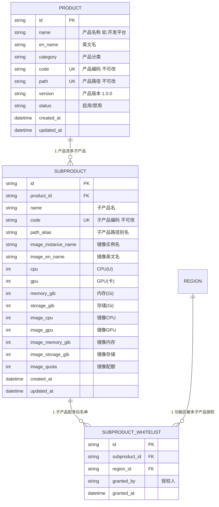
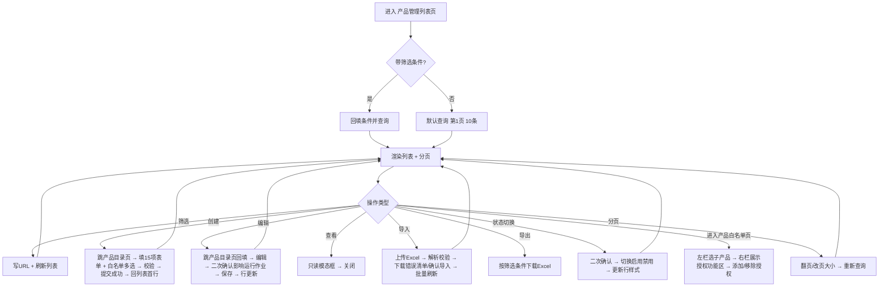

# 智算管理平台 - 产品管理 PRD

## 1. 文档信息

| 项 | 内容 |
|---|---|
| 文档编号 | PRD-IC-PM-001 |
| 产品名称 | 智算管理平台 |
| 模块名称 | 产品管理（含 产品目录、产品白名单 子页） |
| 版本 | V1.0 |
| 作者 | 产品团队 |
| 创建日期 | 2026-08-05 |
| 状态 | 待评审 |

**版本历史：**

| 版本 | 日期 | 修改人 | 修改说明 |
|---|---|---|---|
| V1.0 | 2026-08-05 | 产品团队 | 初稿，基于 Figma 设计稿（node-id=1-1145）反推 |

---

## 2. 业务背景

智算管理平台需要对「产品（Product）」进行完整的主数据与生命周期管理。"产品"在智算场景中是面向租户售卖或下发的最小业务单元（对应 GPU 调度任务中"某租户在某功能区跑某 AI 产品"的业务实体），其下绑定产品版本、子产品关系、镜像信息、以及子产品与功能区的显式白名单授权。

当前存在的问题：

- 产品、产品版本、子产品的层级关系靠线下 Excel 维护，缺乏统一主数据入口，导致研发/运营/调度三侧数据不一致
- 子产品允许在哪些功能区部署？当前靠调度系统的配置文件手改，没有管理界面和审批流，变更容易出错且不可回溯
- 新接入产品线时需要在调度系统手工注册产品、镜像、白名单等多个配置项，重复录入、容易漏

---

## 3. 功能概览

本模块共 3 个子页面：**产品管理（列表页）、产品目录（新增/编辑页）、产品白名单**，覆盖产品全生命周期管理。

| 功能点 | 类型 | 所属子页 | 说明 |
|---|---|---|---|
| FR-01 产品筛选查询 | 查询 | 产品管理 | 按产品名称、产品分类（下拉字典）双条件筛选 |
| FR-02 产品列表 | 展示 | 产品管理 | 10 列数据展示 + 分页 + 创建/导入/导出操作 |
| FR-03 创建产品 | 新增 | 产品目录 | 全量表单创建产品（3 层嵌套 + 白名单配置） |
| FR-04 编辑产品 | 修改 | 产品目录 | 回填产品全量数据，字段可编辑/不可编辑按规则区分 |
| FR-05 查看产品详情 | 展示 | 产品管理 | 列表操作列「查看」→ 弹出只读模态框 |
| FR-06 导入产品 | 新增 | 产品管理 | Excel 批量导入产品主数据 |
| FR-07 导出产品 | 导出 | 产品管理 | 按筛选条件导出为 Excel |
| FR-08 产品状态切换 | 修改 | 产品管理 | 启用 / 禁用（非删除）产品 |
| FR-09 产品白名单管理 | 新增/修改/删除 | 产品白名单 | 配置「子产品 ↔ 功能区」显式授权 |
| FR-10 分页 | 交互 | 列表通用 | 10/20/50 条每页 + 跳页 |

**业务约束：**
- 每个产品下可关联多个子产品（3 层层级：产品 → 子产品；截图暗示产品与子产品是 1:N）
- 子产品的 CPU / GPU / 内存 / 磁盘 / 网络配额 独立配置
- 「产品白名单」显式授权子产品在哪些功能区可调度（未授权的功能区在调度时直接返回无权限）

---

## 4. 用户故事

**US-1 作为平台产品经理**
> 我希望统一维护产品、子产品、镜像、版本等主数据，
> 这样每次发版新产品时不用跑 3 个系统录入，信息也能一处修改全局生效。

**US-2 作为平台运维管理员**
> 我希望能够快速对「某子产品」进行白名单开关——例如临时禁止某子产品在生产区调度，
> 这样可以 5 分钟内完成故障隔离而无需改调度系统配置发版。

**US-3 作为租户运营**
> 我希望能导出当前所有产品列表，
> 这样可以在汇报材料里附上最新的产品矩阵给客户参考。

**US-4 作为调度系统（后端）**
> 我希望通过 API 实时拉取最新的产品 + 白名单数据，
> 这样不需要定时同步配置文件，可以即时响应产品变更。

---

## 5. 功能需求详单

### **FR-01 产品筛选查询**

**需求描述**
产品管理列表顶部提供两个筛选条件 + 查询/重置。

**筛选字段**

| 字段 | 控件 | 占位/选项 |
|---|---|---|
| 产品名称 | Input（模糊搜索） | `请选择产品名称` |
| 产品分类 | Select（字典） | `通用类` / `信创类` / `高性能类`（字典待配置） |

**验收标准**
- **AC-01-1 Given** 已输入筛选条件 **When** 点击查询 **Then** 表格按条件过滤，URL 写入 querystring
- **AC-01-2 Given** 已筛选 **When** 点击重置 **Then** 两个条件清空，表格恢复全量
- **AC-01-3 Given** 无匹配结果 **Then** 空态插画 + 文案「暂无产品数据」

---

### **FR-02 产品列表**

**需求描述**
10 列表格展示所有产品主数据。

**列表字段**

| 列名 | 字段 | 说明 |
|---|---|---|
| 产品名称 | `product.name` | - |
| 产品分类 | `product.category` | 如 通用类 |
| 子产品名称 | `subproduct.name` | 子产品中文名 |
| 镜像实例名 | `subproduct.image_instance_name` | 如 智算平台开发环境镜像 |
| 产品英文名 | `product.en_name` | 如 Development Platform |
| 产品镜像英文名 | `subproduct.image_en_name` | 如 MirrorEnv1 |
| 产品路径 | `product.path` | 如 `xunfei_pd_v1` |
| 状态 | `product.status` | 启用 / 禁用（禁用灰显） |
| 更新时间 | `product.updated_at` | 如 2026-07-01 09:15:39 |
| 操作 | — | 状态、查看、编辑 |

**验收标准**
- **AC-02-1 Given** 有数据 **When** 加载 **Then** 10 列按顺序正确显示
- **AC-02-2 Given** 产品为禁用状态 **When** 渲染整行 **Then** 文字置灰、操作列「状态」按钮显示为启用（可反向开启）
- **AC-02-3 Given** 超长字段 **Then** 截断省略号 + hover tooltip
- **AC-02-4** 表格横向超出时使用内部横向滚动条，不撑破整体布局

---

### **FR-03 创建产品（产品目录表单）**

**需求描述**
点击列表顶部「创建」→ 跳转产品目录新增页（截图第三幅），全量表单共 15 项 + 白名单多选。

**表单分区与字段**

**一、基础信息（2 列布局）**

| 字段 | 控件 | 必填 | 校验 |
|---|---|---|---|
| 产品名称 | Select（字典：通用类/信创类等） | 是 | 字典值 |
| 产品分类 | Select（字典） | 是 | — |
| 产品镜像中文名 | Input | 是 | ≤64 字符 |
| 产品镜像英文名 | Input | 是 | 字母/数字/下划线，2-64 |
| 产品中文名 | Input | 是 | ≤64 字符 |
| 产品英文名 | Input | 是 | 字母/数字/下划线，2-64 |
| 产品编码 | Input | 是 | 字母/数字/下划线，2-32，唯一 |
| 产品版本 | Input | 是 | 语义化版本，如 `1.0.0` |
| 产品路径 | Input | 是 | 路径格式，如 `xunfei_pd_v1`，项目内唯一 |
| 子产品编码 | Input | 是 | 字母/数字/下划线，2-32 |

**二、配额信息（2 列布局）**

| 字段 | 控件 | 必填 | 单位 | 校验 |
|---|---|---|---|---|
| 镜像实例名 | Select（镜像仓库联动） | 是 | — | 从镜像中心字典联动 |
| 子产品路径 | Input | 是 | — | 路径格式 |
| CPU | Select Number | 是 | U | 正整数，1~4096 |
| GPU | Select Number | 是 | 卡 | 整数，0~2048 |
| 内存 | Select Number | 是 | Gi | 正整数 |
| 存储 | Select Number | 是 | Gi | 正整数 |
| 产品镜像中文名称 | ？ | 见下 | 截图中该字段与上方可能重复 |
| 子产品路径别名 | ？ | 见下 | 同上 |
| 产品镜像 CPU | Select Number | 是 | U | — |
| 产品镜像 GPU | Select Number | 是 | 卡 | — |
| 产品镜像 内存 | Select Number | 是 | Gi | — |
| 产品镜像 存储 | Select Number | 是 | Gi | — |
| 产品镜像 配额 | Select Number | 是 | — | 正整数 |
| 子产品白名单功能区 | Multi-Select（树形） | 是 | — | 至少选 1 个；每个子产品最多允许 32 功能区 |

**校验与提交**
- 所有带「*」标红必填项，失焦即校验
- 产品编码/产品路径/子产品路径 全局唯一（后端唯一索引）
- 提交成功后 → 跳转回产品管理列表，并 Toast「创建成功」，新数据出现在首行

**验收标准**
- **AC-03-1 Given** 打开创建页 **Then** 所有字段按分区展示，必填星号标红
- **AC-03-2 Given** 失焦必填字段为空 **When** tab 离开 **Then** 红框 + 错误文案 `请输入xxx`
- **AC-03-3 Given** 产品编码重复 **When** 提交 **Then** 后端返回 409，前端错误提示「该产品编码已存在」
- **AC-03-4 Given** 未选子产品白名单功能区 **When** 提交 **Then** 阻止并提示「请至少选择 1 个白名单功能区」
- **AC-03-5 Given** 全字段合法 **When** 提交 → 成功 **Then** 返回列表，首行显示新创建产品

---

### **FR-04 编辑产品（产品目录表单回填）**

**需求描述**
列表操作列「编辑」→ 跳转到产品目录页并回填对应数据。

**字段可编辑规则**
- ✅ 可编辑：产品分类、所有镜像/配额字段、子产品白名单功能区
- ❌ 不可编辑（灰显 disabled）：产品编码、产品路径、子产品编码（用于调度关联，不允许修改避免破坏关联）
- ⚠️ 谨慎可编辑：产品名称、产品中文名/英文名（若有已在运行调度作业 → 弹窗二次确认「修改后历史作业展示名称将同步变化，确认继续？」）

**验收标准**
- **AC-04-1 Given** 点击编辑 **When** 跳转 **Then** 所有字段正确回填，禁用字段灰显
- **AC-04-2 Given** 已修改白名单从 5 个减到 1 个 **When** 提交 **Then** 提示「即将移除 4 个功能区的调度权限，当前此子产品在被移除的功能区下有 N 个作业在运行，将不再调度新任务，历史运行中的作业不受影响，确认提交？」
- **AC-04-3 Given** 保存成功 **Then** 返回列表，原行就地更新（不刷新全表）+ Toast 成功

---

### **FR-05 查看产品详情**

**需求描述**
列表操作列「查看」→ 弹出只读详情模态框。

**规则**
- 所有字段 disabled 只读
- 不出现「保存/取消」底部按钮，只显示「关闭」
- 白名单功能区以标签形式展示（点击可展开跳转白名单管理页对应子产品）

**验收标准**
- **AC-05-1 Given** 点击查看 **When** 模态框打开 **Then** 所有字段值与列表一致，无任何可编辑控件
- **AC-05-2 Given** 点击关闭 / Esc / 遮罩 **Then** 模态框关闭

---

### **FR-06 导入产品**

**需求描述**
产品管理列表顶部「导入」→ 导入模态框，批量导入产品主数据。

**模板包含字段：**
产品名称、产品分类、子产品名称、镜像实例名、产品英文名、产品镜像英文名、产品路径、状态、子产品编码、产品版本、CPU、GPU、内存、存储、白名单功能区列表（逗号分隔）

**验收标准**
- **AC-06-1 Given** 模板下载按钮 **When** 点击 **Then** 下载 `产品导入模板_V1.0.xlsx`，首行包含上述字段
- **AC-06-2 Given** 上传文件 >10MB 或非 xlsx/csv **Then** 阻止上传并提示
- **AC-06-3 Given** 解析 100 行，其中 3 行校验失败 **When** 解析完成 **Then** 展示成功 97 / 失败 3，失败行可下载错误清单，不允许确认导入
- **AC-06-4 Given** 全部校验通过 → 确认导入 **Then** 后端原子写入（部分失败则整体回滚），前端 Toast N 条导入成功 + 列表刷新首行

---

### **FR-07 导出产品**

**需求描述**
列表顶部「导出」→ 按筛选条件导出 Excel。

**验收标准**
- **AC-07-1 Given** 有筛选条件 **When** 导出 **Then** 仅导出筛选结果
- **AC-07-2 Given** 无筛选 **Then** 全量导出
- **AC-07-3 文件名：`产品管理_YYYYMMDD_HHmmss.xlsx`**
- **AC-07-4 Given** 0 条数据 **When** 导出 **Then** Toast「暂无数据可导出」，不触发下载

---

### **FR-08 产品状态切换**

**需求描述**
列表操作列「状态」按钮 → 切换启用/禁用。

**验收标准**
- **AC-08-1 Given** 当前启用 **When** 点击状态按钮 **Then** 二次确认：「禁用产品 {NAME} 后，调度系统将不再调度该产品下所有子产品的新任务，正在运行的作业不受影响，确认？」
- **AC-08-2 Given** 确认禁用 **Then** 整行置灰，状态列显示禁用，按钮文案变为启用
- **AC-08-3 Given** 产品下有运行中作业 **When** 禁用 **Then** 二次确认升级为黄色预警，并显示运行中作业数量

---

### **FR-09 产品白名单管理**

**需求描述**
独立子页「产品白名单」（左侧导航），维护「子产品 ↔ 功能区」显式授权。

**列表结构**
左：产品 + 子产品树形选择器；右：当前选中子产品的白名单功能区表格（功能区中/英文、授权时间、授权人、操作（移除授权））

**顶部操作**
- 「+ 添加授权」→ 选择子产品（多选）+ 选择功能区（多选）→ 批量新增授权
- 移除授权单条 / 批量移除（左栏勾选 + 顶栏删除）

**验收标准**
- **AC-09-1 Given** 左栏选中某子产品 **When** 右侧表格 **Then** 立即刷新仅显示该子产品的授权功能区
- **AC-09-2 Given** 已在调度中被作业使用的白名单 **When** 移除授权 **Then** 二次确认：「该功能区下有 N 个运行中的作业，移除后新作业不再调度到此功能区，确认移除？」
- **AC-09-3 Given** 同「子产品 + 功能区」重复添加 **Then** 后端幂等处理，返回已存在状态不报错
- **AC-09-4 Given** 未在白名单的功能区 **When** 调度系统尝试调度 **Then** 调度中心返回 `SUBPRODUCT_NOT_WHITELISTED` 错误（后端对接要求，PRD 约束联动项）

---

### **FR-10 分页**

**需求描述**
列表底部统一分页控件。

**验收标准**
- **AC-10-1 默认 10 条/页，当前第 1 页高亮**
- **AC-10-2 修改每页条数 → 立即回第 1 页刷新**
- **AC-10-3 跳页输入框超出范围 → 钳位到最大页**
- **AC-10-4 仅 1 页时上下页按钮禁用**

---

## 6. 数据要求

### 6.1 实体关系图

### 6.2 接口清单（目标产品）

| 方法 | 路径 | 说明 |
|---|---|---|
| GET | `/api/v1/products` | 分页查询产品列表（支持 name/category 筛选） |
| POST | `/api/v1/products` | 创建产品（含子产品 + 初始白名单） |
| PUT | `/api/v1/products/:id` | 编辑产品（级联子产品 + 白名单更新） |
| GET | `/api/v1/products/:id` | 查看产品详情（含子产品 + 白名单） |
| POST | `/api/v1/products/import` | 批量导入 |
| GET | `/api/v1/products/export` | 导出 Excel |
| PATCH | `/api/v1/products/:id/status` | 切换启用/禁用 |
| GET | `/api/v1/whitelist` | 白名单管理页：按子产品 ID 查询授权功能区列表 |
| POST | `/api/v1/whitelist` | 批量添加白名单授权 |
| DELETE | `/api/v1/whitelist/:id` | 移除单条授权 |
| DELETE | `/api/v1/whitelist` | 批量移除授权（body: ids[]） |
| GET | `/api/v1/dict/product-categories` | 产品分类字典（筛选下拉 + 表单下拉） |
| GET | `/api/v1/dict/image-instances` | 镜像实例名字典（表单联动） |
| GET | `/api/v1/dict/regions` | 功能区字典（白名单授权下拉，树状返回） |

---

## 7. 交互流程

### 7.1 Mermaid 流程图

### 7.2 文字流程说明

1. **进入产品管理页**：左侧「产品管理」菜单进入 → 首屏默认第 1 页 10 条；带 URL 参数则回填。
2. **筛选操作**：输入产品名称模糊关键字 / 选择分类 → 查询 → 表格刷新 → URL 持久化；重置清空。
3. **创建产品**：点击「创建」→ 路由跳转 `/products/new` → 进入产品目录新增页 → 分两区（基础信息 + 配额信息）共约 15 项字段 → 白名单功能区多选（必选 ≥1）→ 失焦校验 + 提交全量校验 → 成功返回列表。
4. **编辑产品**：列表「编辑」→ 路由跳转 `/products/:id/edit` → 回填所有字段 → 禁用字段灰显 → 若修改白名单减少功能区 → 二次确认影响运行中作业 → 成功返回列表。
5. **查看产品**：列表「查看」→ 详情模态框（所有字段 disabled）→ 关闭。
6. **导入产品**：顶栏「导入」→ 下载模板（如需）→ 上传 xlsx/csv → 后台解析 + 校验（唯一索引重复、字段缺失、枚举非法、白名单功能区不存在）→ 0 失败则允许确认导入；有失败则下载错误清单 Excel，修正后重新上传。
7. **导出产品**：顶栏「导出」→ 按筛选条件（pageSize 上限 1000、page=1）→ 后端生成 xlsx → Content-Disposition 触发下载。
8. **状态切换**：操作列「状态」→ 二次确认（禁用 → 停止调度新任务）→ 成功后该行置灰/取消置灰。
9. **产品白名单页**：左侧「产品白名单」→ 左栏产品树（产品 → 子产品）→ 选中子产品 → 右栏显示该子产品已授权功能区 → 「+ 添加授权」弹窗：选择多个子产品 + 多个功能区 → 批量新增；右栏操作列「移除授权」→ 二次确认。
10. **分页**：翻页 / 改每页条数 / 跳页 → 重新 GET /products 接口。

---

## 8. 非功能性需求

| 编号 | 分类 | 要求 |
|---|---|---|
| NFR-01 | 性能 | 产品列表 1 万条 + 筛选 P95 ≤ 500ms；单次导入 5 千条 ≤ 5s |
| NFR-02 | 并发 | 产品编码、产品路径、子产品编码唯一索引兜底后并发写入；白名单重复添加使用 upsert 幂等 |
| NFR-03 | 权限 | `PLATFORM_ADMIN` / `PRODUCT_MANAGER` 可 CUD；`TENANT_OPS` 只读；白名单写仅 `PLATFORM_ADMIN` + `OPS_ADMIN` |
| NFR-04 | 审计 | 产品 CRUD、白名单增删、状态切换全部写入审计日志（前后值） |
| NFR-05 | 安全 | 导入文件校验文件头 + 宏清除；路径字段使用正则 `^[a-z0-9_/.-]+$` 防路径穿越 |
| NFR-06 | 兼容性 | 分辨率 1366×768 起；Chrome 110+ / Edge 110+ / Firefox 109+ |
| NFR-07 | 国际化 | 分类/状态/功能区等使用字典 key，预留 i18n |
| NFR-08 | 一致性 | 白名单写入成功后，通过事件总线通知调度中心缓存失效（≤ 3s 内调度中心感知最新白名单） |
| NFR-09 | 可用性 | 表单操作反馈 ≤ 300ms，乐观更新 + 失败回滚；配额字段支持步进器 +/- 快捷调整 |

---

## 9. 边界情况

| 编号 | 场景 | 预期行为 |
|---|---|---|
| ED-01 | 全新环境 0 条产品 | 空态插画 + 文案「暂无产品，点击「创建」开始维护产品主数据」 |
| ED-02 | 白名单授权数量：子产品已授权 32 功能区上限 | 阻止再新增，Toast「该子产品已达最大功能区授权数（32）」 |
| ED-03 | 导入时其中 1 条产品编码重复 | 整批回滚不入库；错误清单标记第 N 行编码重复 |
| ED-04 | 在调度中心有运行中作业时，禁用产品 | 二次确认黄色预警，显示作业数量；禁用后不再调度新作业 |
| ED-05 | 在白名单管理页批量移除 100 条授权 | 按 50 条/批异步移除，进度条显示，完成后弹窗报告成功/失败数 |
| ED-06 | 产品路径字段输入了 `../../../` 非法值 | 前端失焦正则校验失败 + 后端再次校验并 400 返回 |
| ED-07 | 编辑时把白名单功能区从「生产区」移除，但该子产品在生产区有排队中作业 | 二次确认黄色预警：「有 N 个排队中作业将受影响（改为调度失败或迁移），请确认」 |
| ED-08 | 镜像实例名字典联动接口失败（500） | 表单字段降为手动输入框，提示「镜像字典加载失败，请手动输入镜像实例名」 |
| ED-09 | 导出 Excel 时数据量达 10 万条 | 后端分块流式导出；前端进度条；超过 10 万条时前端预警建议缩小筛选范围 |
| ED-10 | 浏览器/系统突然中断，表单未保存 | 产品目录表单自动草稿保存（localStorage，按登录用户 + URL id 粒度），下次进入提示「检测到未保存草稿，是否恢复？」 |

---

## 10. 待办问题

| 编号 | 问题 | 优先级 | 当前结论 | 跟进人 |
|---|---|---|---|---|
| TODO-01 | 产品与子产品的层级是严格 1:N 还是支持 N 层嵌套（产品 → 子产品 → 孙子产品）？ | P1 | Figma 截图暗示 2 层，V1.0 按 2 层实现；数据模型已留扩展空间 | 产品团队 |
| TODO-02 | 产品「状态」与白名单「授权」的生效边界？禁用产品是否等同于所有子产品在所有功能区自动失权？ | P1 | 是，状态禁用 = 全量白名单逻辑失权（调度优先判断产品状态，再判白名单） | 架构组 |
| TODO-03 | 产品分类枚举值由谁维护？是否需要独立字典中心页配置？ | P2 | V1.0 写死 通用类/信创类/高性能类；后续接入字典中心 | 产品团队 |
| TODO-04 | 配额字段是否需要「规格模板」？（如 P40 8卡 模板：GPU=8、CPU=64、内存=512Gi、存储=4TiB 预设） | P2 | V1.0 不做模板，手填；后续版本加规格模板 | 产品团队 |
| TODO-05 | 白名单管理页是否需要「复制授权」能力（把子产品 A 的所有授权一键复制给子产品 B/C/D）？ | P3 | V1.0 不做，迭代期评估 | 产品团队 |
| TODO-06 | 导入模板的「白名单功能区列表」是用中文名、英文名、还是 code 匹配？ | P1 | V1.0 按「功能区中文名称」匹配；匹配不到的标为失败行；后续支持 code/英文名多态匹配 | 产品团队 |
| TODO-07 | 产品编码/路径的命名规范是什么？（防止各团队命名混乱） | P1 | 待产品出规范文档；前端先按正则允许字母/数字/下划线/点/中划线 | 产品团队 |

---

## 11. 组件映射（目标产品）

| 原型组件 | 推荐组件库（Element Plus 例） | 关键属性/备注 |
|---|---|---|
| 产品名称模糊搜索框 | `el-input` | placeholder + `clearable` |
| 产品分类下拉 | `el-select` | 字典联动 + `clearable` |
| 查询/重置/创建/导入/导出 按钮组 | `el-button` | type=primary/default/success |
| 产品列表 | `el-table` | stripe border height=calc(100vh - 280px) + 横向滚动 |
| 状态标签 | `el-tag` | type=success（启用）/ info（禁用） |
| 操作列 按钮 | 「状态」文字按钮 + 「查看/编辑」链接按钮 | — |
| 产品目录表单（基础+配额分区） | `el-form` + `el-row/el-col :span=12` 两列 | label-width=160px |
| 子产品白名单功能区 多选 | `el-tree-select` multiple + check-strictly | show-checkbox，树形返回功能区 |
| 查看详情 只读模态框 | `el-dialog` + `el-descriptions` | width=960px，分段展示 |
| 导入弹窗 | `el-upload` drag 模式 + `el-dialog` | accept=.xlsx,.csv max-size=10MB |
| 二次确认弹窗 | `el-message-box` confirm | type=warning，删除/禁用/白名单移除场景 |
| 状态切换确认 | `el-popconfirm` + 自定义内容（含作业数量警告） | 升级黄色预警 |
| 产品白名单左栏 产品树 | `el-tree` | 懒加载，产品节点下展开子产品节点 |
| 白名单添加授权弹窗 | `el-transfer`（左：所有功能区；右：已授权） | 或双穿梭框 + 搜索 |
| 分页 | `el-pagination` | layout=total,sizes,prev,pager,next,jumper |
| Toast | `ElMessage` success/error/warning | duration=3000 show-close |
| 草稿恢复提示条 | `el-alert` type=info + 操作按钮 | closable=true |
