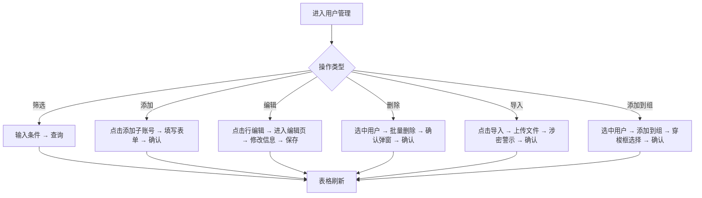
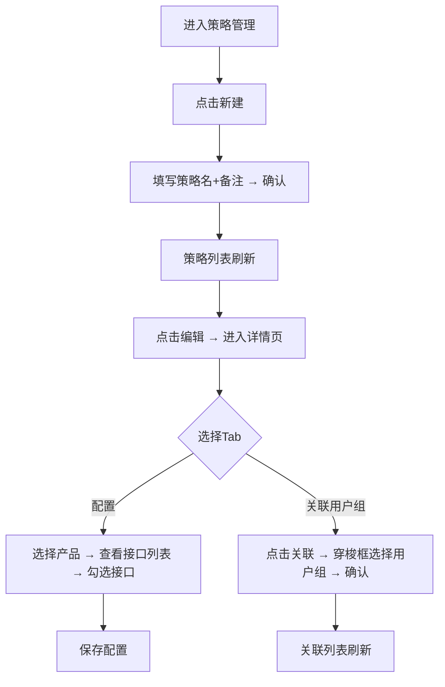
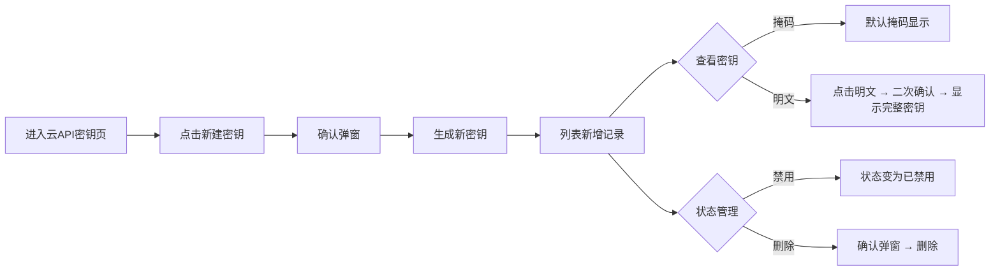
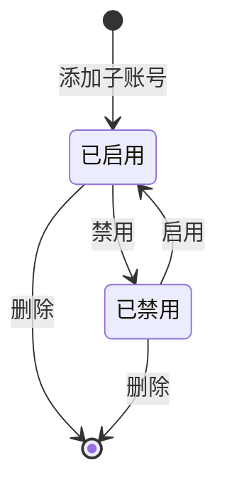

# 统一运营平台 - 租户门户 PRD

## 0. 文档信息
| 版本 | 日期 | 修改内容 | 作者 |
|------|------|---------|------|
| v1.0 | 2026-08-05 | 初稿，按新模板重写 | AI 生成 |

## 1. 业务背景
- **产品定位**: 统一运营平台租户门户，面向租户管理员的统一入口
- **目标用户**: 租户管理员（管理子账号、用户组、策略、API密钥等）、租户用户（查看个人信息）
- **业务背景**: 租户管理员需要一个统一入口完成子账号管理、权限策略配置、API密钥签发、UASS认证、账号纳管等日常运维操作，避免在多个独立系统间切换
- **商业价值**: 子账号管理效率提升 50%，权限策略配置时间从小时级降至分钟级
- **成功指标**: 子账号列表查询响应 ≤ 500ms，支持 1000+ 子账号，API密钥明文查看需二次确认
- **目标产品技术栈**: 待业务方确定（建议与现有产品线一致，如 Vue3 + Element Plus / React + Ant Design 等）
- **设计系统**: Ant Design 风格
- **入口位置**: 统一运营平台 > 租户门户

## 2. 功能概览
统一运营平台租户门户，提供用户权限管理、策略管理、云API密钥管理、UASS认证管理、账号纳管、个人中心等核心功能模块。

| 模块 | 功能点 | 优先级 | 类型 |
|------|--------|--------|------|
| 用户权限 - 用户管理 | 用户列表与筛选 | Must | 新增 |
| 用户权限 - 用户管理 | 子账号CRUD | Must | 新增 |
| 用户权限 - 用户管理 | 批量操作 | Must | 新增 |
| 用户权限 - 用户组管理 | 用户组列表与CRUD | Must | 新增 |
| 用户权限 - 用户组管理 | 用户组编辑页 | Must | 新增 |
| 用户权限 - 策略管理 | 策略列表与CRUD | Must | 新增 |
| 用户权限 - 策略管理 | 策略详情页 | Must | 新增 |
| 用户权限 - 云API密钥 | 密钥管理 | Must | 新增 |
| 用户权限 - UASS认证 | 认证配置 | Should | 新增 |
| 个人 - 账号纳管 | 纳管账号管理 | Should | 新增 |
| 个人 - 个人中心 | 个人信息查看 | Must | 新增 |

## 3. 用户故事
- US-1: 作为租户管理员，我想要创建子账号并分配到用户组，以便管理团队成员的访问权限
- US-2: 作为租户管理员，我想要创建自定义策略并关联产品接口，以便精细化控制权限
- US-3: 作为租户管理员，我想要签发和管理云API密钥，以便程序化访问平台资源
- US-4: 作为租户管理员，我想要开启UASS认证，以便启用统一的身份认证服务
- US-5: 作为租户管理员，我想要纳管外部云账号，以便统一管理多云资源
- US-6: 作为租户用户，我想要查看个人中心和账号信息，以便了解自己的权限配置

## 4. 功能需求详单

**FR-1 用户管理 - 列表与筛选**
| 项目 | 说明 |
|------|------|
| 用户故事 | US-1 |
| 优先级 | Must |
| 描述 | 租户管理员可在用户管理页面查看所有子账号列表，并通过账号名、邮箱、手机号、UASS、员工号进行筛选查询 |
| 输入 | 筛选条件：账号名、邮箱、手机号、UASS、员工号 |
| 输出 | 子账号列表（分页 10 条/页），含账号名、昵称、手机号、邮箱、UASS、员工号、创建时间、状态 |
| 业务规则 | 1) 触发条件: 进入页面自动加载第一页 2) 校验逻辑: 无 3) 冲突处理: 无 4) 旧数据兼容: 支持 1000+ 子账号分页加载 |
| 权限控制 | 仅租户管理员可查看和管理子账号 |
| 状态流转 | 无 |

**验收标准 (Acceptance Criteria)**
- AC-1: Given 租户管理员已登录，When 进入用户管理页，Then 显示子账号列表第一页（10 条）
- AC-2: Given 已输入筛选条件，When 点击「查询」，Then 列表按条件刷新
- AC-3: Given 已输入筛选条件，When 点击「重置」，Then 清空所有筛选条件并恢复全量列表

**FR-2 用户管理 - 子账号CRUD**
| 项目 | 说明 |
|------|------|
| 用户故事 | US-1 |
| 优先级 | Must |
| 描述 | 管理员可添加子账号（填写名称/昵称/手机/邮箱/UASS/员工号 + 密码方式）、查看编辑、删除子账号 |
| 输入 | 添加表单：名称、昵称、手机、邮箱、UASS、员工号、密码方式（自动生成/自定义） |
| 输出 | 新账号出现在列表中，状态为「已启用」 |
| 业务规则 | 1) 触发条件: 点击「添加子账号」按钮 2) 校验逻辑: 必填项不能为空，手机号/邮箱格式校验 3) 冲突处理: 账号名唯一 4) 旧数据兼容: 无 |
| 权限控制 | 仅租户管理员可添加/编辑/删除子账号 |
| 状态流转 | 已启用 ↔(禁用)↔ 已禁用 |

**验收标准 (Acceptance Criteria)**
- AC-1: Given 管理员在用户列表页，When 点击「添加子账号」，Then 弹出添加子账号模态框
- AC-2: Given 必填项为空，When 点击「确认」，Then 红色提示「必填项不能为空」
- AC-3: Given 表单填写完整，When 点击「确认」，Then 新账号出现在列表中，状态为「已启用」
- AC-4: Given 列表有数据，When 点击某行「编辑」，Then 进入编辑页加载该账号数据
- AC-5: Given 列表有数据，When 点击某行「删除」，Then 弹出确认弹窗，确认后该行消失

**FR-3 用户管理 - 批量操作**
| 项目 | 说明 |
|------|------|
| 用户故事 | US-1 |
| 优先级 | Must |
| 描述 | 管理员可批量删除选中用户、批量导入用户数据、导出用户列表、将用户添加到用户组 |
| 输入 | 选中多个用户 → 选择批量操作（删除/导入/导出/添加到组） |
| 输出 | 批量操作结果，列表刷新 |
| 业务规则 | 1) 触发条件: 选中多个用户后激活批量操作按钮 2) 校验逻辑: 删除需二次确认 3) 冲突处理: 无 4) 旧数据兼容: 导入文件格式需符合模板 |
| 权限控制 | 仅租户管理员可执行批量操作 |
| 状态流转 | 无 |

**验收标准 (Acceptance Criteria)**
- AC-1: Given 选中多个用户，When 点击「批量删除」，Then 弹出确认弹窗，确认后删除选中用户
- AC-2: Given 点击「导入」，When 弹出文件上传弹窗，Then 显示涉密警示文案
- AC-3: Given 选中多个用户，When 点击「添加到组」，Then 弹出穿梭框选择用户组
- AC-4: Given 列表有数据，When 点击「导出」，Then 下载当前筛选条件下的用户数据

**FR-4 用户组管理 - 列表与CRUD**
| 项目 | 说明 |
|------|------|
| 用户故事 | US-1 |
| 优先级 | Must |
| 描述 | 管理员可查看用户组列表（含名称/备注/用户数/创建时间），新建、编辑、删除用户组 |
| 输入 | 新建表单：名称、备注 |
| 输出 | 用户组列表（分页 10 条/页），含名称、备注、用户数、创建时间 |
| 业务规则 | 1) 触发条件: 进入用户组管理页面自动加载 2) 校验逻辑: 名称唯一 3) 冲突处理: 删除用户组时若有关联用户需先移出 4) 旧数据兼容: 无 |
| 权限控制 | 仅租户管理员可管理用户组 |
| 状态流转 | 无 |

**验收标准 (Acceptance Criteria)**
- AC-1: Given 租户管理员已登录，When 进入用户组管理页，Then 显示用户组列表第一页
- AC-2: Given 点击「新建」，When 弹出新建用户组模态框，Then 填写名称和备注后确认
- AC-3: Given 名称已存在，When 点击「确认」，Then 提示「名称已存在」
- AC-4: Given 列表有数据，When 点击某行「编辑」，Then 进入用户组编辑页
- AC-5: Given 用户组有关联用户，When 点击「删除」，Then 提示「请先移出用户」

**FR-5 用户组管理 - 编辑页**
| 项目 | 说明 |
|------|------|
| 用户故事 | US-1 |
| 优先级 | Must |
| 描述 | 用户组编辑页包含基本信息表单 + 双Tab（已添加用户/关联策略），支持移出用户和移除策略关联 |
| 输入 | 基本信息：名称、备注；Tab切换：已添加用户/关联策略 |
| 输出 | 已添加用户列表（含账号名、昵称、手机号、操作）、关联策略列表（含策略名称、类型、操作） |
| 业务规则 | 1) 触发条件: 点击用户组的「编辑」 2) 校验逻辑: 无 3) 冲突处理: 无 4) 旧数据兼容: 无 |
| 权限控制 | 仅租户管理员可编辑用户组 |
| 状态流转 | 无 |

**验收标准 (Acceptance Criteria)**
- AC-1: Given 管理员点击用户组的「编辑」，When 进入编辑页，Then 显示基本信息表单 + 双Tab
- AC-2: Given 进入编辑页，When 切换到Tab「已添加用户」，Then 显示用户列表，每行可点击「移出」
- AC-3: Given 进入编辑页，When 切换到Tab「关联策略」，Then 显示策略列表，每行可点击「移除」
- AC-4: Given 点击某用户的「移出」，When 确认移出，Then 该用户从列表中消失

**FR-6 策略管理 - 列表与CRUD**
| 项目 | 说明 |
|------|------|
| 用户故事 | US-2 |
| 优先级 | Must |
| 描述 | 管理员可查看策略列表（含名称/备注/类型/创建时间），区分预置策略和自定义策略，支持新建和删除 |
| 输入 | 新建表单：名称、备注 |
| 输出 | 策略列表（分页 10 条/页），含名称、备注、类型（预置/自定义）、创建时间 |
| 业务规则 | 1) 触发条件: 进入策略管理页面自动加载 2) 校验逻辑: 名称唯一 3) 冲突处理: 预置策略不可删除 4) 旧数据兼容: 无 |
| 权限控制 | 仅租户管理员可管理策略 |
| 状态流转 | 无 |

**验收标准 (Acceptance Criteria)**
- AC-1: Given 租户管理员已登录，When 进入策略管理页，Then 显示策略列表第一页
- AC-2: Given 点击「新建」，When 弹出新建策略模态框，Then 填写名称和备注后确认
- AC-3: Given 新建成功，When 列表刷新，Then 新策略类型为「自定义策略」
- AC-4: Given 预置策略，When 点击「删除」，Then 删除按钮禁用，不可操作
- AC-5: Given 自定义策略，When 点击「删除」，Then 弹出确认弹窗，确认后删除

**FR-7 策略管理 - 详情页**
| 项目 | 说明 |
|------|------|
| 用户故事 | US-2 |
| 优先级 | Must |
| 描述 | 策略详情页包含策略信息卡 + 双Tab（配置/关联用户组），配置Tab含产品树+接口列表，关联Tab含用户组表格 |
| 输入 | 策略ID；Tab切换：配置/关联用户组 |
| 输出 | 配置Tab：左侧产品树（7个产品），右侧接口列表（含名称/URL/描述/版本）；关联Tab：用户组表格（含名称/备注/用户数/操作） |
| 业务规则 | 1) 触发条件: 点击策略的「编辑」 2) 校验逻辑: 无 3) 冲突处理: 无 4) 旧数据兼容: 无 |
| 权限控制 | 仅租户管理员可编辑策略 |
| 状态流转 | 无 |

**验收标准 (Acceptance Criteria)**
- AC-1: Given 管理员点击策略的「编辑」，When 进入详情页，Then 显示策略信息卡 + 双Tab
- AC-2: Given 进入详情页，When 切换到Tab「配置」，Then 左侧显示产品树，右侧显示接口列表
- AC-3: Given 进入详情页，When 切换到Tab「关联用户组」，Then 显示已关联的用户组，可移除
- AC-4: Given 点击「关联」，When 弹出穿梭框选择用户组，Then 确认后关联列表刷新

**FR-8 云API密钥管理**
| 项目 | 说明 |
|------|------|
| 用户故事 | US-3 |
| 优先级 | Must |
| 描述 | 管理员可签发新密钥、查看密钥（明文/掩码切换）、禁用/启用、删除密钥 |
| 输入 | 新建密钥确认；密钥状态切换 |
| 输出 | 密钥列表（分页 10 条/页），含账号、密钥（明文/掩码）、创建时间、状态 |
| 业务规则 | 1) 触发条件: 进入云API密钥页面自动加载 2) 校验逻辑: 明文查看需二次确认 3) 冲突处理: 无 4) 旧数据兼容: 无 |
| 权限控制 | 仅租户管理员可管理API密钥 |
| 状态流转 | 正常 ↔(禁用)↔ 已禁用 →(删除)→ 已删除 |

**验收标准 (Acceptance Criteria)**
- AC-1: Given 管理员进入云API密钥页，When 点击「新建密钥」，Then 弹出确认弹窗，确认后生成新密钥
- AC-2: Given 新建成功，When 列表刷新，Then 新增一条记录，默认状态「正常」
- AC-3: Given 密钥默认掩码显示，When 点击「明文」按钮，Then 切换显示完整密钥
- AC-4: Given 正常状态密钥，When 点击「禁用」，Then 状态变为「已禁用」
- AC-5: Given 已禁用密钥，When 点击「删除」，Then 弹出确认弹窗，确认后删除

**FR-9 UASS认证管理**
| 项目 | 说明 |
|------|------|
| 用户故事 | US-4 |
| 优先级 | Should |
| 描述 | 管理员可开启/关闭UASS认证，开启时需确认 |
| 输入 | 开启/关闭开关 |
| 输出 | UASS认证状态（已开启/未开启） |
| 业务规则 | 1) 触发条件: 点击开启开关 2) 校验逻辑: 开启需二次确认 3) 冲突处理: 已开启时关闭无需确认 4) 旧数据兼容: 无 |
| 权限控制 | 仅租户管理员可管理UASS认证 |
| 状态流转 | 未开启 →(开启)→ 已开启 →(关闭)→ 未开启 |

**验收标准 (Acceptance Criteria)**
- AC-1: Given 管理员进入UASS认证管理页，When 点击开启开关，Then 弹出确认弹窗
- AC-2: Given 确认弹窗，When 点击「确认」，Then UASS状态变为「已开启」
- AC-3: Given UASS已开启，When 点击关闭开关，Then 直接关闭，无需确认弹窗
- AC-4: Given 进入页面，When 查看开启流程，Then 显示两步：配置参数 → 开启开关

**FR-10 账号纳管**
| 项目 | 说明 |
|------|------|
| 用户故事 | US-5 |
| 优先级 | Should |
| 描述 | 管理员可查看纳管账号列表、新增纳管账号、编辑纳管账号、删除纳管账号 |
| 输入 | 新增表单：功能区、实例、地域、账号、类型；编辑表单：SecretId、SecretKey、描述 |
| 输出 | 纳管账号列表（含功能区/实例/地域/账号/类型/操作） |
| 业务规则 | 1) 触发条件: 点击「新增」进入新增模式 2) 校验逻辑: 功能区/实例/地域为必填 3) 冲突处理: 无 4) 旧数据兼容: 编辑模式下账号信息只读 |
| 权限控制 | 仅租户管理员可管理纳管账号 |
| 状态流转 | 无 |

**验收标准 (Acceptance Criteria)**
- AC-1: Given 管理员进入账号纳管页，When 点击「新增」，Then 进入新增模式表单
- AC-2: Given 必填项为空，When 点击「保存」，Then 红色提示「必填项不能为空」
- AC-3: Given 表单填写完整，When 点击「保存」，Then 列表新增一条记录
- AC-4: Given 列表有数据，When 点击某行「编辑」，Then 进入编辑模式，账号信息只读，仅密钥可编辑
- AC-5: Given 列表有数据，When 点击某行「删除」，Then 弹出确认弹窗，确认后删除

**FR-11 个人中心**
| 项目 | 说明 |
|------|------|
| 用户故事 | US-6 |
| 优先级 | Must |
| 描述 | 用户可查看个人账号信息、账号权限、安全设置，并编辑部分信息 |
| 输入 | 编辑表单：SecretId、SecretKey、描述 |
| 输出 | 三张卡片：账号信息（账号ID/租户ID/登录账号/UASS/员工号/昵称）、账号权限（关联策略/用户组）、安全设置（USBKey开关） |
| 业务规则 | 1) 触发条件: 点击顶部头像 → 「个人中心」 2) 校验逻辑: 无 3) 冲突处理: 无 4) 旧数据兼容: 无 |
| 权限控制 | 所有用户可查看自己的个人中心 |
| 状态流转 | 无 |

**验收标准 (Acceptance Criteria)**
- AC-1: Given 用户点击顶部头像 → 「个人中心」，When 进入个人中心页，Then 显示三张卡片
- AC-2: Given 账号信息卡片，When 查看字段，Then 显示账号ID、租户ID、登录账号、UASS、员工号、昵称
- AC-3: Given 账号权限卡片，When 查看内容，Then 显示关联策略和用户组
- AC-4: Given 安全设置卡片，When 点击「编辑」，Then 弹出编辑弹窗，可修改SecretId/SecretKey/描述

## 5. 数据要求

### 用户 (User)
| 字段 | 类型 | 必填 | 校验规则 | 说明 |
|------|------|------|---------|------|
| id | string | 是 | 唯一 | 用户ID |
| name | string | 是 | 1-50 字符 | 账号名 |
| nickname | string | 否 | 1-50 字符 | 昵称 |
| type | enum | 是 | main / sub | 账号类型（主账号/子账号） |
| email | string | 否 | 邮箱格式 | 邮箱 |
| phone | string | 否 | 手机号格式 | 手机号 |
| uass | string | 否 | - | UASS标识 |
| employee | string | 否 | - | 员工号 |
| created | datetime | 是 | ISO 8601 | 创建时间 |
| status | enum | 是 | enabled / disabled | 状态 |

### 用户组 (UserGroup)
| 字段 | 类型 | 必填 | 校验规则 | 说明 |
|------|------|------|---------|------|
| id | string | 是 | 唯一 | 用户组ID |
| name | string | 是 | 唯一，1-50 字符 | 用户组名称 |
| remark | string | 否 | 1-200 字符 | 备注 |
| userCount | int | 是 | ≥ 0 | 用户数 |
| created | datetime | 是 | ISO 8601 | 创建时间 |

### 策略 (Policy)
| 字段 | 类型 | 必填 | 校验规则 | 说明 |
|------|------|------|---------|------|
| id | string | 是 | 唯一 | 策略ID |
| name | string | 是 | 唯一，1-50 字符 | 策略名称 |
| remark | string | 否 | 1-200 字符 | 备注 |
| type | enum | 是 | preset / custom | 类型（预置/自定义） |
| created | datetime | 是 | ISO 8601 | 创建时间 |

### 云API密钥 (ApiKey)
| 字段 | 类型 | 必填 | 校验规则 | 说明 |
|------|------|------|---------|------|
| id | string | 是 | 唯一 | 密钥ID |
| account | string | 是 | - | 所属账号 |
| key | string | 是 | - | 密钥值 |
| created | datetime | 是 | ISO 8601 | 创建时间 |
| status | enum | 是 | normal / disabled | 状态（正常/已禁用） |

### 纳管账号 (CustodyAccount)
| 字段 | 类型 | 必填 | 校验规则 | 说明 |
|------|------|------|---------|------|
| id | string | 是 | 唯一 | 纳管账号ID |
| area | string | 是 | - | 功能区 |
| instance | string | 是 | - | 实例 |
| account | string | 是 | - | 账号 |
| accountType | enum | 是 | - | 账号类型 |
| region | string | 是 | - | 地域 |
| secretId | string | 否 | - | SecretId |
| secretKey | string | 否 | - | SecretKey |
| description | string | 否 | 1-200 字符 | 描述 |

## 6. 交互流程

### 6.1 用户管理流程

文字流程：进入用户管理 → 选择操作类型（筛选/添加/编辑/删除/导入/添加到组）→ 执行对应操作 → 表格刷新

### 6.2 策略配置流程

文字流程：进入策略管理 → 新建策略 → 列表刷新 → 点击编辑进入详情页 → 选择Tab（配置/关联用户组）→ 执行配置或关联 → 保存

### 6.3 云API密钥管理流程

文字流程：进入云API密钥页 → 新建密钥 → 确认 → 生成 → 查看密钥（掩码/明文）→ 状态管理（禁用/删除）

### 6.4 用户状态机

文字流程：添加子账号 → 已启用 ↔(禁用/启用)↔ 已禁用 → 删除

## 7. 非功能性需求
- **性能**: 用户列表分页加载 ≤ 500ms，支持 1000+ 子账号，策略列表查询 ≤ 500ms
- **安全**: API密钥默认掩码显示，明文查看需二次确认；删除操作需二次确认弹窗，防止误删
- **兼容性**: Chrome 90+ / Firefox 88+ / Edge 90+，页面最小宽度 1200px，支持横向滚动
- **可访问性**: 键盘导航支持 Tab 切换，ARIA 标签标注表格列头，对比度 AA
- **可用性**: 筛选条件支持组合查询，重置一键清空；穿梭框组件支持搜索 + 分页
- **审计**: 所有 CRUD 操作需记录操作日志
- **权限**: 仅租户管理员可访问用户权限模块

## 8. 边界情况
- 空状态: 表格无数据时显示「暂无数据」占位
- 加载状态: 列表查询时显示 loading spinner
- 错误状态: 网络异常显示「加载失败，请重试」按钮
- 数据边界: 用户名超长时表格单元格截断 + tooltip 显示全名
- 删除预置策略: 禁用删除按钮，不可操作
- API密钥明文查看: 切换显示，默认掩码
- UASS已开启时再次操作: 直接关闭，无需确认弹窗
- 纳管账号新增模式: 功能区/实例/地域为必填
- 纳管账号编辑模式: 账号信息只读，仅密钥可编辑
- 用户组用户数为0: 正常显示，不特殊处理
- 穿梭框左侧无数据: 显示空状态，右侧已有数据正常显示
- 顶部导航未实现项: 显示 Placeholder 占位页面
- 表格横向滚动: 列数超过容器宽度时，使用 `overflow-x-auto` 横向滚动，不撑开整页布局

## 9. 待办问题
- [ ] Q1: 顶部导航 7 项中仅「用户权限」和「个人」有实现，其余 5 项是否后续迭代实现? @产品
- [ ] Q2: 用户组管理中「同步用户组」功能的同步来源是什么（LDAP/AD/其他）? @后端
- [ ] Q3: 策略配置中产品树和接口列表的数据来源是平台预置还是动态拉取? @后端
- [ ] Q4: UASS认证开启后的具体参数配置项有哪些? @产品
- [ ] Q5: 账号纳管中「功能区」字段的枚举值列表是什么? @产品
- [ ] Q6: 用户导入的文件格式是 CSV 还是 Excel? 是否提供导入模板下载? @产品
- [ ] Q7: 策略关联用户组后，权限生效的时机是即时还是延迟? @后端

## 10. 组件映射

> 以下为目标产品开发时建议使用的组件库映射。实际开发以目标产品选定的技术栈为准。
> 若目标产品使用 Ant Design，参考「Ant Design」列；若使用 Element Plus，参考「Element Plus」列。

| UI 元素 | Ant Design | Element Plus | 关键属性 |
|---------|-----------|--------------|---------|
| 按钮 | Button | ElButton | type="primary" / "default" / "link" |
| 数据表格 | Table | ElTable | columns, dataSource, pagination, rowSelection |
| 文本输入 | Input | ElInput | placeholder, allowClear |
| 下拉选择 | Select | ElSelect | options, placeholder, allowClear |
| 树形控件 | Tree | ElTree | treeData, onSelect, checkable |
| 表单项 | Form.Item | ElFormItem | label, rules |
| 弹窗 | Modal | ElDialog | title, open, onOk, onCancel |
| 分页 | Pagination | ElPagination | total, current, pageSize |
| 标签 | Tag | ElTag | color |
| 穿梭框 | Transfer | ElTransfer | dataSource, targetKeys, render |
| 标签页 | Tabs | ElTabs | items, activeKey, onChange |
| 开关 | Switch | ElSwitch | checked, onChange |
| 下拉菜单 | Dropdown | ElDropdown | menu, trigger |
